# 🤖 A2A MCP - Intelligent Agent Orchestration System

An advanced multi-agent system built with **LangGraph** and **A2A Protocol** that features intelligent request routing, specialized agents for different domains, and seamless agent coordination.

## 🌟 Overview

This project demonstrates a production-ready agent orchestration system where:
- **🎯 Orchestrator Agent** intelligently routes user requests to specialized agents
- **☸️ ArgoCD Agent** handles Kubernetes and GitOps operations  
- **💰 Currency Agent** manages financial data and currency conversions
- **🧮 Math Agent** performs advanced mathematical calculations and analysis
- **🔧 CLI Client** provides interactive command-line interface
- **📡 A2A Protocol** enables standardized agent communication

## 🎉 Recent Updates (June 2025)

### ✅ Major Fixes Implemented
- **CLI Hanging Fixed**: Resolved timeout issues when requesting currency conversions
- **Enhanced Currency Routing**: Single currency codes like "usd" now correctly route to Currency Agent (60%+ confidence)
- **Clean CLI Responses**: Fixed raw JSON display - now shows clean, formatted answers
- **Python 3.10+ Support**: Updated dependencies for A2A SDK compatibility
- **Improved Error Handling**: Better handling of agent response states (`input-required`, `completed`, `failed`)

## 🏗️ System Architecture

```mermaid
graph TD
    B --> C[LangGraph Workflow]
    C --> D[Request Analysis]
    D --> E[Intelligent Routing]
    E --> F[Skill-Based Matching]
    F --> G[Confidence Scoring]
    G --> H{Best Agent Selection}
    H -->|Kubernetes/GitOps| I[☸️ ArgoCD Agent]
    H -->|Currency/Finance| J[💰 Currency Agent]
    H -->|Math/Calculations| K[🧮 Math Agent]
    H -->|Future Agents| L[🔮 Extensible]
    
    I --> M[ArgoCD MCP Server]
    J --> N[Frankfurter API]
    K --> O[Math MCP Server]
    O --> P[SymPy + NumPy]
    
    Q[🔧 Orchestrator Client] --> B
    R[📡 HTTP API] --> B
    
    subgraph "LangGraph Workflow"
        C
        D
        E
        F
        G
    end
    
    subgraph "Intelligent Routing Engine"
        F
        G
        H
    end
```



## 🚀 Quick Start

### Prerequisites
- **Python 3.10+** (updated from 3.8 for A2A SDK compatibility)
- **Node.js** (for ArgoCD MCP server)
- **[uv](https://docs.astral.sh/uv/)** package manager
- **API Keys** (Google Gemini or OpenAI)

### 1. Install Dependencies
```bash
# Clone the repository
git clone <repository-url>
cd a2a-mcp

# Install orchestrator
cd orchestrator && uv sync && cd ..

# Install agents
cd argocdAgent && uv sync && cd ..
cd currencyAgent && uv sync && cd ..
cd mathAgent && uv sync && cd ..

# Install orchestrator client
cd orchestrator_client && uv sync && cd ..
```

### 2. Set Environment Variables
```bash
# Required for LLM
export GOOGLE_API_KEY="your-google-api-key"
# OR for OpenAI
export API_KEY="your-openai-api-key"
export TOOL_LLM_URL="https://api.openai.com/v1"
export TOOL_LLM_NAME="gpt-3.5-turbo"

# Required for ArgoCD Agent
export ARGOCD_BASE_URL="https://your-argocd-server.com/"
export ARGOCD_API_TOKEN="your-argocd-api-token"
export NODE_TLS_REJECT_UNAUTHORIZED="0"  # If using self-signed certs
```

### 3. Test the Orchestrator (Recommended First Step)
```bash
cd orchestrator

# Run comprehensive test suite
uv run -m app.test_orchestrator

# Test individual routing
uv run -m app -m "List all ArgoCD applications" -v
uv run -m app -m "Convert 100 USD to EUR" -v
```

## 🎯 Running the Full System

### Option A: Orchestrator Only (Simulated Agents)
Perfect for testing routing logic without running actual agents:

```bash
cd orchestrator

# Test routing intelligence
uv run -m app -m "Sync my Kubernetes application" -v
uv run -m app -m "What's the USD to EUR exchange rate?" -v
uv run -m app -m "kubernetes cluster management" -v
```

### Option B: Full System with Real Agents
Run all components for complete functionality:

**Terminal 1: Currency Agent**
```bash
cd currencyAgent
uv run -m app --port 8002
```

**Terminal 2: ArgoCD Agent**
```bash
cd argocdAgent
uv run -m app --port 8001
```

**Terminal 3: Math Agent**
```bash
cd mathAgent
uv run -m app --port 8003
```

**Terminal 4: Orchestrator Agent**
```bash
cd orchestrator
uv run -m app --port 8000
```

**Terminal 5: Orchestrator Client**
```bash
cd orchestrator_client
uv run . --agent http://localhost:8000
```

### Option C: Using the CLI with Orchestrator
Interactive command-line experience:

```bash
# Start orchestrator
cd orchestrator && uv run -m app --port 8000

# In another terminal, start orchestrator client
cd orchestrator_client && uv run . --agent http://localhost:8000

# Now you can interact naturally:
# > "Deploy my application to staging"
# > "What's the current Bitcoin price in USD?"
# > "Show me all ArgoCD applications"
```

## 📊 Intelligent Routing Examples

The orchestrator automatically routes requests based on **keywords** and **skills**:

### ArgoCD Agent Routing
```bash
# High confidence routing (>90%)
"Sync the guestbook application in ArgoCD" → ArgoCD Agent (100%)
"List all applications in my cluster" → ArgoCD Agent (99%)

# Skill-based routing
"kubernetes cluster management" → ArgoCD Agent (74%)
"Help me troubleshoot a failing pod" → ArgoCD Agent (60%)
```

### Currency Agent Routing
```bash
# High confidence routing (>90%)
"What is the exchange rate for USD to EUR?" → Currency Agent (100%)
"Convert 100 USD to Japanese Yen" → Currency Agent (80%)
"usd" → Currency Agent (60%) # Fixed: Now correctly routes single currency codes
"how much is 10 USD in INR?" → Currency Agent (100%) # Fixed: Clean responses

# Financial analysis
"Analyze market trends for cryptocurrency" → Currency Agent (83%)
"Get historical currency rates" → Currency Agent (84%)
```

### Math Agent Routing
```bash
# High confidence routing (>90%)
"Calculate 2 + 2" → Math Agent (100%)
"Solve x^2 - 4 = 0" → Math Agent (100%)
"Find the derivative of x^2 + 3x + 2" → Math Agent (100%)
"What is the determinant of [[1,2],[3,4]]?" → Math Agent (100%)

# Mathematical analysis
"Calculate the mean of [1,2,3,4,5]" → Math Agent (95%)
"What is sin(pi/4)?" → Math Agent (90%)
"Integrate x^2 dx" → Math Agent (100%)
```

## 🧪 Testing Scenarios

### Comprehensive Test Suite
```bash
cd orchestrator
uv run -m app.test_orchestrator
```
**Expected Output**: 13/13 tests passing with detailed routing decisions

### Individual Agent Testing
```bash
# Test ArgoCD agent directly
cd argocdAgent
uv run -m app.test_client

# Test Currency agent directly  
cd currencyAgent
uv run -m app.test_client

# Test Math agent directly
cd mathAgent
uv run -m app.test_client

# Test orchestrator client
cd orchestrator_client
uv run . --agent http://localhost:8000
```

## 🔧 Configuration

### Agent Endpoints
Default ports for each component:
- **Orchestrator**: `http://localhost:8000`
- **ArgoCD Agent**: `http://localhost:8001`
- **Currency Agent**: `http://localhost:8002`
- **Math Agent**: `http://localhost:8003`
- **CLI Client**: Connects to orchestrator

### Environment Variables
```bash
# LLM Configuration
GOOGLE_API_KEY=your-google-api-key
API_KEY=your-openai-api-key
TOOL_LLM_URL=https://api.openai.com/v1
TOOL_LLM_NAME=gpt-3.5-turbo

# ArgoCD Configuration
ARGOCD_BASE_URL=https://your-argocd-server.com/
ARGOCD_API_TOKEN=your-argocd-api-token
NODE_TLS_REJECT_UNAUTHORIZED=0

# Optional: Override agent endpoints
ARGOCD_AGENT_URL=http://localhost:8001
CURRENCY_AGENT_URL=http://localhost:8002
```

## 📁 Project Structure

```
a2a-mcp/
├── orchestrator/           # 🤖 Intelligent request router
│   ├── app/
│   │   ├── orchestrator.py    # Core routing logic
│   │   └── __main__.py        # CLI interface
│   ├── test/
│   │   └── test_orchestrator.py # Comprehensive tests
│   ├── README.md             # Detailed orchestrator docs
│   ├── BLOG_POST.md          # Architecture deep dive
│   └── QUICKSTART.md         # 5-minute test guide
├── argocdAgent/            # ☸️ Kubernetes & GitOps agent
│   ├── app/
│   │   ├── agent.py          # ArgoCD agent logic
│   │   ├── agent_executor.py # A2A SDK integration
│   │   └── __main__.py       # Agent server
│   ├── test/
│   │   ├── test_client.py    # Sync testing
│   │   ├── async_test_client.py # Async testing
│   │   └── README.md         # Test documentation
│   └── README.md
├── currencyAgent/          # 💰 Financial data agent
│   ├── app/
│   │   ├── agent.py          # Currency agent logic
│   │   ├── agent_executor.py # A2A SDK integration
│   │   └── __main__.py       # Agent server
│   ├── test/
│   │   ├── test_client.py    # Agent testing
│   │   └── README.md         # Test documentation
│   └── README.md
├── mathAgent/              # 🧮 Mathematical calculations agent
│   ├── app/
│   │   ├── agent.py          # Math agent logic (MCP-based)
│   │   ├── agent_executor.py # A2A SDK integration
│   │   └── __main__.py       # Agent server
│   ├── math_mcp_server.py    # MCP server for mathematical tools
│   ├── test/
│   │   ├── simple_test.py    # Basic functionality
│   │   ├── comprehensive_test.py # Full LLM integration
│   │   ├── test_mcp_connection.py # MCP protocol testing
│   │   ├── test_mcp_agent.py # MCP tools testing
│   │   ├── test_math_functions.py # Direct math testing
│   │   ├── test_orchestrator_routing.py # Routing tests
│   │   ├── debug_routing.py  # Routing debugging
│   │   └── README.md         # Test documentation
│   └── README.md
├── orchestrator_client/    # 🔧 Interactive orchestrator client
│   ├── __main__.py           # Client implementation
│   ├── utils/                # Client utilities
│   │   ├── push_notification_listener.py # WebSocket support
│   │   └── push_notification_auth.py     # Push notification auth
│   ├── test/
│   │   ├── push_notification_listener.py # WebSocket testing
│   │   └── README.md         # Test documentation
│   └── README.md
├── TESTING_OVERVIEW.md     # 📋 Complete testing guide
├── TESTING_GUIDE.md        # 🧪 Integration testing guide
└── README.md              # This file
```

## 🎯 Key Features

### 🤖 Intelligent Orchestrator
- **Skill-based routing** using A2A AgentCard protocol
- **Confidence scoring** (0.0-1.0) for routing decisions
- **Detailed reasoning** for transparency
- **Dynamic agent registration** at runtime
- **LangGraph workflow** for structured decision-making

### ☸️ ArgoCD Agent
- **Kubernetes management** via ArgoCD API
- **GitOps operations** (sync, deploy, monitor)
- **Application lifecycle** management
- **MCP protocol** integration for tool access

### 💰 Currency Agent
- **Real-time exchange rates** via Frankfurter API
- **Currency conversion** with historical data
- **Financial market analysis** capabilities
- **Multi-turn conversations** with context memory

### 🧮 Math Agent
- **MCP-based architecture** using Model Context Protocol for tool access
- **Advanced calculations** using SymPy and NumPy via MCP server
- **Equation solving** for algebraic and polynomial equations
- **Calculus operations** including derivatives and integrals
- **Matrix operations** for linear algebra computations
- **Statistical analysis** with descriptive statistics

### 🔧 Orchestrator Client
- **Interactive chat** interface
- **Session management** for conversation continuity
- **Push notifications** support
- **Multi-agent** connectivity

## 🚀 Advanced Usage

### Programmatic Integration
```python
from orchestrator.app.orchestrator import SmartOrchestrator

# Initialize orchestrator
orchestrator = SmartOrchestrator()

# Process requests
result = await orchestrator.process_request(
    "Deploy my application using GitOps"
)

print(f"Routed to: {result['selected_agent_name']}")
print(f"Confidence: {result['confidence']:.1%}")
print(f"Response: {result['response']}")
```

### Adding New Agents
```python
from a2a_sdk import AgentCard, Skill

# Define new agent capabilities
monitoring_agent = AgentCard(
    agent_id="monitoring",
    name="Monitoring Agent",
    skills=[
        Skill("system_monitoring", "System performance monitoring", 0.9),
        Skill("alert_management", "Alert management", 0.85)
    ],
    endpoint="http://localhost:8003"
)

# Register with orchestrator
orchestrator.add_agent(monitoring_agent)
```

### Docker Deployment
```bash
# Build currency agent container
cd currencyAgent
podman build . -t currency-agent

# Run with environment variables
podman run -p 8002:8002 -e GOOGLE_API_KEY=your-key currency-agent
```

## 🐛 Troubleshooting

### Common Issues

**1. CLI Hanging or Timeout Issues** ⚡ **FIXED**
```bash
# Issue: CLI hangs when requesting currency conversions
# Root Cause: Orchestrator didn't handle "input-required" state from agents
# Solution: Updated _forward_request_to_agent to handle all task states

# Test the fix:
cd orchestrator_client && uv run . --agent http://localhost:8000
# Try: "usd" or "how much is 10 USD in EUR?"
# Should now respond quickly without hanging
```

**2. Currency Routing Issues** 🎯 **FIXED**
```bash
# Issue: "usd" was routing to ArgoCD instead of Currency Agent
# Root Cause: Currency skill tags didn't include currency codes
# Solution: Added currency codes (usd, eur, inr, etc.) to skill tags

# Test the fix:
cd orchestrator && uv run -m app -m "usd" -v
# Should route to Currency Agent with confidence >60%
```

**3. CLI Response Formatting** 📝 **FIXED**
```bash
# Issue: CLI showed raw JSON instead of clean answers
# Root Cause: format_ai_response didn't handle orchestrator artifacts
# Solution: Updated CLI to extract clean text from response artifacts

# Test the fix:
# Before: {"artifacts":[{"parts":[{"text":"10 USD is 862.6 INR"}]}]}
# After: Clean formatted response: "10 USD is 862.6 INR"
```

**4. Agent Connection Failed**
```bash
# Check if agents are running
lsof -i :8001  # ArgoCD Agent
lsof -i :8002  # Currency Agent
lsof -i :8003  # Math Agent

# Restart agents if needed
cd argocdAgent && uv run -m app --port 8001
cd currencyAgent && uv run -m app --port 8002
cd mathAgent && uv run -m app --port 8003
```

**5. Import/Dependency Errors**
```bash
# Reinstall dependencies
cd orchestrator && uv sync --force
cd argocdAgent && uv sync --force
cd currencyAgent && uv sync --force

# Check Python version (requires 3.10+)
python3 --version
```

**6. Environment Variables**
```bash
# Verify required variables are set
echo $GOOGLE_API_KEY
echo $ARGOCD_BASE_URL
echo $ARGOCD_API_TOKEN
```

## 🧪 Testing Infrastructure

This project includes comprehensive testing suites for all components:

### 📋 Test Suites Overview
- **[Testing Overview](TESTING_OVERVIEW.md)** - Complete testing guide for all components
- **[Integration Testing Guide](TESTING_GUIDE.md)** - End-to-end system testing

### 🔧 Component-Specific Tests
- **[Math Agent Tests](mathAgent/test/README.md)** - 8 comprehensive test files covering MCP, mathematical operations, and routing
- **[Currency Agent Tests](currencyAgent/test/README.md)** - Currency exchange and financial data testing
- **[ArgoCD Agent Tests](argocdAgent/test/README.md)** - Kubernetes/GitOps operations testing (sync + async)
- **[Orchestrator Tests](orchestrator/test/README.md)** - Request routing and agent coordination testing
- **[Orchestrator Client Tests](orchestrator_client/test/README.md)** - Command-line interface and WebSocket testing

### 🚀 Quick Test Commands
```bash
# Test all components
cd mathAgent && uv run python test/comprehensive_test.py    # Math agent with MCP
cd currencyAgent && uv run python test/test_client.py       # Currency operations
cd argocdAgent && uv run python test/test_client.py         # Kubernetes/GitOps
cd orchestrator && uv run python test/test_orchestrator.py  # Request routing
cd orchestrator_client && uv run python test/push_notification_listener.py  # WebSocket/Client
```

## 📚 Documentation

- **[Orchestrator README](orchestrator/README.md)** - Detailed orchestrator documentation
- **[Orchestrator Blog Post](orchestrator/BLOG_POST.md)** - Architecture deep dive
- **[Quick Start Guide](orchestrator/QUICKSTART.md)** - 5-minute testing guide
- **[ArgoCD Agent README](argocdAgent/README.md)** - ArgoCD agent documentation
- **[Currency Agent README](currencyAgent/README.md)** - Currency agent documentation
- **[Math Agent README](mathAgent/README.md)** - Mathematical operations and MCP documentation
- **[Orchestrator Client README](orchestrator_client/README.md)** - Orchestrator client documentation

## 📈 Performance & Scalability

- **Average routing time**: ~50ms
- **Agent communication**: ~200ms (local network)
- **Memory usage**: ~50MB per agent
- **Concurrent requests**: Fully async/await support
- **Horizontal scaling**: Multiple orchestrator instances supported

## 🤝 Contributing

1. **Fork the repository**
2. **Create a feature branch**: `git checkout -b feature/amazing-feature`
3. **Add tests** for new functionality
4. **Run the test suite**: `cd orchestrator && uv run -m app.test_orchestrator`
5. **Submit a pull request**

## 📄 License

This project is licensed under the MIT License - see the [LICENSE](LICENSE) file for details.

---

## 🎉 Get Started Now!

```bash
# Quick test (recommended)
cd orchestrator && uv run -m app.test_orchestrator

# Interactive experience
cd orchestrator && uv run -m app -m "Help me deploy my Kubernetes application" -v

# Full system experience
# Terminal 1: cd currencyAgent && uv run -m app --port 8002
# Terminal 2: cd argocdAgent && uv run -m app --port 8001
# Terminal 3: cd orchestrator && uv run -m app --port 8000
# Terminal 4: cd orchestrator_client && uv run . --agent http://localhost:8000
```

**🚀 Welcome to the future of intelligent agent orchestration!**