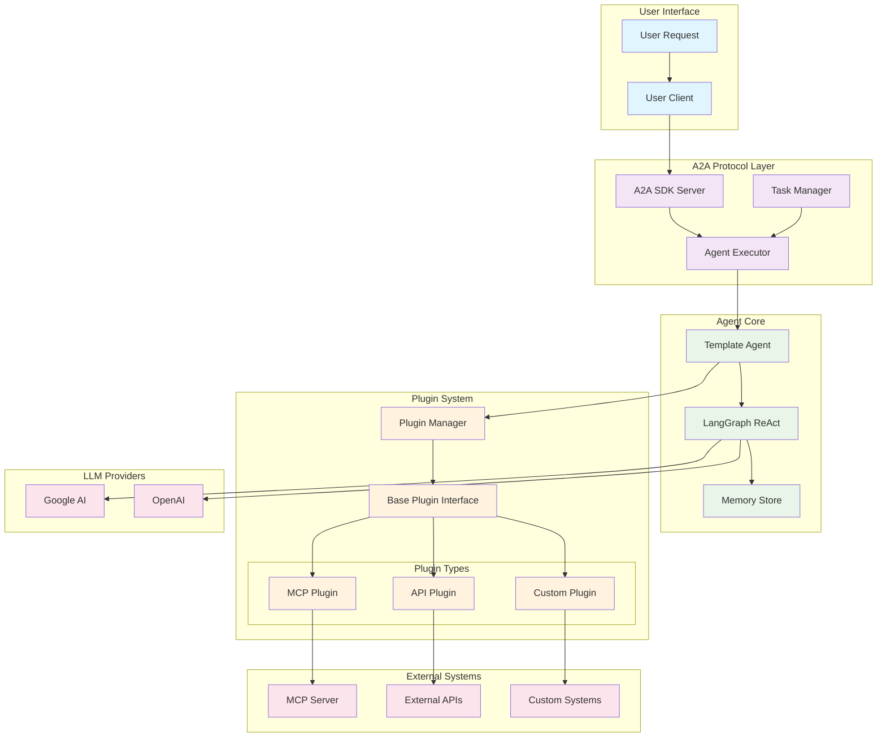
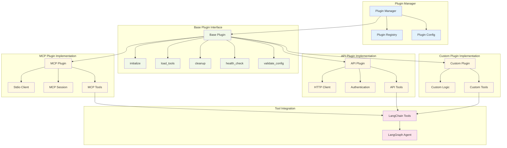
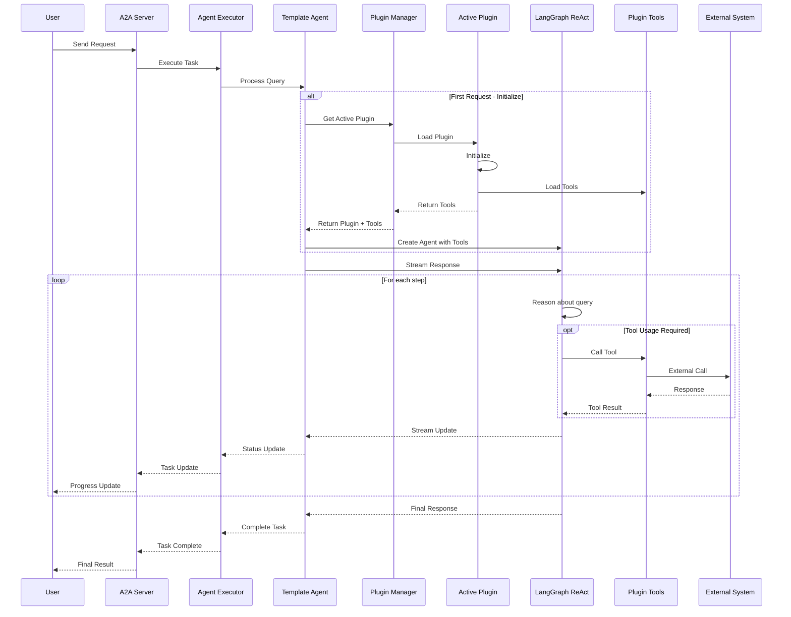
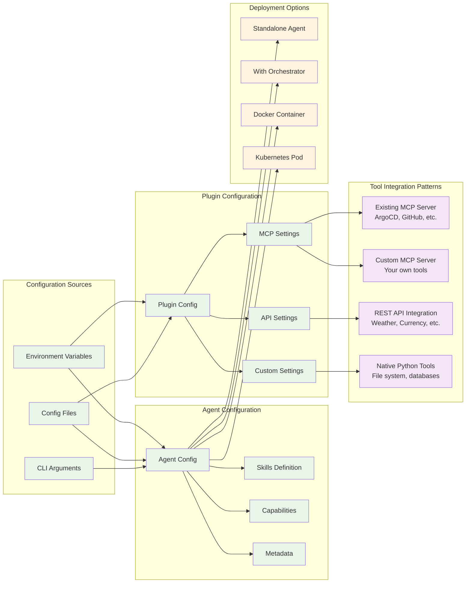

# Pluggable Agent Template Architecture Design

## Overview

This design presents a pluggable agent template architecture that extracts common patterns from existing agents (ArgoCD, Currency, Math) and provides a flexible framework for creating new agents with different tool integration approaches.

The template architecture enables rapid development of specialized agents while maintaining consistency, testability, and scalability across different tool integration patterns.

## System Architecture

The overall system architecture provides clear separation of concerns across multiple layers:



### Architecture Layers

- **User Interface Layer**: Handles user requests and client interactions
- **A2A Protocol Layer**: Provides standardized agent communication via the A2A SDK
- **Agent Core**: Contains the main template agent with LangGraph ReAct patterns and memory
- **Plugin System**: Pluggable architecture supporting multiple tool integration patterns
- **External Systems**: Various external services and LLM providers

## Plugin System Design

The plugin system is the core innovation of this architecture, providing a flexible and extensible framework for tool integration:



### Plugin Components

- **Plugin Manager**: Centralized plugin lifecycle management, registry, and configuration
- **Base Plugin Interface**: Abstract interface defining standard plugin methods:
  - `initialize()`: Plugin initialization and setup
  - `load_tools()`: Load and configure plugin-specific tools
  - `cleanup()`: Resource cleanup and shutdown
  - `health_check()`: Plugin health monitoring
  - `validate_config()`: Configuration validation
- **Plugin Implementations**: Three main plugin types:
  - **MCP Plugin**: Integrates with Model Context Protocol servers
  - **API Plugin**: Integrates with REST APIs
  - **Custom Plugin**: Supports custom tool implementations
- **Tool Integration**: All plugins convert their tools to LangChain-compatible format for LangGraph

## Request Processing Flow

The system processes requests through a well-defined flow with streaming support:



### Processing Steps

1. **Request Initiation**: User sends request to A2A server
2. **Task Execution**: Agent executor processes the task
3. **Plugin Initialization**: Template agent initializes plugin system if needed
4. **Tool Loading**: Plugin manager loads the appropriate plugin and tools
5. **Query Processing**: LangGraph ReAct agent processes the query with streaming
6. **Tool Execution**: Tools are called as needed, interacting with external systems
7. **Progress Updates**: Progress updates are streamed back to the user
8. **Response Completion**: Final response is returned

## Configuration and Deployment

The architecture supports flexible configuration and multiple deployment patterns:



### Configuration Management

- **Configuration Sources**: Environment variables, config files, CLI arguments
- **Agent Configuration**: Skills, capabilities, metadata definition
- **Plugin Configuration**: Specific settings for each plugin type
- **Deployment Options**: Standalone, orchestrated, containerized, or Kubernetes deployment
- **Tool Integration Patterns**: Support for existing MCP servers, custom MCP servers, REST APIs, and native Python tools

## Pattern Extraction from Existing Agents

The template extracts and abstracts common patterns from three existing agents:

```mermaid
graph TB
    subgraph "Existing Agents Analysis"
        
        subgraph "ArgoCD Agent"
            ARGOCD[ArgoCD Agent]
            ARGOCD_A2A[A2A SDK]
            ARGOCD_LG[LangGraph]
            ARGOCD_MCP[ArgoCD MCP Server]
            ARGOCD_TOOLS[kubectl, git, helm tools]
        end
        
        subgraph "Currency Agent"
            CURRENCY[Currency Agent]
            CURRENCY_A2A[A2A SDK]
            CURRENCY_LG[LangGraph]
            CURRENCY_API[Frankfurter API]
            CURRENCY_TOOLS[exchange_rate tool]
        end
        
        subgraph "Math Agent"
            MATH[Math Agent]
            MATH_A2A[A2A SDK]
            MATH_LG[LangGraph]
            MATH_MCP[Custom MCP Server]
            MATH_TOOLS[add, multiply, etc.]
        end
    end
    
    subgraph "Template Architecture"
        TEMPLATE[Template Agent]
        TEMPLATE_A2A[A2A SDK]
        TEMPLATE_LG[LangGraph ReAct]
        PLUGIN_MGR[Plugin Manager]
        
        subgraph "Plugin Types"
            MCP_PLUGIN[MCP Plugin]
            API_PLUGIN[API Plugin]
            CUSTOM_PLUGIN[Custom Plugin]
        end
    end
    
    subgraph "Common Patterns Extracted"
        COMMON_A2A[A2A Protocol Integration]
        COMMON_LG[LangGraph ReAct Pattern]
        COMMON_TOOLS[Tool Integration]
        COMMON_CONFIG[Configuration Management]
        COMMON_HEALTH[Health Monitoring]
    end

    ARGOCD --> ARGOCD_A2A
    ARGOCD --> ARGOCD_LG
    ARGOCD --> ARGOCD_MCP
    ARGOCD_MCP --> ARGOCD_TOOLS
    
    CURRENCY --> CURRENCY_A2A
    CURRENCY --> CURRENCY_LG
    CURRENCY --> CURRENCY_API
    CURRENCY_API --> CURRENCY_TOOLS
    
    MATH --> MATH_A2A
    MATH --> MATH_LG
    MATH --> MATH_MCP
    MATH_MCP --> MATH_TOOLS
    
    TEMPLATE --> TEMPLATE_A2A
    TEMPLATE --> TEMPLATE_LG
    TEMPLATE --> PLUGIN_MGR
    PLUGIN_MGR --> MCP_PLUGIN
    PLUGIN_MGR --> API_PLUGIN
    PLUGIN_MGR --> CUSTOM_PLUGIN
    
    ARGOCD_A2A -.-> COMMON_A2A
    CURRENCY_A2A -.-> COMMON_A2A
    MATH_A2A -.-> COMMON_A2A
    
    ARGOCD_LG -.-> COMMON_LG
    CURRENCY_LG -.-> COMMON_LG
    MATH_LG -.-> COMMON_LG
    
    ARGOCD_TOOLS -.-> COMMON_TOOLS
    CURRENCY_TOOLS -.-> COMMON_TOOLS
    MATH_TOOLS -.-> COMMON_TOOLS
    
    COMMON_A2A -.-> TEMPLATE_A2A
    COMMON_LG -.-> TEMPLATE_LG
    COMMON_TOOLS -.-> PLUGIN_MGR
    COMMON_CONFIG -.-> TEMPLATE
    COMMON_HEALTH -.-> TEMPLATE
    
    MCP_PLUGIN -.-> ARGOCD_MCP
    MCP_PLUGIN -.-> MATH_MCP
    API_PLUGIN -.-> CURRENCY_API
    
    classDef existing fill:#e1f5fe
    classDef template fill:#e8f5e8
    classDef common fill:#fff3e0
    
    class ARGOCD,ARGOCD_A2A,ARGOCD_LG,ARGOCD_MCP,ARGOCD_TOOLS,CURRENCY,CURRENCY_A2A,CURRENCY_LG,CURRENCY_API,CURRENCY_TOOLS,MATH,MATH_A2A,MATH_LG,MATH_MCP,MATH_TOOLS existing
    class TEMPLATE,TEMPLATE_A2A,TEMPLATE_LG,PLUGIN_MGR,MCP_PLUGIN,API_PLUGIN,CUSTOM_PLUGIN template
    class COMMON_A2A,COMMON_LG,COMMON_TOOLS,COMMON_CONFIG,COMMON_HEALTH common
```



### Agent Pattern Analysis

- **ArgoCD Agent** → **MCP Plugin Pattern**: Integrates with existing MCP server for Kubernetes/GitOps operations
- **Currency Agent** → **API Plugin Pattern**: Integrates with REST APIs for currency exchange operations
- **Math Agent** → **Custom Plugin Pattern**: Uses custom MCP server for mathematical calculations

### Common Patterns Extracted

All three agents share common patterns that are abstracted into the template:

- **A2A Protocol Integration**: Standardized agent communication
- **LangGraph ReAct Patterns**: Consistent reasoning and action patterns
- **Tool Integration Approaches**: Various methods for external tool integration
- **Configuration Management**: Environment-driven configuration
- **Health Monitoring**: Status reporting and health checks

## Key Design Principles

### 1. Pluggability
Easy to add new tool integration patterns without modifying core agent code. The plugin system provides a clean interface for extending functionality.

### 2. Standardization
Common interface for all plugin types while maintaining flexibility for specific tool requirements.

### 3. Configuration-Driven
Plugin selection and behavior controlled via environment variables and config files, enabling easy customization without code changes.

### 4. Hot-Swappable
Plugin manager supports runtime plugin switching, allowing for dynamic tool integration changes.

### 5. Extensibility
Base plugin interface allows for future plugin types and tool integration patterns.

### 6. Compatibility
Full compatibility with existing A2A SDK and LangGraph patterns, ensuring seamless integration.

## Benefits

### Development Efficiency
- **Reduced Development Time**: New agents can be created by simply configuring plugins
- **Rapid Prototyping**: Quick experimentation with different tool combinations
- **Consistent Patterns**: Standardized approach reduces learning curve

### Maintenance and Operations
- **Consistent Architecture**: All agents follow the same architectural patterns
- **Maintainability**: Plugin system isolates tool-specific logic
- **Testability**: Each plugin can be tested independently
- **Monitoring**: Built-in health checks and status reporting

### Scalability and Flexibility
- **Easy Extension**: Simple to add new tool integration patterns
- **Configuration Flexibility**: Multiple configuration sources and deployment options
- **Plugin Ecosystem**: Supports building a library of reusable plugins

## Usage Examples

### Creating a New Agent with MCP Plugin

```bash
# Set environment variables
export TOOL_TYPE=mcp
export MCP_SERVER_PATH=/path/to/mcp/server
export AGENT_NAME=MyCustomAgent
export AGENT_DESCRIPTION="Agent for custom operations"

# Run the agent
python -m app
```

### Creating a New Agent with API Plugin

```bash
# Set environment variables
export TOOL_TYPE=api
export API_BASE_URL=https://api.example.com
export API_KEY=your-api-key
export AGENT_NAME=APIAgent
export AGENT_SKILLS="API integration, data processing"

# Run the agent
python -m app
```

### Creating a New Agent with Custom Plugin

```bash
# Set environment variables
export TOOL_TYPE=custom
export CUSTOM_TOOL_MODULE=my_custom_tools
export AGENT_NAME=CustomAgent
export AGENT_CAPABILITIES="Custom processing, specialized operations"

# Run the agent
python -m app
```

## Future Enhancements

### Plugin Ecosystem
- **Plugin Registry**: Centralized registry for sharing plugins
- **Plugin Marketplace**: Community-driven plugin distribution
- **Plugin Versioning**: Support for plugin version management

### Advanced Features
- **Multi-Plugin Support**: Ability to load multiple plugins simultaneously
- **Plugin Chaining**: Sequential plugin processing capabilities
- **Dynamic Loading**: Runtime plugin discovery and loading

### Integration Enhancements
- **Monitoring Integration**: Enhanced metrics and monitoring
- **Security Features**: Plugin sandboxing and security controls
- **Performance Optimization**: Caching and optimization features

## Conclusion

The Pluggable Agent Template Architecture provides a robust foundation for creating specialized agents while maintaining consistency, flexibility, and scalability. By extracting common patterns from existing agents and providing a pluggable framework, this architecture enables rapid development of new agents with diverse tool integration requirements.

The architecture's design principles of pluggability, standardization, and configuration-driven behavior ensure that new agents can be created quickly while maintaining high quality and consistency across the ecosystem. 