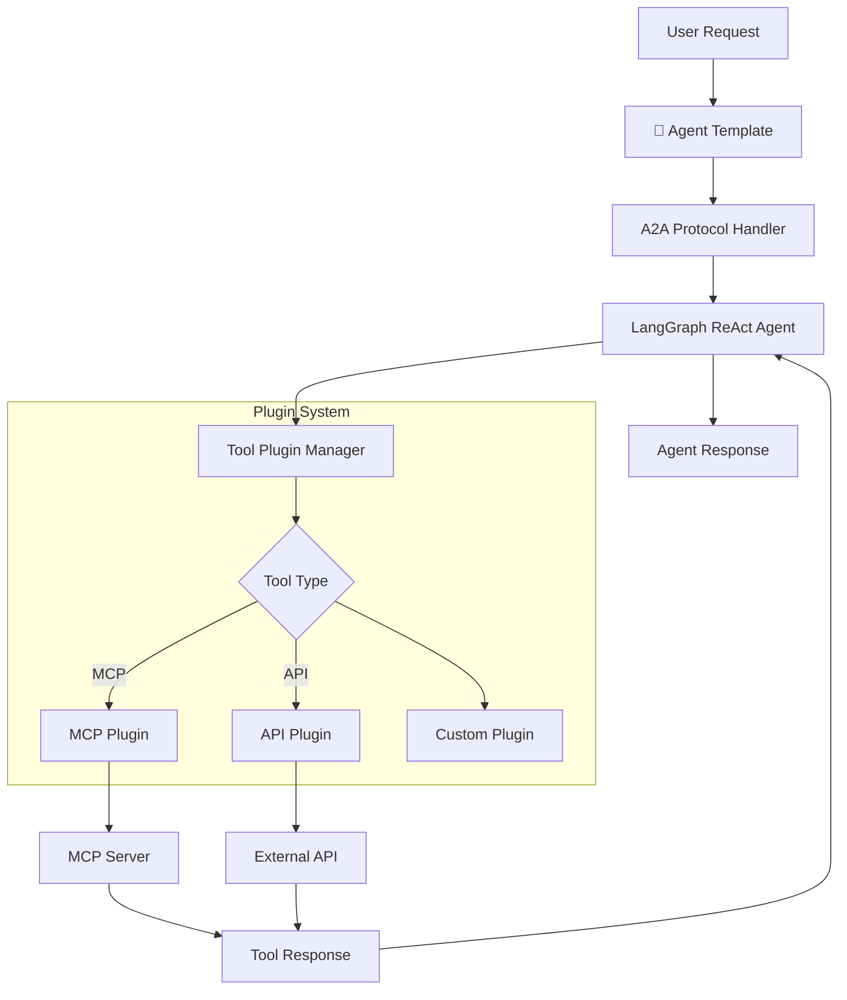

# Agent Template - Pluggable A2A + LangGraph Framework

A flexible and extensible agent template built with **A2A SDK** and **LangGraph** that supports pluggable tool integrations. This template provides a unified framework for creating agents that can work with either **MCP servers** or **API-based tools**.

## 🏗️ Architecture Overview

The agent template follows a modular architecture that separates concerns and allows for easy extension:



## ✨ Key Features

### 🔌 Pluggable Architecture
- **MCP Plugin**: Integrate with existing or custom MCP servers
- **API Plugin**: Connect to external APIs and services
- **Custom Plugins**: Extend with your own tool integrations
- **Hot-swappable**: Change tool sources without code changes

### 🤖 Core A2A + LangGraph Integration
- **A2A Protocol**: Standardized agent communication
- **LangGraph ReAct**: Intelligent reasoning and action patterns
- **Streaming Support**: Real-time response streaming
- **Context Management**: Multi-turn conversation support

### 🛠️ Developer-Friendly
- **Template-based**: Quick agent creation from template
- **Configuration-driven**: Environment-based configuration
- **Extensible**: Easy to add new capabilities
- **Test-ready**: Built-in testing framework

## 🚀 Quick Start

### 1. Create New Agent from Template

```bash
# Copy template to create new agent
cp -r agentTemplate myNewAgent
cd myNewAgent

# Install dependencies
uv sync

# Set up environment
echo "GOOGLE_API_KEY=your_api_key_here" > .env
echo "AGENT_NAME=MyNewAgent" >> .env
echo "AGENT_PORT=8004" >> .env
```

### 2. Configure Tool Plugins

Choose your tool integration method:

#### Option A: MCP Plugin (Existing MCP Server)
```bash
# Use existing MCP server
echo "TOOL_TYPE=mcp" >> .env
echo "MCP_COMMAND=npx your-mcp-server@latest stdio" >> .env
```

#### Option B: MCP Plugin (Custom MCP Server)
```bash
# Use custom MCP server
echo "TOOL_TYPE=mcp" >> .env
echo "MCP_COMMAND=python custom_mcp_server.py" >> .env
```

#### Option C: API Plugin
```bash
# Use API-based tools
echo "TOOL_TYPE=api" >> .env
echo "API_BASE_URL=https://api.example.com" >> .env
echo "API_KEY=your_api_key" >> .env
```

### 3. Customize Agent Configuration

Edit `config/agent_config.py`:

```python
from a2a.types import AgentSkill

AGENT_SKILLS = [
    AgentSkill(
        id="your_primary_skill",
        name="Your Primary Skill",
        description="Description of what your agent does",
        tags=["keyword1", "keyword2", "keyword3"],
        examples=["Example query 1", "Example query 2"]
    )
]

AGENT_DESCRIPTION = "Your agent description here"
AGENT_KEYWORDS = ["keyword1", "keyword2", "keyword3"]
```

### 4. Run Your Agent

```bash
# Start the agent
uv run -m app

# Test the agent
uv run -m app.test_client
```

## 🔧 Plugin System

### MCP Plugin

The MCP plugin allows integration with Model Context Protocol servers:

```python
# plugins/mcp_plugin.py
class MCPPlugin(BasePlugin):
    async def load_tools(self):
        # Load tools from MCP server
        server_params = StdioServerParameters(
            command=self.config.mcp_command.split()[0],
            args=self.config.mcp_command.split()[1:]
        )
        
        async with stdio_client(server_params) as (read, write):
            session = ClientSession(read, write)
            tools = await load_mcp_tools(session)
            return tools
```

### API Plugin

The API plugin enables direct integration with external APIs:

```python
# plugins/api_plugin.py
class APIPlugin(BasePlugin):
    def load_tools(self):
        # Create API-based tools
        return [
            self.create_api_tool(
                name="api_function",
                description="Function description",
                endpoint="/api/endpoint",
                method="POST"
            )
        ]
```

### Custom Plugin

Create custom plugins for specialized integrations:

```python
# plugins/custom_plugin.py
class CustomPlugin(BasePlugin):
    def load_tools(self):
        # Implement your custom tool loading logic
        return [
            Tool(
                name="custom_tool",
                description="Custom tool description",
                func=self.custom_function
            )
        ]
```

## 📁 Project Structure

```
agentTemplate/
├── app/
│   ├── __init__.py
│   ├── __main__.py              # A2A server entry point
│   ├── agent_executor.py        # A2A protocol executor
│   ├── agent.py                 # Core agent logic
│   └── test_client.py           # Test client
├── config/
│   ├── __init__.py
│   ├── agent_config.py          # Agent configuration
│   └── plugin_config.py         # Plugin configuration
├── plugins/
│   ├── __init__.py
│   ├── base_plugin.py           # Base plugin interface
│   ├── mcp_plugin.py            # MCP integration plugin
│   ├── api_plugin.py            # API integration plugin
│   └── plugin_manager.py        # Plugin management
├── examples/
│   ├── mcp_example/             # MCP plugin example
│   ├── api_example/             # API plugin example
│   └── custom_example/          # Custom plugin example
├── pyproject.toml               # Dependencies
├── .env.example                 # Environment template
└── README.md                    # This file
```

## 🎯 Usage Examples

### Example 1: Weather Agent with API Plugin

```bash
# Configure for weather API
echo "TOOL_TYPE=api" > .env
echo "API_BASE_URL=https://api.openweathermap.org" >> .env
echo "API_KEY=your_weather_api_key" >> .env
echo "AGENT_NAME=WeatherAgent" >> .env

# Customize skills in config/agent_config.py
AGENT_SKILLS = [
    AgentSkill(
        id="weather_forecast",
        name="Weather Forecast",
        description="Get weather information and forecasts",
        tags=["weather", "forecast", "temperature", "rain"],
        examples=["What's the weather in New York?", "Will it rain tomorrow?"]
    )
]
```

### Example 2: Database Agent with MCP Plugin

```bash
# Configure for database MCP server
echo "TOOL_TYPE=mcp" > .env
echo "MCP_COMMAND=python database_mcp_server.py" >> .env
echo "AGENT_NAME=DatabaseAgent" >> .env

# Customize skills for database operations
AGENT_SKILLS = [
    AgentSkill(
        id="database_query",
        name="Database Query",
        description="Execute database queries and operations",
        tags=["database", "sql", "query", "data"],
        examples=["Show me all users", "Count orders by status"]
    )
]
```

### Example 3: Custom File Agent

```bash
# Configure for custom file operations
echo "TOOL_TYPE=custom" > .env
echo "AGENT_NAME=FileAgent" >> .env

# Implement custom plugin for file operations
# plugins/file_plugin.py - implement file system tools
```

## 🔧 Configuration

### Environment Variables

```bash
# Core Configuration
GOOGLE_API_KEY=your_google_api_key          # Required: LLM API key
AGENT_NAME=YourAgentName                    # Agent display name
AGENT_PORT=8004                             # Agent port (default: 8004)

# Tool Configuration
TOOL_TYPE=mcp|api|custom                    # Plugin type
MCP_COMMAND=python your_mcp_server.py       # MCP server command
API_BASE_URL=https://api.example.com        # API base URL
API_KEY=your_api_key                        # API authentication key

# Optional Configuration
LOG_LEVEL=INFO                              # Logging level
STREAMING_ENABLED=true                      # Enable streaming responses
CONTEXT_MEMORY=true                         # Enable conversation memory
```

### Plugin Configuration

```python
# config/plugin_config.py
PLUGIN_CONFIGS = {
    "mcp": {
        "command": "python math_mcp_server.py",
        "timeout": 30,
        "retry_count": 3
    },
    "api": {
        "base_url": "https://api.example.com",
        "timeout": 10,
        "rate_limit": 100
    },
    "custom": {
        "module": "plugins.custom_plugin",
        "class": "CustomPlugin"
    }
}
```

## 🧪 Testing

### Unit Tests

```bash
# Run all tests
uv run pytest

# Run specific test categories
uv run pytest tests/test_plugins.py
uv run pytest tests/test_agent.py
uv run pytest tests/test_integration.py
```

### Integration Tests

```bash
# Test MCP integration
uv run -m app.test_client --plugin mcp

# Test API integration
uv run -m app.test_client --plugin api

# Test custom plugin
uv run -m app.test_client --plugin custom
```

## 🔮 Extension Points

### Adding New Plugin Types

1. Create plugin class extending `BasePlugin`
2. Implement `load_tools()` method
3. Register in `plugin_manager.py`
4. Add configuration in `plugin_config.py`

### Custom Tool Creation

```python
from langchain_core.tools import tool

@tool
def custom_function(param1: str, param2: int) -> str:
    """Custom tool function description"""
    # Implement your logic here
    return f"Result for {param1} with {param2}"
```

### Response Format Customization

```python
from pydantic import BaseModel

class CustomResponseFormat(BaseModel):
    status: str
    data: dict
    metadata: dict
```

## 📚 Plugin Development Guide

### 1. Base Plugin Interface

```python
from abc import ABC, abstractmethod
from typing import List, Any

class BasePlugin(ABC):
    def __init__(self, config: dict):
        self.config = config
    
    @abstractmethod
    async def load_tools(self) -> List[Any]:
        """Load tools for this plugin"""
        pass
    
    @abstractmethod
    async def cleanup(self):
        """Clean up resources"""
        pass
```

### 2. Tool Registration

```python
# In your plugin
def register_tools(self):
    return [
        {
            "name": "tool_name",
            "description": "Tool description",
            "handler": self.tool_handler,
            "schema": tool_schema
        }
    ]
```

### 3. Error Handling

```python
class PluginError(Exception):
    """Base plugin exception"""
    pass

class MCPConnectionError(PluginError):
    """MCP connection error"""
    pass

class APIError(PluginError):
    """API error"""
    pass
```

## 🤝 Contributing

1. Fork the repository
2. Create a feature branch
3. Implement your changes
4. Add tests
5. Submit a pull request

## 📖 Examples Repository

Check the `examples/` directory for complete implementations:

- **MCP Example**: Complete MCP-based agent
- **API Example**: REST API integration
- **Custom Example**: Custom tool implementation
- **Hybrid Example**: Mixed MCP and API tools

---

**Built with A2A SDK, LangGraph, and Plugin Architecture** 🔌 