<!-- START doctoc generated TOC please keep comment here to allow auto update -->
<!-- DON'T EDIT THIS SECTION, INSTEAD RE-RUN doctoc TO UPDATE -->
**Table of Contents**  *generated with [DocToc](https://github.com/thlorenz/doctoc)*

- [Aichestra: Building an Intelligent Agent Routing System with A2A Protocol and LangGraph](#aichestra-building-an-intelligent-agent-routing-system-with-a2a-protocol-and-langgraph)
  - [Background](#background)
  - [Project Overview](#project-overview)
  - [Architecture](#architecture)
    - [Smart Orchestrator](#smart-orchestrator)
    - [A2A Protocol Integration](#a2a-protocol-integration)
    - [MCP Integration](#mcp-integration)
    - [LangGraph Integration](#langgraph-integration)
  - [Sequence Diagram: "What is 10 USD to INR?"](#sequence-diagram-what-is-10-usd-to-inr)
  - [How the Orchestrator Works](#how-the-orchestrator-works)
    - [Agent Discovery and Registration](#agent-discovery-and-registration)
    - [Request Processing Pipeline](#request-processing-pipeline)
    - [Confidence Scoring Algorithm](#confidence-scoring-algorithm)
  - [Agent Interaction Examples](#agent-interaction-examples)
    - [Agent Discovery Display](#agent-discovery-display)
    - [Intelligent Routing Examples](#intelligent-routing-examples)
    - [Agent Register](#agent-register)
    - [Agent Unregister](#agent-unregister)
    - [Agent List](#agent-list)
  - [Future Improvements](#future-improvements)
    - [Multi-Agent Collaboration](#multi-agent-collaboration)
    - [Data Persistence and Recovery](#data-persistence-and-recovery)
    - [Advanced Routing Intelligence](#advanced-routing-intelligence)
    - [Enhanced Monitoring and Analytics](#enhanced-monitoring-and-analytics)
  - [Conclusion](#conclusion)

<!-- END doctoc generated TOC please keep comment here to allow auto update -->

# Aichestra: Building an Intelligent Agent Routing System with A2A Protocol and LangGraph

## Background

In today's rapidly evolving AI landscape, organizations are increasingly adopting specialized AI agents to handle specific tasks - from currency conversions to mathematical calculations to Kubernetes operations. However, managing multiple agents and routing user requests to the right agent presents significant challenges. How do you ensure that a currency conversion request reaches the currency agent, while a mathematical equation gets routed to the math agent?

**Aichestra** solves this problem by providing an intelligent orchestration system that automatically routes user requests to the most appropriate specialized agent using dynamic capability discovery, skill-based matching, and confidence scoring.

## Project Overview

Aichestra is an intelligent multi-agent routing system built with modern technologies:

- **🤖 Smart Orchestrator**: Central routing engine using LangGraph workflows
- **🔧 Orchestrator Client**: Command-line interface for seamless interactions
- **🔗 A2A Protocol**: Standardized agent communication protocol
- **💰 Sample Agent: Currency Agent**: Specialized for financial operations and exchange rates
- **🧮 Sample Agent: Math Agent**: Advanced mathematical calculations and equation solving
- **☸️ Sample Agent: ArgoCD Agent**: Kubernetes and GitOps operations management

## Architecture

The Aichestra system follows a hub-and-spoke architecture with the Smart Orchestrator at its center:

```mermaid
graph TB
    subgraph "Client Layer"
        CLI[🔧 Orchestrator Client]
        API[🌐 Direct API Access]
    end
    
    subgraph "Orchestration Layer"
        ORCH[🤖 Smart Orchestrator<br/>Port 8000]
        
        subgraph "A2A Integration"
            RESOLVER[A2A Card Resolver]
            DISCOVERY[Dynamic Agent Discovery]
            SCORING[Confidence Scoring Engine]
        end
        
        subgraph "LangGraph Workflow"
            ANALYZE[Analyze Request]
            ROUTE[Route to Agent]
        end
    end
    
    subgraph "Agent Layer"
        CURRENCY[💰 Currency Agent<br/>Port 8002]
        MATH[🧮 Math Agent<br/>Port 8003]  
        ARGOCD[☸️ ArgoCD Agent<br/>Port 8001]
    end
    
    subgraph "External Services"
        FRANKFURTER[Frankfurter API<br/>Exchange Rates]
        ARGOMCP[ArgoCD MCP Server]
        MATHMCP[Math MCP Server]
    end
    
    CLI --> ORCH
    API --> ORCH
    
    ORCH --> RESOLVER
    RESOLVER --> DISCOVERY
    DISCOVERY --> SCORING
    SCORING --> ANALYZE
    ANALYZE --> ROUTE
    
    ROUTE --> CURRENCY
    ROUTE --> MATH
    ROUTE --> ARGOCD
    
    CURRENCY --> FRANKFURTER
    MATH --> MATHMCP
    ARGOCD --> ARGOMCP
```



### Smart Orchestrator
The orchestrator serves as the intelligent routing engine:

- **A2A Card Resolver**: Fetches agent capabilities from running endpoints
- **Dynamic Skill Registry**: Extracts skills, tags, and keywords from AgentCards
- **Confidence Scoring**: Quantifies routing decisions (0.0-1.0 scale)
- **LangGraph Workflow**: Simple analyze → route decision process
- **Agent Communication**: HTTP-based communication with selected agents
- **Agent Management**: Register and unregister agents

### A2A Protocol Integration
The system uses the A2A (Agent-to-Agent) protocol for standardized communication:

```python
# Agent Card structure
AgentCard(
    name="Currency Agent",
    description="Handles currency exchange and financial data",
    url="http://localhost:8002/",
    skills=[
        AgentSkill(
            name="currency_exchange",
            tags=["currency", "exchange", "usd", "eur", "inr"],
            description="Currency exchange operations and rate lookups"
        )
    ]
)
```

### MCP Integration

The Model Context Protocol (MCP) provides a standardized way for agents to access external tools and resources. Aichestra supports both **custom MCP servers** that we build ourselves and **existing MCP servers** from the community:

**Custom MCP Server Development**
We can build specialized MCP servers tailored to our specific needs:

**Math Agent MCP Integration**
```python
# Math MCP Server with mathematical tools
from mcp import McpServer
from mcp.types import Tool, TextContent

class MathMCPServer:
    def __init__(self):
        self.server = McpServer("math-mcp-server")
        self.register_tools()
    
    def register_tools(self):
        @self.server.tool("calculate")
        async def calculate(expression: str) -> str:
            """Evaluate mathematical expressions safely"""
            # Safe mathematical evaluation
            return str(eval_math_expression(expression))
        
        @self.server.tool("solve_equation")
        async def solve_equation(equation: str) -> str:
            """Solve algebraic equations"""
            # Symbolic math solving
            return solve_symbolic_equation(equation)
```

**Existing MCP Server Integration**
We can also leverage existing MCP servers from the community:

**ArgoCD Agent MCP Integration with Akuity's ArgoCD MCP Server**
```python
# Using Akuity's ArgoCD MCP Server: https://github.com/akuity/argocd-mcp
class ArgocdAgent:
    def __init__(self):
        # Initialize ArgoCD MCP server in stdio mode
        self.mcp_toolkit = self._setup_argocd_mcp()
        self.model = ChatGoogleGenerativeAI(model='gemini-2.0-flash')
        
        # Get MCP tools from ArgoCD server
        mcp_tools = self.mcp_toolkit.get_tools()
        
        # Create LangGraph agent with ArgoCD MCP tools
        self.graph = create_react_agent(
            model=self.model,
            tools=mcp_tools,
            checkpointer=MemorySaver()
        )
    
    def _setup_argocd_mcp(self):
        """Setup ArgoCD MCP server using Akuity's implementation"""
        # Environment variables for ArgoCD connection
        argocd_base_url = os.getenv("ARGOCD_BASE_URL", "https://localhost:8080")
        argocd_api_token = os.getenv("ARGOCD_API_TOKEN")
        
        if not argocd_api_token:
            raise ValueError("ARGOCD_API_TOKEN environment variable is required")
        
        # Initialize MCPToolkit with ArgoCD MCP server
        return MCPToolkit(
            server_command=["npx", "argocd-mcp@latest", "stdio"],
            server_env={
                "ARGOCD_BASE_URL": argocd_base_url,
                "ARGOCD_API_TOKEN": argocd_api_token,
                # For self-signed certificates (development only)
                "NODE_TLS_REJECT_UNAUTHORIZED": "0"  # Use with caution
            },
            transport="stdio"
        )
```

**Benefits of MCP Integration**
1. **Standardized Tool Access**: Consistent interface for external tools
2. **Community Ecosystem**: Leverage existing MCP servers like Akuity's ArgoCD server
3. **Custom Extensions**: Build specialized tools for specific domains
4. **Secure Isolation**: Tools run in separate processes for security
5. **Easy Integration**: Simple protocol for adding new capabilities
6. **Production Ready**: Use battle-tested servers like the Akuity ArgoCD MCP server

### LangGraph Integration

LangGraph provides the workflow orchestration engine for both the Smart Orchestrator and individual agents:

**Smart Orchestrator LangGraph Workflow**
```python

class SmartOrchestrator:
    def _create_workflow(self):
        """Create the orchestrator's LangGraph workflow"""
        workflow = StateGraph(RouterState)
        
        # Define workflow nodes
        workflow.add_node("analyze", self._analyze_request)
        workflow.add_node("route", self._route_to_agent)
        
        # Define workflow edges
        workflow.add_edge("analyze", "route")
        workflow.set_entry_point("analyze")
        workflow.set_finish_point("route")
        
        return workflow.compile()
```

**Currency Agent LangGraph ReAct Pattern**
```python
from langgraph.prebuilt import create_react_agent
from langgraph.checkpoint.memory import MemorySaver

class CurrencyAgent:
    def __init__(self):
        # Initialize LLM and tools
        self.model = ChatGoogleGenerativeAI(model='gemini-2.0-flash')
        self.tools = [get_exchange_rate]
        self.memory = MemorySaver()
        
        # Create ReAct agent with LangGraph
        self.graph = create_react_agent(
            model=self.model,
            tools=self.tools,
            checkpointer=self.memory,
            prompt=self.SYSTEM_INSTRUCTION,
            response_format=ResponseFormat
        )
```

**Math Agent LangGraph with MCP Tools**
```python
from langchain_mcp_adapters import MCPToolkit

class MathAgent:
    def __init__(self):
        # Initialize MCP connection
        self.mcp_toolkit = MCPToolkit(
            server_path="./math_mcp_server.py",
            transport="stdio"
        )
        
        # Get MCP tools
        mcp_tools = self.mcp_toolkit.get_tools()
        
        # Create LangGraph agent with MCP tools
        self.model = ChatGoogleGenerativeAI(model='gemini-2.0-flash')
        self.graph = create_react_agent(
            model=self.model,
            tools=mcp_tools,
            checkpointer=MemorySaver()
        )
```

## Sequence Diagram: "What is 10 USD to INR?"

Let's trace through a complete request flow using the currency conversion example:

```mermaid
sequenceDiagram
    participant User
    participant OrchestratorClient as 🔧 Orchestrator Client
    participant SmartOrchestrator as 🤖 Smart Orchestrator
    participant CurrencyAgent as 💰 Currency Agent
    participant LangGraphEngine as LangGraph Engine
    participant GoogleAI as Google AI (Gemini)
    participant FrankfurterAPI as Frankfurter API

    User->>OrchestratorClient: "What is 10 USD to INR?"
    
    Note over OrchestratorClient: Create A2A message payload
    OrchestratorClient->>SmartOrchestrator: A2A JSON-RPC Request<br/>{"method": "message/send", "params": {...}}
    
    Note over SmartOrchestrator: LangGraph Workflow: Analyze Phase
    SmartOrchestrator->>SmartOrchestrator: Extract request content<br/>"What is 10 USD to INR?"
    
    Note over SmartOrchestrator: Skill-based matching algorithm
    SmartOrchestrator->>SmartOrchestrator: Calculate agent scores:<br/>Currency Agent: 4.5/5.0 (keywords: USD, INR, currency)<br/>Math Agent: 0.0/5.0<br/>ArgoCD Agent: 0.0/5.0
    
    Note over SmartOrchestrator: Confidence scoring & reasoning
    SmartOrchestrator->>SmartOrchestrator: Best Agent: Currency Agent<br/>Confidence: 0.90 (90%)<br/>Reasoning: "Selected Currency Agent based on keywords: usd, inr, currency"
    
    Note over SmartOrchestrator: LangGraph Workflow: Route Phase
    SmartOrchestrator->>CurrencyAgent: Forward A2A Request<br/>POST http://localhost:8002<br/>{"method": "message/send", "params": {...}}
    
    Note over CurrencyAgent: A2A Agent Executor Processing
    CurrencyAgent->>CurrencyAgent: Parse A2A message<br/>Extract user query: "What is 10 USD to INR?"
    
    Note over CurrencyAgent: LangGraph ReAct Agent Workflow
    CurrencyAgent->>LangGraphEngine: Initialize ReAct workflow<br/>with context_id and checkpointer
    
    LangGraphEngine->>GoogleAI: Analyze request<br/>"What is 10 USD to INR?"
    GoogleAI->>LangGraphEngine: Generate tool call plan<br/>get_exchange_rate(USD, INR, latest)
    
    LangGraphEngine->>CurrencyAgent: Execute tool: get_exchange_rate
    CurrencyAgent->>FrankfurterAPI: GET https://api.frankfurter.app/latest<br/>?from=USD&to=INR
    FrankfurterAPI->>CurrencyAgent: {"amount": 1.0, "base": "USD", "date": "2024-01-15", "rates": {"INR": 83.25}}
    
    CurrencyAgent->>LangGraphEngine: Tool result: {"rates": {"INR": 83.25}}
    LangGraphEngine->>GoogleAI: Format response with calculation<br/>10 USD × 83.25 = 832.50 INR
    GoogleAI->>LangGraphEngine: "10 USD equals 832.50 INR<br/>Current exchange rate: 1 USD = 83.25 INR"
    
    LangGraphEngine->>CurrencyAgent: Final structured response<br/>{"status": "completed", "message": "..."}
    
    Note over CurrencyAgent: A2A Response Formatting
    CurrencyAgent->>SmartOrchestrator: A2A JSON-RPC Response<br/>{"result": {"status": "completed", "response": "..."}}
    
    Note over SmartOrchestrator: Response Processing & Metadata
    SmartOrchestrator->>SmartOrchestrator: Add routing metadata:<br/>- Selected agent: Currency Agent<br/>- Confidence: 0.90<br/>- Processing time: 1.2s
    
    SmartOrchestrator->>OrchestratorClient: Complete Response<br/>🎯 Routed to Currency Agent → 10 USD equals 832.50 INR
    
    OrchestratorClient->>User: "🎯 Routed to Currency Agent → 10 USD equals 832.50 INR<br/>Current exchange rate: 1 USD = 83.25 INR<br/>Confidence: 90% | Processing time: 1.2s"
```



Key Steps in the Flow are as following:

1. **User Input**: User submits "What is 10 USD to INR?" through the orchestrator client
2. **A2A Protocol**: Client wraps the request in A2A JSON-RPC format and sends to orchestrator
3. **Request Analysis**: SmartOrchestrator extracts the request content and begins LangGraph workflow
4. **Skill Matching**: System calculates scores for each agent based on keywords and skills:
   - Currency Agent: 4.5/5.0 (matches "USD", "INR", currency context)
   - Math Agent: 0.0/5.0 (no mathematical operations detected)
   - ArgoCD Agent: 0.0/5.0 (no Kubernetes context)
5. **Confidence Scoring**: Converts raw score to confidence percentage (90% for Currency Agent)
6. **Agent Routing**: Forwards request to Currency Agent via A2A protocol
7. **LangGraph Processing**: Currency Agent uses ReAct pattern to understand and process request
8. **Tool Execution**: Agent calls `get_exchange_rate` tool to fetch live data from Frankfurter API
9. **Response Generation**: Agent calculates result and formats user-friendly response
10. **Response Routing**: Result flows back through orchestrator to client with routing information

## How the Orchestrator Works

### Agent Discovery and Registration

The orchestrator maintains a dynamic registry of available agents:

1. **Initialization**: Connects to default endpoints (8001, 8002, 8003)
2. **Card Fetching**: Uses A2A CardResolver to retrieve agent metadata
3. **Skill Extraction**: Builds searchable keyword registry from agent skills
4. **Dynamic Updates**: Supports runtime agent registration/unregistration

### Request Processing Pipeline

```python
async def process_request(self, request: str) -> Dict:
    # 1. Initialize LangGraph state
    initial_state = RouterState(request=request, ...)
    
    # 2. Execute workflow: analyze → route
    final_state = await self.workflow.ainvoke(initial_state)
    
    # 3. Return routing decision with metadata
    return {
        "selected_agent_name": agent_card.name,
        "confidence": final_state["confidence"],
        "reasoning": final_state["reasoning"],
        "response": final_state["response"]
    }
```

### Confidence Scoring Algorithm

The system uses a multi-factor scoring approach:

1. **Primary Matching** (Weight: 1.5)
   - Direct skill name matches
   - Skill description keyword matches

2. **Secondary Matching** (Weight: 1.0)
   - Agent skill tag matches
   - Agent name keyword matches

3. **Confidence Calculation**
   ```python
   confidence = min(best_score / 5.0, 1.0)  # Normalize to 0.0-1.0
   ```

4. **Fallback Strategy**
   - Default to ArgoCD agent if no clear winner
   - Minimum confidence threshold for routing decisions

## Agent Interaction Examples

### Agent Discovery Display

Once connected, you'll see available agents:

```console
% uv run . --agent http://localhost:8000
Will use headers: {}
======= Agent Card ========
{"capabilities":{"pushNotifications":true,"stateTransitionHistory":false,"streaming":false},"defaultInputModes":["text"],"defaultOutputModes":["text"],"description":"Intelligent agent that routes requests to specialized agents using LangGraph and A2A protocol","name":"Smart Orchestrator Agent","skills":[{"description":"Intelligent request routing to specialized agents","id":"request_routing","name":"Request Routing","tags":["routing","orchestration"]},{"description":"Multi-agent system coordination and management","id":"agent_coordination","name":"Agent Coordination","tags":["coordination","management"]},{"description":"Skill-based agent selection and matching","id":"skill_matching","name":"Skill Matching","tags":["matching","selection"]},{"description":"Confidence scoring for routing decisions","id":"confidence_scoring","name":"Confidence Scoring","tags":["scoring","confidence"]}],"url":"http://localhost:8000/","version":"1.0.0"}

============================================================
🤖 AVAILABLE AGENTS
============================================================
Found 3 available agents:

1. ArgoCD Agent (http://localhost:8001)
   Description: Handles ArgoCD and Kubernetes operations via MCP protocol
   Skills: Kubernetes Management, GitOps, Application Deployment (+3 more)

2. Currency Agent (http://localhost:8002/)
   Description: Handles currency exchange and financial data
   Skills: Currency exchange operations, Financial data analysis, Market analysis and trends (+2 more)

3. Math Agent (http://localhost:8003/)
   Description: Advanced mathematical assistant for calculations, equation solving, calculus, statistics, and matrix operations via MCP
   Skills: Arithmetic Calculation, Equation Solving, Calculus Operations (+2 more)

============================================================
💡 The orchestrator will automatically route your requests to the best agent!
============================================================
=========  starting a new task ========

What do you want to send to the agent? (:q or quit to exit):
```

### Intelligent Routing Examples

```bash
# Financial operations → Currency Agent
> "Convert 100 USD to EUR"
🎯 Routing to Currency Agent (100% confidence)
💰 Response: 100 USD = 85.32 EUR (current rate: 0.8532)

# Mathematical operations → Math Agent  
> "What is 2+3?"
🎯 Routing to Math Agent (95% confidence)
🧮 Response: 2 + 3 = 5

# Kubernetes operations → ArgoCD Agent
> "List all applications"
🎯 Routing to ArgoCD Agent (100% confidence)
☸️ Response: Found 5 applications: guestbook, web-app, api-service...
```

### Agent Register

```console
% uv run . --register_agent http://localhost:8003
Will use headers: {}
======= Agent Card ========
{"capabilities":{"pushNotifications":true,"stateTransitionHistory":false,"streaming":false},"defaultInputModes":["text"],"defaultOutputModes":["text"],"description":"Intelligent agent that routes requests to specialized agents using LangGraph and A2A protocol","name":"Smart Orchestrator Agent","skills":[{"description":"Intelligent request routing to specialized agents","id":"request_routing","name":"Request Routing","tags":["routing","orchestration"]},{"description":"Multi-agent system coordination and management","id":"agent_coordination","name":"Agent Coordination","tags":["coordination","management"]},{"description":"Skill-based agent selection and matching","id":"skill_matching","name":"Skill Matching","tags":["matching","selection"]},{"description":"Confidence scoring for routing decisions","id":"confidence_scoring","name":"Confidence Scoring","tags":["scoring","confidence"]}],"url":"http://localhost:8000/","version":"1.0.0"}
🔄 Registering agent http://localhost:8003 with orchestrator http://localhost:8000
📤 Sending registration request...
🎉 Registration completed successfully!
📄 ✅ Successfully registered Math Agent from http://localhost:8003
Agent ID: Math Agent
Agent Name: Math Agent
Total agents: 3
```

### Agent Unregister

```console
% uv run . --unregister_agent http://localhost:8003
Will use headers: {}
======= Agent Card ========
{"capabilities":{"pushNotifications":true,"stateTransitionHistory":false,"streaming":false},"defaultInputModes":["text"],"defaultOutputModes":["text"],"description":"Intelligent agent that routes requests to specialized agents using LangGraph and A2A protocol","name":"Smart Orchestrator Agent","skills":[{"description":"Intelligent request routing to specialized agents","id":"request_routing","name":"Request Routing","tags":["routing","orchestration"]},{"description":"Multi-agent system coordination and management","id":"agent_coordination","name":"Agent Coordination","tags":["coordination","management"]},{"description":"Skill-based agent selection and matching","id":"skill_matching","name":"Skill Matching","tags":["matching","selection"]},{"description":"Confidence scoring for routing decisions","id":"confidence_scoring","name":"Confidence Scoring","tags":["scoring","confidence"]}],"url":"http://localhost:8000/","version":"1.0.0"}
🔄 Unregistering agent http://localhost:8003 from orchestrator http://localhost:8000
📤 Sending unregistration request...
🎉 Unregistration completed successfully!
📄 ✅ Successfully unregistered Math Agent (ID: Math Agent)
Agent ID: Math Agent
Remaining agents: 2
```

### Agent List

```console
% uv run  . --list_agent
Will use headers: {}
======= Agent Card ========
{"capabilities":{"pushNotifications":true,"stateTransitionHistory":false,"streaming":false},"defaultInputModes":["text"],"defaultOutputModes":["text"],"description":"Intelligent agent that routes requests to specialized agents using LangGraph and A2A protocol","name":"Smart Orchestrator Agent","skills":[{"description":"Intelligent request routing to specialized agents","id":"request_routing","name":"Request Routing","tags":["routing","orchestration"]},{"description":"Multi-agent system coordination and management","id":"agent_coordination","name":"Agent Coordination","tags":["coordination","management"]},{"description":"Skill-based agent selection and matching","id":"skill_matching","name":"Skill Matching","tags":["matching","selection"]},{"description":"Confidence scoring for routing decisions","id":"confidence_scoring","name":"Confidence Scoring","tags":["scoring","confidence"]}],"url":"http://localhost:8000/","version":"1.0.0"}

============================================================
🤖 AVAILABLE AGENTS
============================================================
Found 3 available agents:

1. ArgoCD Agent (http://localhost:8001)
   Description: Handles ArgoCD and Kubernetes operations via MCP protocol
   Skills: Kubernetes Management, GitOps, Application Deployment (+3 more)

2. Currency Agent (http://localhost:8002/)
   Description: Handles currency exchange and financial data
   Skills: Currency exchange operations, Financial data analysis, Market analysis and trends (+2 more)

3. Math Agent (http://localhost:8003/)
   Description: Advanced mathematical assistant for calculations, equation solving, calculus, statistics, and matrix operations via MCP
   Skills: Arithmetic Calculation, Equation Solving, Calculus Operations (+2 more)

============================================================
💡 The orchestrator will automatically route your requests to the best agent!
============================================================
```

## Future Improvements

### Multi-Agent Collaboration

The current system focuses on single-agent routing, but future enhancements will support **multi-agent workflows**:

**Collaborative Task Execution**
```python
# Future: Multi-agent workflow for complex requests
request = "Calculate the total cost of deploying 5 replicas of an application that costs $10 USD per month, converted to EUR"

# Workflow would involve:
# 1. Math Agent: Calculate 5 × $10 = $50 USD
# 2. Currency Agent: Convert $50 USD to EUR  
# 3. ArgoCD Agent: Validate deployment configuration
# 4. Orchestrator: Combine results into final response
```

**Agent Coordination Patterns**
- **Sequential Workflows**: Agent A → Agent B → Agent C
- **Parallel Processing**: Multiple agents working simultaneously
- **Conditional Branching**: Route based on intermediate results
- **Error Recovery**: Fallback agents for failed operations

### Data Persistence and Recovery

**Conversation History**
```python
# Persistent conversation storage
class ConversationStore:
    async def save_conversation(self, context_id: str, messages: List[Message])
    async def retrieve_conversation(self, context_id: str) -> List[Message]
    async def search_conversations(self, query: str) -> List[ConversationSummary]
```

**Agent State Management**
- Persistent agent configurations and customizations
- Historical routing decisions for learning and optimization
- Agent performance metrics and success rates
- User preference learning for improved routing

**Recovery Mechanisms**
```python
# Future: Automatic recovery from agent failures
class RecoveryManager:
    async def handle_agent_failure(self, agent_id: str, request: str):
        # 1. Mark agent as temporarily unavailable
        # 2. Re-route to next best agent
        # 3. Log failure for analysis
        # 4. Attempt agent health recovery
```

### Advanced Routing Intelligence

**Machine Learning Integration**
- Learn from routing success/failure patterns
- User feedback integration for routing optimization
- Predictive routing based on request patterns
- Dynamic confidence threshold adjustment

**Context-Aware Routing**
```python
# Future: Context-aware agent selection
class ContextualRouter:
    def analyze_context(self, request: str, user_history: List[str], current_session: Session):
        # Consider user expertise level
        # Account for previous interactions
        # Adapt to user preferences
        # Optimize for session continuity
```

**Agent Load Balancing**
- Monitor agent response times and availability
- Distribute load across multiple instances of same agent type
- Implement circuit breaker patterns for failing agents
- Dynamic scaling based on demand

### Enhanced Monitoring and Analytics

**Real-time Dashboards**
- Agent performance metrics and health status
- Request routing patterns and success rates
- User interaction analytics and satisfaction scores
- System resource utilization and bottlenecks

**Observability Integration**
```python
# Future: Comprehensive observability
from prometheus_client import Counter, Histogram
from opentelemetry import trace

routing_counter = Counter('agent_routing_total', 'Total agent routing requests')
response_time = Histogram('agent_response_seconds', 'Agent response time')
tracer = trace.get_tracer(__name__)
```

## Conclusion

Aichestra represents a significant advancement in multi-agent system architecture by focusing on **intelligent single-agent routing** rather than complex multi-agent orchestration. The system's key innovations include:

**Technical Excellence**
- **A2A Protocol Integration**: Standardized, scalable agent communication
- **LangGraph Workflows**: Sophisticated AI-driven decision making
- **Dynamic Capability Discovery**: Self-organizing agent ecosystem
- **Confidence-Based Routing**: Transparent, explainable routing decisions

**Practical Benefits**
- **Simplified Architecture**: Easier to understand, deploy, and maintain
- **High Performance**: Direct routing eliminates coordination overhead
- **Extensible Design**: Easy to add new specialized agents
- **Developer Experience**: Clear APIs and comprehensive tooling

**Future Potential**
The foundation established by Aichestra's intelligent routing system provides an excellent platform for future enhancements. The planned multi-agent collaboration features will enable handling of complex, multi-step tasks while maintaining the system's core strengths of simplicity and reliability.

As organizations continue to adopt AI agents for specialized tasks, systems like Aichestra become essential infrastructure - providing the intelligent routing and coordination needed to make multi-agent systems practical and effective in real-world applications.

The project demonstrates that sometimes the most elegant solution is not the most complex one. By focusing on doing one thing exceptionally well - intelligent agent routing - Aichestra provides a solid foundation for the future of multi-agent systems.

---

**Built with LangGraph, A2A Protocol, and modern AI technologies** 🤖

*Explore the full source code and documentation at: [github.com/aichestra/aichestra](https://github.com/aichestra/aichestra)* 