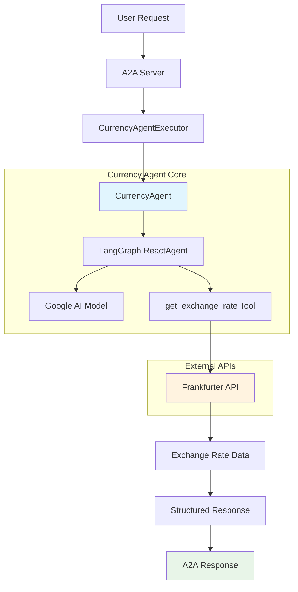
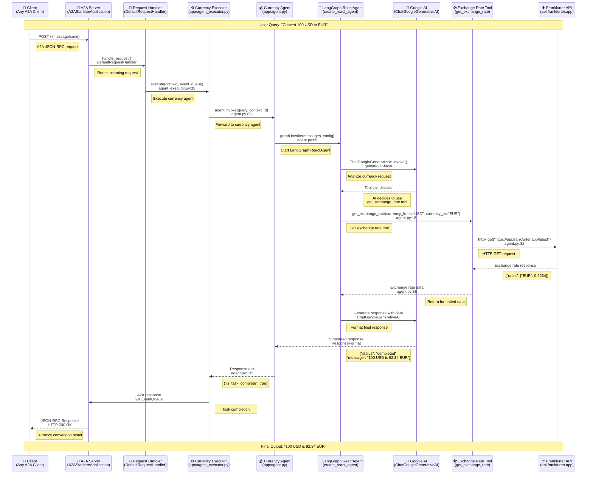

# Developer Guide: Currency Agent

This document provides a comprehensive technical overview of the Currency Agent, including its architecture, design patterns, implementation details, and best practices.

## 📋 Overview

The Currency Agent is a specialized A2A-compatible agent designed exclusively for currency exchange operations. It leverages the Frankfurter API for real-time exchange rates and uses LangGraph with Google AI for intelligent currency conversion assistance.

## 🏗️ Architecture Overview



## 🔄 Complete Function Call Flow



## 🔍 Core Components Analysis

### 1. Currency Agent Class (app/agent.py)

**Key Features:**
- Single-purpose currency conversion agent
- LangGraph ReactAgent integration
- Structured response format
- Google AI model with tool calling

**System Instruction:**
```python
SYSTEM_INSTRUCTION = (
    'You are a specialized assistant for currency conversions. '
    'Your sole purpose is to use the get_exchange_rate tool '
    'to answer questions about currency exchange rates.'
)
```

### 2. Exchange Rate Tool

**Implementation:**
```python
@tool
def get_exchange_rate(
    currency_from: str = 'USD',
    currency_to: str = 'EUR',
    currency_date: str = 'latest',
):
    """Use this to get current exchange rate."""
    # Frankfurter API integration
```

**Features:**
- Real-time exchange rates via Frankfurter API
- Historical rate support
- Comprehensive error handling
- Input validation

### 3. Response Format

**Structure:**
```python
class ResponseFormat(BaseModel):
    status: Literal['input_required', 'completed', 'error']
    message: str
```

**Status Types:**
- `input_required`: Need more information
- `completed`: Successfully processed
- `error`: Processing error occurred

## 🎯 Key Design Patterns

### 1. Single Responsibility Principle
- Handles only currency exchange operations
- Rejects non-currency requests politely
- Focused tool set with single exchange rate tool

### 2. Reactive Agent Pattern
- Uses LangGraph's create_react_agent
- Model reasons about request, then acts with tools
- Iterative process until completion

### 3. Structured Response Pattern
- Enforces consistent response format
- Status-based response handling
- Standardized error reporting

### 4. External API Integration
- Robust error handling for API failures
- Response validation and parsing
- Graceful degradation on errors

## 🔧 Configuration

### Environment Variables
```bash
model_source=google          # Model provider
GOOGLE_API_KEY=your_key     # Google AI API key
API_KEY=your_key            # Alternative API key
TOOL_LLM_NAME=gpt-4         # OpenAI model name
TOOL_LLM_URL=api_url        # OpenAI API URL
```

### Adding New Currency Sources
1. Create new tool function
2. Register tool in agent
3. Update system instruction

## 🧪 Testing

### Unit Testing
```python
@patch('httpx.get')
def test_get_exchange_rate_success(self, mock_get):
    mock_response = MagicMock()
    mock_response.json.return_value = {
        "rates": {"EUR": 0.9234}
    }
    mock_get.return_value = mock_response
    
    result = get_exchange_rate("USD", "EUR")
    assert "rates" in result
```

### Integration Testing
```python
async def test_full_currency_conversion():
    agent = CurrencyAgent()
    result = agent.invoke("Convert 100 USD to EUR", "test_context")
    assert result['is_task_complete'] == True
```

## 🚀 Performance Optimization

### API Response Caching
```python
@lru_cache(maxsize=100)
def get_cached_exchange_rate(currency_from, currency_to, date_str):
    return get_exchange_rate(currency_from, currency_to, date_str)
```

### Async Optimization
```python
async def get_multiple_rates(currency_pairs):
    tasks = [get_single_rate(pair[0], pair[1]) for pair in currency_pairs]
    return await asyncio.gather(*tasks)
```

## 🔒 Security Best Practices

### 1. API Key Management
- Use environment variables
- Validate API key format
- Never log API keys

### 2. Input Validation
```python
def validate_currency_code(currency: str) -> bool:
    return len(currency) == 3 and currency.isalpha()
```

### 3. Rate Limiting
- Implement request rate limiting
- Monitor API usage
- Handle rate limit responses

## 📚 Best Practices

1. **Error Handling**: Always handle API failures gracefully
2. **Input Validation**: Validate currency codes and amounts
3. **Response Consistency**: Use structured response format
4. **Performance**: Implement caching for frequently requested rates
5. **Security**: Protect API keys and validate inputs

## 🔄 Extension Points

### Adding New Tools
```python
@tool
def get_crypto_rates(crypto_from: str, currency_to: str):
    """Get cryptocurrency exchange rates"""
    pass
```

### Custom Response Processing
```python
def process_custom_response(self, raw_response):
    """Custom response processing logic"""
    return processed_response
```

## 📚 Related Documentation

- [Main README](../README.md) - Project overview
- [Currency Agent README](README.md) - User guide
- [A2A Protocol](https://github.com/modelcontextprotocol/a2a) - A2A specification
- [LangGraph](https://langchain-ai.github.io/langgraph/) - ReactAgent framework
- [Frankfurter API](https://www.frankfurter.app/) - Exchange rate API

---

*Last updated: January 2025* 