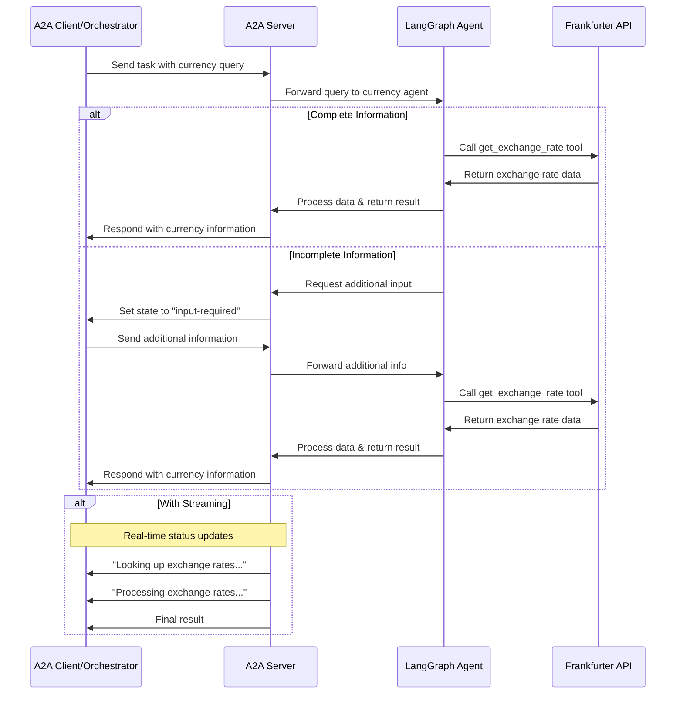

# LangGraph Currency Agent with A2A Protocol

This sample demonstrates a currency conversion agent built with [LangGraph](https://langchain-ai.github.io/langgraph/) and exposed through the A2A protocol. It showcases conversational interactions with support for multi-turn dialogue and streaming responses. **The agent can run standalone or as part of the [intelligent orchestrator system](../orchestrator/README.md)**.

## 🚀 Quick Start with Orchestrator

**Recommended**: Use the orchestrator for intelligent routing to this agent:

```bash
# Navigate to project root
cd ..

# Test orchestrator routing to Currency agent
cd orchestrator
uv sync
uv run -m app -m "Convert 100 USD to EUR" -v
uv run -m app -m "What's the exchange rate for GBP to CAD?" -v
```

The orchestrator will automatically route currency/financial requests to this agent based on:
- **Keywords**: `currency`, `exchange`, `rate`, `convert`, `dollar`, `eur`, `usd`, `financial`
- **Skills**: `currency_exchange`, `financial_data`, `market_analysis`, `rate_conversion`, `historical_data`

## 🏗️ System Integration

This agent integrates with the orchestrator system:

```mermaid
graph TD
    A[User: "Convert USD to EUR"] --> B[🤖 Orchestrator Agent]
    B --> C[Skill Analysis]
    C --> D[💰 Currency Agent - Port 8002]
    D --> E[LangGraph ReAct Agent]
    E --> F[Frankfurter API]
    F --> G[Real-time Exchange Rates]
```

## How It Works

This agent uses LangGraph with LLM (for example Google Gemini..) to provide currency exchange information through a ReAct agent pattern. The A2A protocol enables standardized interaction with the agent, allowing clients to send requests and receive real-time updates.



## Key Features

- **Multi-turn Conversations**: Agent can request additional information when needed
- **Real-time Streaming**: Provides status updates during processing
- **Push Notifications**: Support for webhook-based notifications
- **Conversational Memory**: Maintains context across interactions
- **Currency Exchange Tool**: Integrates with Frankfurter API for real-time rates
- **Orchestrator Integration**: Intelligent routing based on request content

## Prerequisites

- Python 3.12 or higher
- [UV](https://docs.astral.sh/uv/)
- Access to an LLM and API Key

## Setup & Running

### Option 1: Via Orchestrator (Recommended)

Run as part of the intelligent orchestration system:

```bash
# Terminal 1: Start Currency Agent
cd currencyAgent
uv sync
uv run -m app --port 8002

# Terminal 2: Start Orchestrator
cd ../orchestrator
uv run -m app --port 8000

# Terminal 3: Test routing
cd ../orchestrator
uv run -m app -m "What is the USD to EUR exchange rate?" -v
```

### Option 2: Standalone Agent

1. Navigate to the samples directory:

   ```bash
   cd currencyAgent
   ```

2. Create an environment file with your API key:

   ```bash
   # If you're using a Google Gemini model (gemini-pro, etc.):
   echo "GOOGLE_API_KEY=your_api_key_here" > .env
  
   # If you're using OpenAI or any compatible API (e.g., local LLM via Ollama, LM Studio, etc.):
   echo "API_KEY=your_api_key_here" > .env  # (not necessary if have no api key)
   echo "TOOL_LLM_URL=your_llm_url" > .env
   echo "TOOL_LLM_NAME=your_llm_name" > .env
   ```

3. Run the agent:

   ```bash
   # Basic run on default port 10000
   uv run app

   # On custom host/port (for orchestrator integration use port 8002)
   uv run app --host 0.0.0.0 --port 8002
   ```

4. In a separate terminal, run the test client:

   ```bash
   uv run app/test_client.py
   ```

## 🧪 Testing Scenarios

### 📋 Test Suite
The Currency Agent includes comprehensive testing:

- **[Test Documentation](test/README.md)** - Complete testing guide
- **`test_client.py`** - Currency exchange and financial data testing

```bash
# Run comprehensive test suite
cd currencyAgent
uv run python test/test_client.py

# Expected: Currency conversion, exchange rates, and error handling tests pass
```

### Via Orchestrator
```bash
cd orchestrator

# High-confidence Currency routing
uv run -m app -m "What is the exchange rate for USD to EUR?" -v      # 100% confidence
uv run -m app -m "Convert 100 USD to Japanese Yen" -v               # 80% confidence
uv run -m app -m "Calculate exchange rate between GBP and CAD" -v   # 100% confidence

# Skill-based routing
uv run -m app -m "financial market analysis" -v                     # 69% confidence
uv run -m app -m "Get historical currency rates" -v                 # 84% confidence
```

### Direct Agent Testing
```bash
cd currencyAgent

# Run the test client
uv run -m app.test_client

# Start agent server and test
uv run -m app --port 8002
# In another terminal:
curl -X POST http://localhost:8002 -H "Content-Type: application/json" -d '{"method": "message/send", "params": {"message": {"parts": [{"text": "Convert 100 USD to EUR"}]}}}'
```

## 🔗 Integration with Orchestrator

### Agent Card Configuration

The orchestrator recognizes this agent with the following capabilities:

```python
Currency Agent Card:
- agent_id: "currency"
- name: "Currency Agent"
- endpoint: "http://localhost:8002"
- skills:
  - currency_exchange (0.95)
  - financial_data (0.85)
  - market_analysis (0.8)
  - rate_conversion (0.9)
  - historical_data (0.75)
- keywords: ["currency", "exchange", "rate", "convert", "dollar"]
- capabilities: ["get_exchange_rate", "convert_currency", "get_historical_rates"]
```

### Routing Examples

The orchestrator routes these requests to the Currency agent:

| Request | Confidence | Matched Skills/Keywords |
|---------|------------|-------------------------|
| "What is the exchange rate for USD to EUR?" | 100% | exchange, rate, usd + currency_exchange |
| "Convert 100 USD to Japanese Yen" | 80% | convert, usd, yen |
| "Get historical currency rates" | 84% | currency, rate + historical_data |
| "Financial market analysis" | 69% | financial + financial_data, market_analysis |

## Build Container Image

Agent can also be built using a container file.

1. Navigate to the `currencyAgent` directory:

  ```bash
  cd currencyAgent
  ```

2. Build the container file

    ```bash
    podman build . -t langgraph-a2a-server
    ```

> [!Tip]  
> Podman is a drop-in replacement for `docker` which can also be used in these commands.

3. Run your container

    ```bash
    podman run -p 8002:8002 -e GOOGLE_API_KEY=your_api_key_here langgraph-a2a-server
    ```

4. Test with orchestrator

    ```bash
    cd ../orchestrator
    uv run -m app -m "Convert 100 USD to EUR" -v
    ```

> [!Important]
> * **Access URL:** You must access the A2A client through the URL `0.0.0.0:8002`. Using `localhost` will not work.
> * **Hostname Override:** If you're deploying to an environment where the hostname is defined differently outside the container, use the `HOST_OVERRIDE` environment variable to set the expected hostname on the Agent Card. This ensures proper communication with your client application.

## 🚀 Full System Setup

To run the complete orchestrated system:

### Terminal 1: Currency Agent
```bash
cd currencyAgent
uv sync
uv run -m app --port 8002
```

### Terminal 2: ArgoCD Agent (Optional)
```bash
cd ../argocdAgent
uv sync
uv run -m app --port 8001
```

### Terminal 3: Orchestrator
```bash
cd ../orchestrator
uv run -m app --port 8000
```

### Terminal 4: CLI Client
```bash
cd ../cli
uv run . --agent http://localhost:8000

# Now you can interact naturally:
# > "What's the current USD to EUR rate?"
# > "Convert 50 GBP to USD"
# > "Show me Bitcoin price in USD"
```

## Technical Implementation

- **LangGraph ReAct Agent**: Uses the ReAct pattern for reasoning and tool usage
- **Streaming Support**: Provides incremental updates during processing
- **Checkpoint Memory**: Maintains conversation state between turns
- **Push Notification System**: Webhook-based updates with JWK authentication
- **A2A Protocol Integration**: Full compliance with A2A specifications
- **Orchestrator Compatible**: Designed to work seamlessly with intelligent routing

## Limitations

- Only supports text-based input/output (no multi-modal support)
- Uses Frankfurter API which has limited currency options
- Memory is session-based and not persisted between server restarts

## Examples

### Via Orchestrator (Recommended)
```bash
cd orchestrator

# Natural language currency requests
uv run -m app -m "How much is 100 USD in EUR?" -v
uv run -m app -m "Convert 50 GBP to Japanese Yen" -v
uv run -m app -m "What's the Bitcoin price in USD?" -v
```

### Direct API Usage

**Synchronous request**

Request:

```
POST http://localhost:8002
Content-Type: application/json

{
    "id": "12113c25-b752-473f-977e-c9ad33cf4f56",
    "jsonrpc": "2.0",
    "method": "message/send",
    "params": {
        "message": {
            "kind": "message",
            "messageId": "120ec73f93024993becf954d03a672bc",
            "parts": [
                {
                    "kind": "text",
                    "text": "how much is 10 USD in INR?"
                }
            ],
            "role": "user"
        }
    }
}
```

Response:

```json
{
    "id": "12113c25-b752-473f-977e-c9ad33cf4f56",
    "jsonrpc": "2.0",
    "result": {
        "artifacts": [
            {
                "artifactId": "08373241-a745-4abe-a78b-9ca60882bcc6",
                "name": "conversion_result",
                "parts": [
                    {
                        "kind": "text",
                        "text": "10 USD is 856.2 INR."
                    }
                ]
            }
        ],
        "contextId": "e329f200-eaf4-4ae9-a8ef-a33cf9485367",
        "history": [
            {
                "contextId": "e329f200-eaf4-4ae9-a8ef-a33cf9485367",
                "kind": "message",
                "messageId": "120ec73f93024993becf954d03a672bc",
                "parts": [
                    {
                        "kind": "text",
                        "text": "how much is 10 USD in INR?"
                    }
                ]
            }
        ]
    }
}
```

## 🐛 Troubleshooting

### Connection Issues
```bash
# Check if agent is running
lsof -i :8002

# Restart agent
cd currencyAgent
uv run -m app --port 8002

# Test agent directly
uv run -m app.test_client
```

### Orchestrator Integration Issues
```bash
# Test if agent is reachable from orchestrator
curl http://localhost:8002/health

# Check orchestrator routing
cd ../orchestrator
uv run -m app -m "test currency" -v

# Verify API keys
echo $GOOGLE_API_KEY
echo $API_KEY
```

### API Issues
- **Frankfurter API**: Check if the API is accessible
- **LLM API Key**: Verify your Google API key or OpenAI API key is valid
- **Rate Limits**: Some APIs have rate limiting

## 📚 Related Documentation

- **[Main Project README](../README.md)** - Complete system overview
- **[Orchestrator README](../orchestrator/README.md)** - Intelligent routing system
- **[Orchestrator Blog Post](../orchestrator/BLOG_POST.md)** - Technical architecture
- **[Orchestrator Client README](../orchestrator_client/README.md)** - Interactive client interface

## Notes

- **Best used with the orchestrator** for intelligent request routing and multi-agent coordination
- The agent uses Google's Gemini model by default; you can change to OpenAI by setting environment variables
- For production use, consider implementing proper authentication and rate limiting
- Memory is session-based and not persisted between server restarts

---

## 🎉 Quick Test Commands

```bash
# Test orchestrator routing (recommended)
cd ../orchestrator && uv run -m app -m "Convert 100 USD to EUR" -v

# Test agent directly
cd currencyAgent && uv run -m app.test_client

# Start agent server
cd currencyAgent && uv run -m app --port 8002
```
