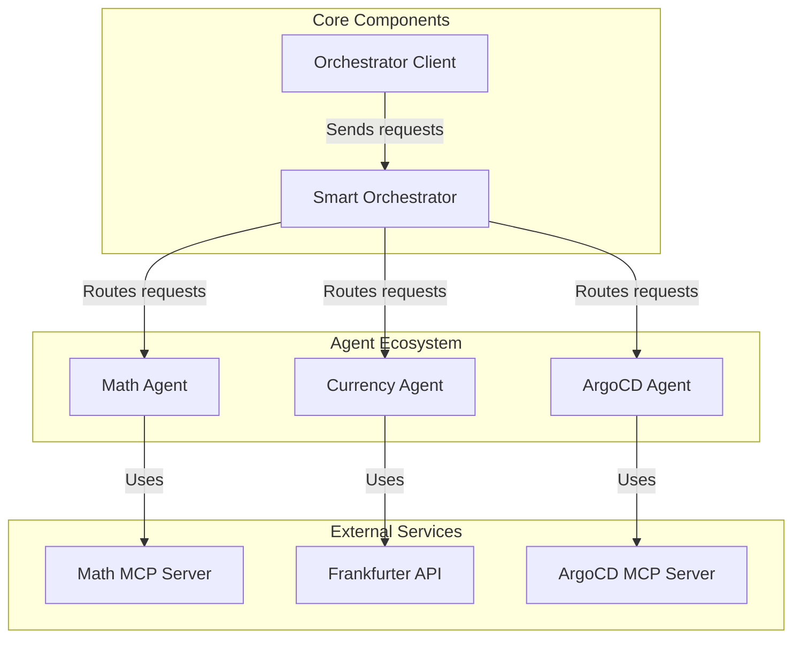
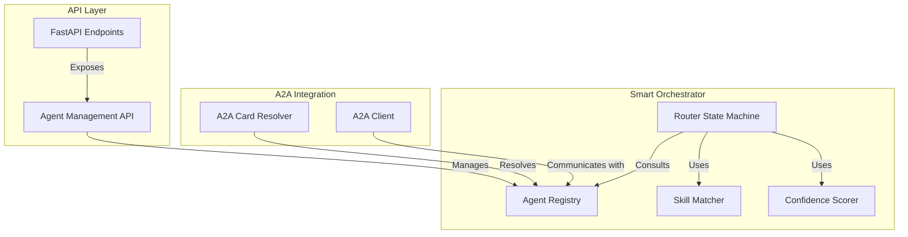
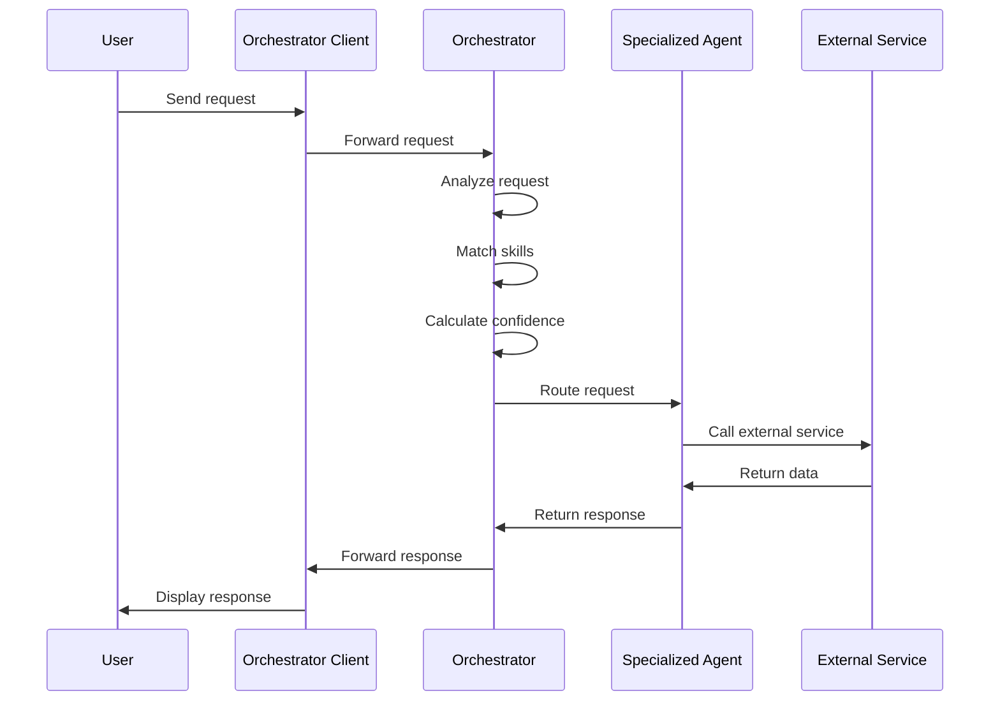
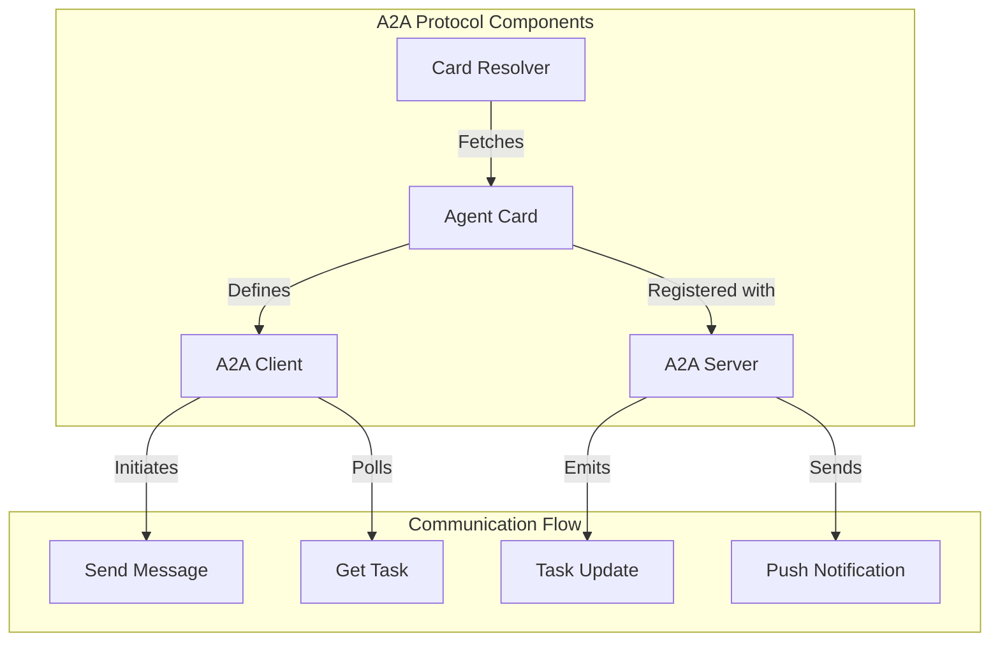
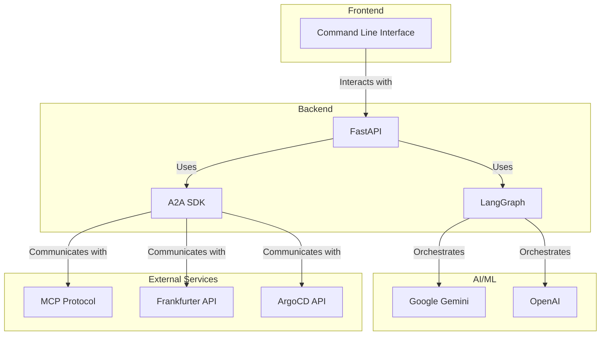
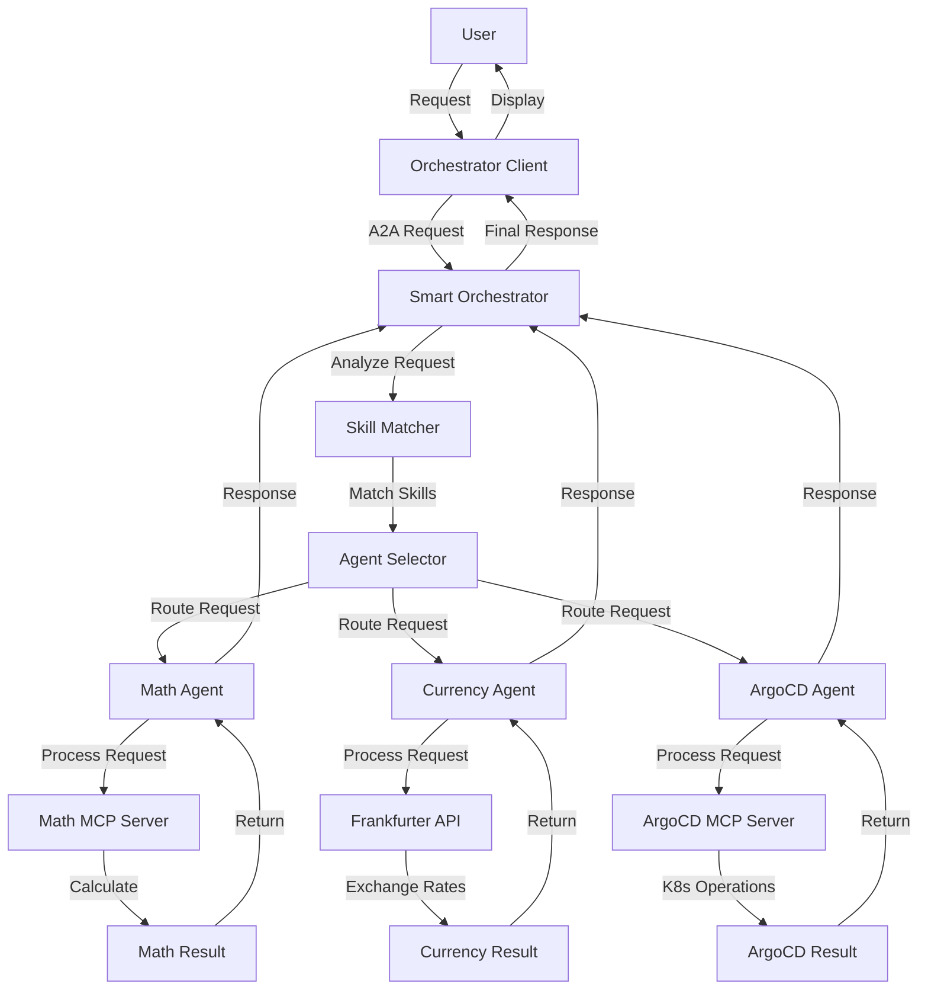
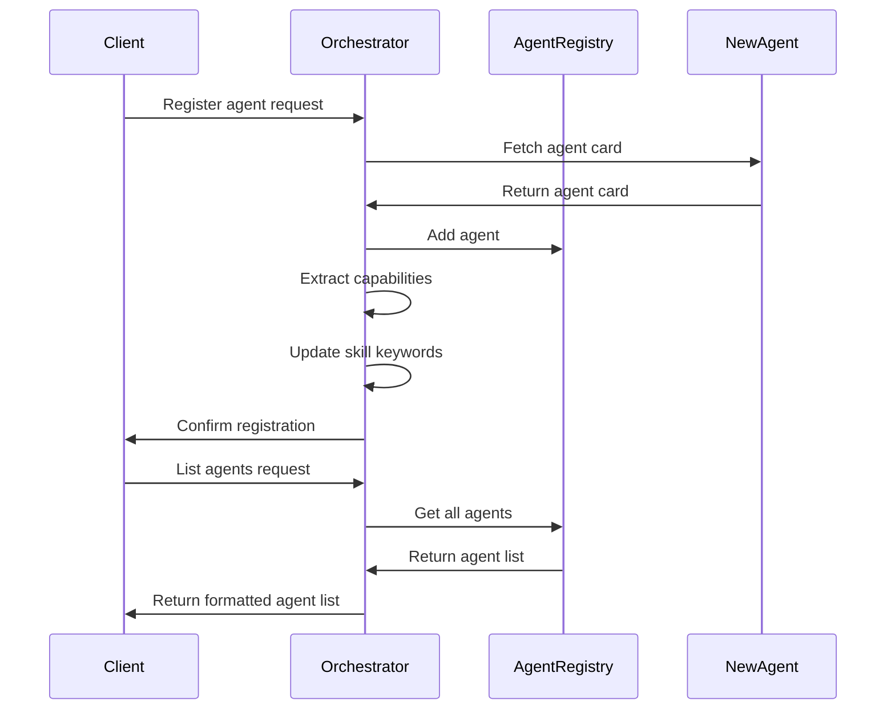
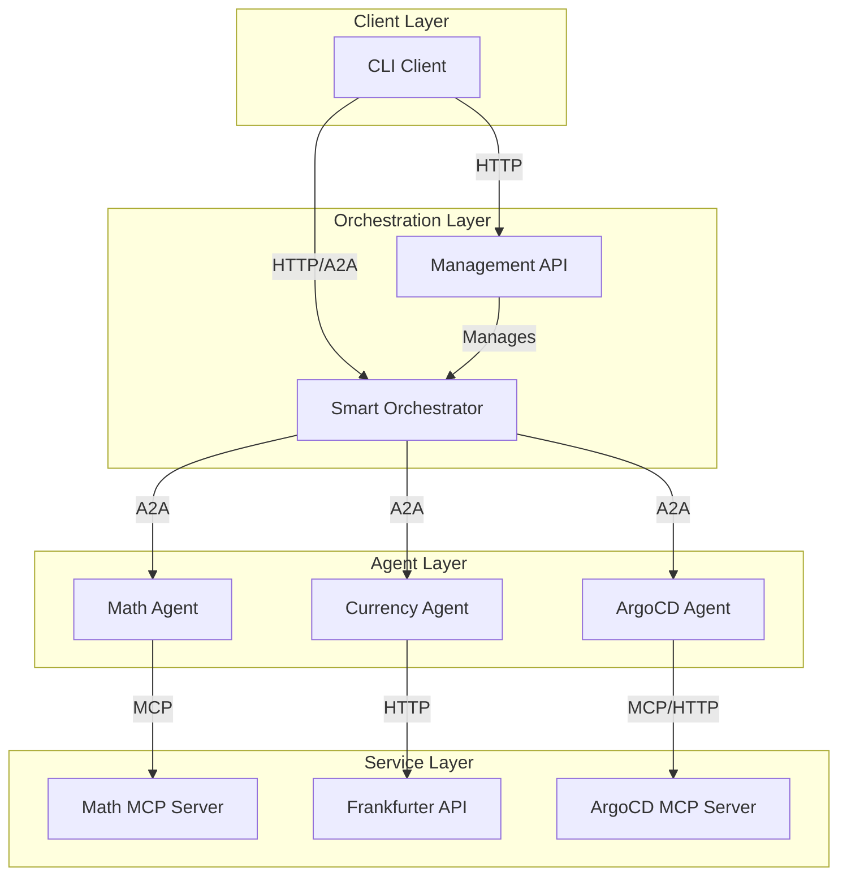
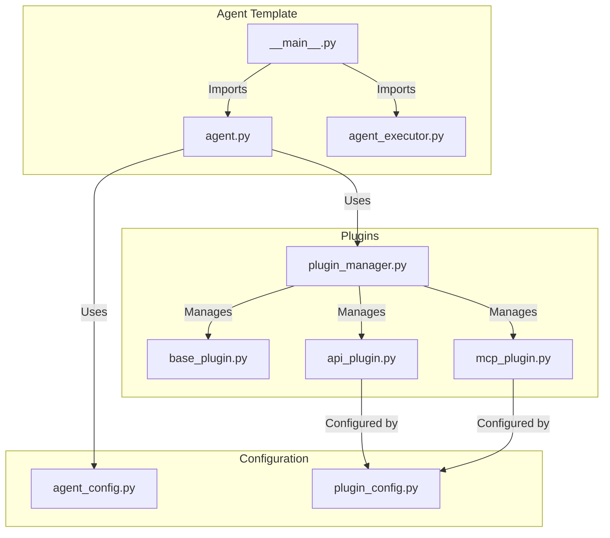

# Aichestra Architecture

## Overview

Aichestra is an intelligent multi-agent orchestration system built with LangGraph and A2A Protocol. The system features intelligent request routing, specialized agents for different domains, and dynamic capability discovery.

## System Components

### Core Components

### Smart Orchestrator Architecture

### Agent Communication Flow

## Component Details

### 1. Smart Orchestrator

The Smart Orchestrator is the central component of the system, responsible for routing requests to the appropriate specialized agent based on their capabilities.

#### Key Features:
- **Dynamic Agent Discovery**: Automatically discovers agent capabilities from AgentCards
- **Skill-Based Matching**: Routes requests based on agent skills, tags, and descriptions
- **Confidence Scoring**: Provides confidence scores for routing decisions
- **Real-time Registration**: Agents can be registered/unregistered dynamically

#### Implementation:
- Built with LangGraph for workflow orchestration
- Uses A2A Protocol for standardized agent communication
- Implements a FastAPI server for agent management

#### Core Classes:
- `SmartOrchestrator`: Main orchestrator class that manages agent routing
- `OrchestratorAgentExecutor`: A2A-compatible executor for the orchestrator
- `RouterState`: State machine for request routing

### 2. Specialized Agents

The system includes several specialized agents, each designed to handle specific types of requests.

#### Math Agent

**Purpose**: Performs mathematical calculations and analysis

**Features**:
- Arithmetic calculations and expression evaluation
- Algebraic equation solving
- Calculus operations (derivatives and integrals)
- Matrix operations and linear algebra
- Statistical analysis

**Implementation**:
- Uses LangGraph ReAct agent pattern
- Integrates with a custom MCP (Model Context Protocol) server
- Leverages SymPy and NumPy for mathematical operations

#### Currency Agent

**Purpose**: Handles currency exchange and financial data

**Features**:
- Currency conversion between different currencies
- Exchange rate lookup
- Historical rate analysis

**Implementation**:
- Uses LangGraph ReAct agent pattern
- Integrates with Frankfurter API for exchange rate data
- Implements structured response format

#### ArgoCD Agent

**Purpose**: Manages Kubernetes and GitOps operations

**Features**:
- List ArgoCD applications
- Sync applications
- Check deployment status

**Implementation**:
- Uses LangGraph ReAct agent pattern
- Integrates with ArgoCD MCP server
- Implements fallback to direct API if MCP fails

### 3. Orchestrator Client

**Purpose**: Provides a command-line interface for interacting with the orchestrator

**Features**:
- Interactive command-line interface
- Agent registration and management
- Multi-turn conversation support
- Push notification support

**Implementation**:
- Uses A2A Client for communication
- Supports both A2A protocol and FastAPI endpoints
- Implements hybrid approach with fallbacks

### 4. A2A Protocol Integration

The system uses the A2A (Agent-to-Agent) Protocol for standardized communication between components.

## Technical Architecture

### Technology Stack

### Data Flow

## Agent Registration and Discovery

## Deployment Architecture

## Extensibility

The system is designed to be highly extensible, allowing new agents to be added dynamically. The agent template provides a starting point for creating new specialized agents.

### Creating a New Agent

To create a new agent:

1. Use the `agentTemplate` as a starting point
2. Implement the required interfaces:
   - `agent.py`: Core agent logic
   - `agent_executor.py`: A2A protocol integration
   - `__main__.py`: Entry point and server setup
3. Register the agent with the orchestrator

### Agent Template Structure

## Conclusion

Aichestra provides a flexible, extensible framework for building intelligent multi-agent systems. The architecture allows for easy addition of new specialized agents, while the smart orchestrator ensures that requests are routed to the most appropriate agent based on their capabilities.

The use of standardized protocols like A2A and MCP ensures interoperability between components, while the LangGraph framework provides robust workflow orchestration capabilities.
