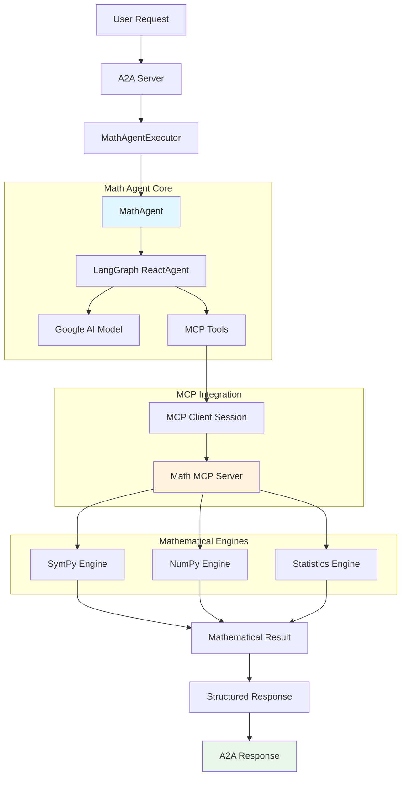

# Developer Guide: Math Agent

This document provides a comprehensive technical overview of the Math Agent, including its architecture, MCP integration, design patterns, and implementation details.

## 📋 Overview

The Math Agent is a sophisticated A2A-compatible agent that provides advanced mathematical computation capabilities through the Model Context Protocol (MCP). It combines LangGraph ReactAgent with a custom MCP server to deliver powerful mathematical tools including calculus, algebra, statistics, and matrix operations.

## 🏗️ Architecture Overview



## 🔄 Complete Function Call Flow

```mermaid
sequenceDiagram
    participant Client as 📱 Client<br/>(Any A2A Client)
    participant A2A as 🔌 A2A Server<br/>(A2AStarletteApplication)
    participant Handler as 🔄 Request Handler<br/>(DefaultRequestHandler)
    participant Executor as ⚙️ Math Executor<br/>(app/agent_executor.py)
    participant Agent as 🧮 Math Agent<br/>(app/agent.py)
    participant LangGraph as 🔀 LangGraph ReactAgent<br/>(create_react_agent)
    participant Model as 🤖 Google AI<br/>(ChatGoogleGenerativeAI)
    participant MCPClient as 📡 MCP Client<br/>(ClientSession)
    participant MCPServer as 🖥️ MCP Server<br/>(math_mcp_server.py)
    participant SymPy as 🔢 SymPy Engine<br/>(sympy)

    Note over Client, SymPy: User Query: "What is the derivative of x^2 + 3x + 2?"

    Client->>A2A: POST / (message/send)
    Note right of Client: A2A JSON-RPC request

    A2A->>Handler: handle_request()<br/>DefaultRequestHandler
    Note right of A2A: Route incoming request

    Handler->>Executor: execute(context, event_queue)<br/>agent_executor.py:35
    Note right of Handler: Execute math agent

    Executor->>Agent: process_request(query)<br/>agent.py:67
    Note right of Executor: Forward to math agent

    Agent->>Agent: _create_agent_with_mcp_tools()<br/>agent.py:47
    Note right of Agent: Initialize MCP connection

    Agent->>MCPClient: stdio_client(server_params)<br/>agent.py:50
    Note right of Agent: Start MCP server process

    MCPClient->>MCPServer: Initialize MCP Server<br/>math_mcp_server.py:350
    Note right of MCPClient: Start math MCP server

    MCPServer-->>MCPClient: Server ready
    Note left of MCPServer: MCP server initialized

    Agent->>MCPClient: session.initialize()<br/>agent.py:53
    Note right of Agent: Initialize MCP session

    Agent->>MCPClient: load_mcp_tools(session)<br/>agent.py:56
    Note right of Agent: Load mathematical tools

    MCPClient->>MCPServer: list_tools()<br/>math_mcp_server.py:17
    Note right of MCPClient: Request available tools

    MCPServer-->>MCPClient: Tool definitions
    Note left of MCPServer: [calculate_expression,<br/>solve_equation, derivative,<br/>integral, matrix_operations,<br/>statistics_calculator]

    MCPClient-->>Agent: MCP tools loaded<br/>agent.py:57
    Note left of MCPClient: 6 mathematical tools

    Agent->>LangGraph: create_react_agent(model, tools)<br/>agent.py:61
    Note right of Agent: Create ReactAgent with MCP tools

    Agent->>LangGraph: agent.ainvoke({"messages": query})<br/>agent.py:74
    Note right of Agent: Process derivative request

    LangGraph->>Model: ChatGoogleGenerativeAI.invoke()<br/>gemini-1.5-flash
    Note right of LangGraph: Analyze mathematical request

    Model-->>LangGraph: Tool call decision
    Note left of Model: AI decides to use<br/>derivative tool

    LangGraph->>MCPClient: derivative(expression="x**2 + 3*x + 2")<br/>via MCP tools
    Note right of LangGraph: Call derivative tool

    MCPClient->>MCPServer: call_tool("derivative", args)<br/>math_mcp_server.py:119
    Note right of MCPClient: MCP tool call

    MCPServer->>MCPServer: handle_derivative(arguments)<br/>math_mcp_server.py:215
    Note right of MCPServer: Route to derivative handler

    MCPServer->>SymPy: sp.sympify("x**2 + 3*x + 2")<br/>math_mcp_server.py:225
    Note right of MCPServer: Parse mathematical expression

    SymPy-->>MCPServer: Symbolic expression
    Note left of SymPy: x**2 + 3*x + 2

    MCPServer->>SymPy: sp.diff(expr, variable)<br/>math_mcp_server.py:227
    Note right of MCPServer: Calculate derivative

    SymPy-->>MCPServer: Derivative result
    Note left of SymPy: 2*x + 3

    MCPServer-->>MCPClient: TextContent result<br/>math_mcp_server.py:230
    Note left of MCPServer: "Derivative: 2*x + 3"

    MCPClient-->>LangGraph: Tool result
    Note left of MCPClient: Mathematical result

    LangGraph->>Model: Generate response with result<br/>ChatGoogleGenerativeAI
    Note right of LangGraph: Format final answer

    Model-->>Agent: Final response<br/>agent.py:78
    Note left of Model: "The derivative of x² + 3x + 2<br/>is 2x + 3"

    Agent-->>Executor: Response string<br/>agent.py:81
    Note left of Agent: Mathematical explanation

    Executor->>A2A: A2A response<br/>via EventQueue
    Note right of Executor: Task completion

    A2A-->>Client: JSON-RPC Response<br/>HTTP 200 OK
    Note left of A2A: Mathematical result

    Note over Client, SymPy: Final Output: "The derivative of x² + 3x + 2 is 2x + 3"
```



## 🔍 Core Components Analysis

### 1. Math Agent Class (app/agent.py)

**Key Features:**
- MCP-based mathematical tool integration
- Asynchronous processing with session management
- Google AI model with mathematical reasoning
- Dynamic tool loading from MCP server

**Architecture Pattern:**
```python
class MathAgent:
    def __init__(self):
        self._initialize_model()
    
    async def process_request(self, request: str) -> str:
        # Create fresh MCP connection for each request
        async with stdio_client(server_params) as (read, write):
            async with ClientSession(read, write) as session:
                await session.initialize()
                tools = await load_mcp_tools(session)
                agent = create_react_agent(self.model, tools)
                response = await agent.ainvoke({"messages": request})
                return self._extract_response(response)
```

### 2. MCP Server Implementation (math_mcp_server.py)

**Available Tools:**
1. **calculate_expression** - Safe expression evaluation
2. **solve_equation** - Algebraic equation solving
3. **derivative** - Calculus differentiation
4. **integral** - Calculus integration
5. **matrix_operations** - Linear algebra operations
6. **statistics_calculator** - Statistical analysis

**Tool Definition Example:**
```python
Tool(
    name="derivative",
    description="Calculate the derivative of a mathematical expression",
    inputSchema={
        "type": "object",
        "properties": {
            "expression": {
                "type": "string",
                "description": "Mathematical expression (e.g., 'x**2 + 3*x + 2')"
            },
            "variable": {
                "type": "string",
                "description": "Variable to differentiate with respect to",
                "default": "x"
            }
        },
        "required": ["expression"]
    }
)
```

### 3. Mathematical Engines Integration

#### SymPy Engine
- **Purpose**: Symbolic mathematics and calculus
- **Capabilities**: Expression parsing, differentiation, integration, equation solving
- **Safety**: Secure expression evaluation without eval()

#### NumPy Engine
- **Purpose**: Numerical computations and linear algebra
- **Capabilities**: Matrix operations, array processing
- **Performance**: Optimized numerical algorithms

#### Statistics Engine
- **Purpose**: Statistical analysis and data processing
- **Capabilities**: Mean, median, mode, standard deviation, variance

### 4. MCP Protocol Integration

**Connection Management:**
```python
server_params = StdioServerParameters(
    command="python",
    args=[str(math_server_path)],
)

async with stdio_client(server_params) as (read, write):
    async with ClientSession(read, write) as session:
        await session.initialize()
        tools = await load_mcp_tools(session)
```

**Tool Loading:**
- Dynamic tool discovery from MCP server
- Automatic tool registration with LangGraph
- Type-safe tool invocation

## 🎯 Key Design Patterns

### 1. MCP Integration Pattern
- **Protocol Compliance**: Full MCP specification adherence
- **Tool Discovery**: Dynamic tool loading from server
- **Session Management**: Proper connection lifecycle
- **Error Handling**: Graceful MCP communication failures

### 2. Fresh Session Pattern
- **Isolation**: Each request gets fresh MCP connection
- **Reliability**: Prevents connection state issues
- **Resource Management**: Automatic cleanup after requests

### 3. Symbolic Computation Pattern
- **Safety**: No eval() usage, only SymPy parsing
- **Flexibility**: Handles both numerical and symbolic results
- **Validation**: Input expression validation and sanitization

### 4. Multi-Engine Architecture
- **Specialization**: Different engines for different math domains
- **Optimization**: Best tool for each mathematical operation
- **Extensibility**: Easy addition of new mathematical engines

## 🔧 Mathematical Capabilities

### 1. Expression Evaluation
```python
# Examples:
"2 + 2"                    → 4.0
"sin(pi/4)"               → 0.7071067811865476
"sqrt(16)"                → 4.0
"log(e)"                  → 1.0
"factorial(5)"            → 120.0
```

### 2. Equation Solving
```python
# Examples:
"x**2 - 4 = 0"           → [-2, 2]
"2*x + 5 = 11"           → [3]
"x**3 - 8 = 0"           → [2, -1 - sqrt(3)*I, -1 + sqrt(3)*I]
```

### 3. Calculus Operations
```python
# Derivatives:
"x**2 + 3*x + 2"         → 2*x + 3
"sin(x)"                 → cos(x)
"e**x"                   → exp(x)

# Integrals:
"x**2"                   → x**3/3
"sin(x)"                 → -cos(x)
"1/x"                    → log(x)
```

### 4. Matrix Operations
```python
# Examples:
multiply([[1,2],[3,4]], [[5,6],[7,8]])  → [[19,22],[43,50]]
determinant([[1,2],[3,4]])               → -2.0
inverse([[1,2],[3,4]])                   → [[-2,1],[1.5,-0.5]]
```

### 5. Statistical Analysis
```python
# Examples:
mean([1,2,3,4,5])        → 3.0
std([1,2,3,4,5])         → 1.5811388300841898
median([1,2,3,4,5])      → 3.0
```

## 🧪 Testing and Debugging

### Unit Testing MCP Tools

```python
import pytest
from unittest.mock import AsyncMock, patch

class TestMathMCPServer:
    @pytest.mark.asyncio
    async def test_calculate_expression(self):
        """Test expression calculation"""
        arguments = {"expression": "2 + 2"}
        result = await handle_calculate_expression(arguments)
        assert "Result: 4.0" in result[0].text
    
    @pytest.mark.asyncio
    async def test_derivative_calculation(self):
        """Test derivative calculation"""
        arguments = {"expression": "x**2", "variable": "x"}
        result = await handle_derivative(arguments)
        assert "2*x" in result[0].text
    
    @pytest.mark.asyncio
    async def test_solve_equation(self):
        """Test equation solving"""
        arguments = {"equation": "x**2 - 4 = 0", "variable": "x"}
        result = await handle_solve_equation(arguments)
        assert "[-2, 2]" in result[0].text
```

### Integration Testing

```python
class TestMathAgentIntegration:
    @pytest.mark.asyncio
    async def test_full_math_workflow(self):
        """Test complete mathematical workflow"""
        agent = MathAgent()
        
        # Test basic calculation
        result = await agent.process_request("What is 2 + 2?")
        assert "4" in result
        
        # Test calculus
        result = await agent.process_request("What is the derivative of x^2?")
        assert "2*x" in result or "2x" in result
        
        # Test equation solving
        result = await agent.process_request("Solve x^2 - 4 = 0")
        assert "2" in result and "-2" in result
```

### MCP Server Testing

```bash
# Test MCP server directly
python math_mcp_server.py

# Test specific tools
echo '{"method": "tools/list", "params": {}}' | python math_mcp_server.py

# Test tool calls
echo '{"method": "tools/call", "params": {"name": "calculate_expression", "arguments": {"expression": "2+2"}}}' | python math_mcp_server.py
```

### Debug Mode

```python
# Enable debug logging
import logging
logging.basicConfig(level=logging.DEBUG)

# Test with debug output
agent = MathAgent()
result = await agent.process_request("Calculate the integral of x^2")
print(f"Debug result: {result}")
```

## 🚀 Performance Optimization

### 1. Connection Pooling
```python
class MCPConnectionPool:
    def __init__(self, max_connections=10):
        self.max_connections = max_connections
        self.connections = []
        self.available = asyncio.Queue()
    
    async def get_connection(self):
        """Get available MCP connection"""
        if not self.available.empty():
            return await self.available.get()
        
        if len(self.connections) < self.max_connections:
            conn = await self._create_connection()
            self.connections.append(conn)
            return conn
        
        return await self.available.get()
```

### 2. Result Caching
```python
from functools import lru_cache

@lru_cache(maxsize=1000)
def cached_derivative(expression: str, variable: str = "x") -> str:
    """Cache derivative calculations"""
    return calculate_derivative(expression, variable)
```

### 3. Async Batch Processing
```python
async def process_multiple_expressions(expressions: List[str]) -> List[str]:
    """Process multiple expressions concurrently"""
    tasks = [agent.process_request(expr) for expr in expressions]
    return await asyncio.gather(*tasks)
```

## 🔒 Security Best Practices

### 1. Expression Validation
```python
def validate_expression(expression: str) -> bool:
    """Validate mathematical expression safety"""
    dangerous_patterns = ['import', 'exec', 'eval', '__']
    return not any(pattern in expression.lower() for pattern in dangerous_patterns)
```

### 2. Resource Limits
```python
import resource
import signal

def set_computation_limits():
    """Set resource limits for mathematical computations"""
    # Limit CPU time to 30 seconds
    resource.setrlimit(resource.RLIMIT_CPU, (30, 30))
    
    # Limit memory usage
    resource.setrlimit(resource.RLIMIT_AS, (512*1024*1024, 512*1024*1024))
```

### 3. Input Sanitization
```python
def sanitize_math_input(expression: str) -> str:
    """Sanitize mathematical input"""
    # Remove potentially harmful characters
    import re
    sanitized = re.sub(r'[^a-zA-Z0-9+\-*/()^.,\s=]', '', expression)
    return sanitized.strip()
```

## 🔧 Configuration and Extensibility

### Environment Variables
```bash
GOOGLE_API_KEY=your_api_key           # Google AI API key
MCP_SERVER_TIMEOUT=30                 # MCP server timeout
MAX_EXPRESSION_LENGTH=1000            # Maximum expression length
ENABLE_SYMBOLIC_RESULTS=true          # Enable symbolic mathematics
```

### Adding New Mathematical Tools

1. **Define Tool in MCP Server:**
```python
Tool(
    name="new_math_tool",
    description="Description of new mathematical capability",
    inputSchema={
        "type": "object",
        "properties": {
            "input_param": {
                "type": "string",
                "description": "Parameter description"
            }
        },
        "required": ["input_param"]
    }
)
```

2. **Implement Tool Handler:**
```python
async def handle_new_math_tool(arguments: Dict[str, Any]) -> List[TextContent]:
    """Handle new mathematical tool."""
    try:
        # Implementation logic
        result = perform_new_calculation(arguments)
        return [TextContent(type="text", text=f"Result: {result}")]
    except Exception as e:
        return [TextContent(type="text", text=f"Error: {str(e)}")]
```

3. **Register Tool:**
```python
@server.call_tool()
async def call_tool(name: str, arguments: Dict[str, Any]) -> List[TextContent]:
    if name == "new_math_tool":
        return await handle_new_math_tool(arguments)
    # ... existing tools
```

### Custom Mathematical Engines

```python
class CustomMathEngine:
    """Custom mathematical computation engine"""
    
    def __init__(self):
        self.capabilities = ["custom_operation"]
    
    def custom_operation(self, input_data):
        """Implement custom mathematical operation"""
        # Custom logic here
        return result

# Register custom engine
def register_custom_engine():
    """Register custom mathematical engine"""
    engine = CustomMathEngine()
    # Integration logic
```

## 📊 Monitoring and Metrics

### Performance Metrics
```python
import time
from collections import defaultdict

class MathAgentMetrics:
    def __init__(self):
        self.request_count = defaultdict(int)
        self.response_times = defaultdict(list)
        self.error_count = defaultdict(int)
    
    def record_request(self, tool_name: str, response_time: float, success: bool):
        """Record request metrics"""
        self.request_count[tool_name] += 1
        self.response_times[tool_name].append(response_time)
        if not success:
            self.error_count[tool_name] += 1
    
    def get_metrics(self) -> dict:
        """Get performance metrics"""
        return {
            "total_requests": sum(self.request_count.values()),
            "average_response_time": self._calculate_average_response_time(),
            "error_rate": self._calculate_error_rate(),
            "tool_usage": dict(self.request_count)
        }
```

### Health Checks
```python
async def health_check() -> dict:
    """Perform health check on math agent"""
    try:
        # Test basic functionality
        agent = MathAgent()
        test_result = await agent.process_request("2 + 2")
        
        return {
            "status": "healthy",
            "mcp_server": "running",
            "basic_math": "4" in test_result
        }
    except Exception as e:
        return {
            "status": "unhealthy",
            "error": str(e)
        }
```

## 📚 Best Practices

### 1. Error Handling
- Always validate mathematical expressions before processing
- Provide meaningful error messages for invalid inputs
- Handle MCP connection failures gracefully
- Implement timeout mechanisms for long-running calculations

### 2. Performance Optimization
- Use connection pooling for MCP sessions
- Implement result caching for expensive operations
- Set appropriate resource limits
- Monitor memory usage for large calculations

### 3. Security
- Validate all mathematical expressions
- Prevent code injection through expression parsing
- Set computation time and memory limits
- Log security-related events

### 4. Maintainability
- Keep mathematical engines separate and modular
- Use type hints for all function signatures
- Implement comprehensive test coverage
- Document mathematical algorithms and formulas

## 🔄 Extension Points

### Adding New Mathematical Domains
```python
# Example: Adding graph theory tools
@server.list_tools()
async def list_graph_tools() -> List[Tool]:
    return [
        Tool(
            name="shortest_path",
            description="Find shortest path in a graph",
            inputSchema={...}
        )
    ]
```

### Custom Response Formatting
```python
def format_mathematical_response(result: Any, context: str) -> str:
    """Format mathematical results based on context"""
    if context == "calculus":
        return format_calculus_result(result)
    elif context == "algebra":
        return format_algebra_result(result)
    else:
        return str(result)
```

## 📚 Related Documentation

- [Main README](../README.md) - Project overview
- [Math Agent README](README.md) - User guide
- [MCP Protocol](https://modelcontextprotocol.io/) - Model Context Protocol
- [SymPy Documentation](https://docs.sympy.org/) - Symbolic mathematics
- [NumPy Documentation](https://numpy.org/doc/) - Numerical computing
- [LangGraph Documentation](https://langchain-ai.github.io/langgraph/) - ReactAgent framework

---

*Last updated: January 2025*
