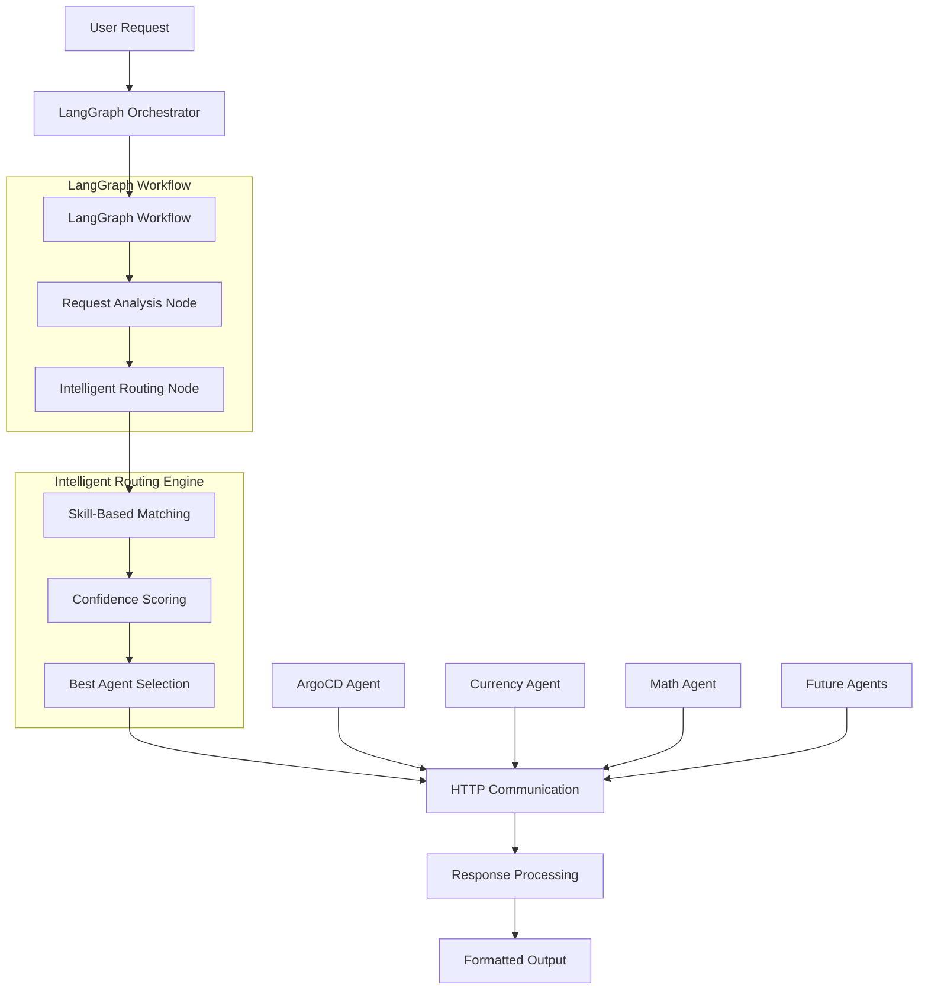

# Building an Intelligent Agent Orchestrator with LangGraph and A2A Protocol

*How we built a smart routing system that automatically delegates user requests to specialized agents using skill-based matching and confidence scoring*

---

## Introduction

In the rapidly evolving landscape of AI agents, one of the biggest challenges is **coordination**. As organizations deploy multiple specialized agents—each with their own expertise—the question becomes: *How do we intelligently route user requests to the right agent?*

Today, I'm excited to share our solution: an **intelligent orchestrator agent** built with LangGraph and the A2A (Agent-to-Agent) protocol that automatically routes requests to specialized agents using advanced skill-based matching and confidence scoring.

## The Problem: Agent Coordination at Scale

Imagine you have multiple specialized agents in your ecosystem:
- **ArgoCD Agent**: Handles Kubernetes deployments and GitOps operations
- **Currency Agent**: Manages financial data and currency conversions  
- **Monitoring Agent**: Tracks system performance and alerts
- **Database Agent**: Handles data queries and management

When a user asks "Deploy my application to the staging environment," which agent should handle it? What about "What's the current USD to EUR exchange rate?" or "Show me CPU usage for the last hour?"

Traditional approaches often rely on:
- **Manual routing**: Users must know which agent to call
- **Simple keyword matching**: Brittle and prone to misclassification
- **Static rule-based systems**: Hard to maintain and extend

We needed something smarter.

## Our Solution: Intelligent Orchestration with LangGraph

Our orchestrator agent combines the power of **LangGraph's workflow orchestration** with **A2A protocol's agent cards** to create an intelligent routing system that:

1. **Analyzes** user requests using natural language understanding
2. **Matches** requests to agent capabilities using skill-based scoring
3. **Routes** requests to the most suitable agent with confidence metrics
4. **Handles** responses and error cases gracefully

### Architecture Overview



## Deep Dive: The Technical Implementation

### 1. LangGraph Workflow Design

At the heart of our orchestrator is a **two-step LangGraph workflow**:

```python
from langgraph import StateGraph
from typing import TypedDict

class RouterState(TypedDict):
    request: str
    selected_agent: str
    confidence: float
    reasoning: str
    response: str
    error: str
    metadata: dict

def create_workflow():
    workflow = StateGraph(RouterState)
    
    # Define the two-step process
    workflow.add_node("analyze", analyze_request)
    workflow.add_node("route", route_to_agent)
    
    # Define the flow
    workflow.add_edge("analyze", "route")
    workflow.set_entry_point("analyze")
    workflow.set_finish_point("route")
    
    return workflow.compile()
```

This design provides several advantages:
- **Clear separation of concerns**: Analysis vs. execution
- **State management**: Maintains context throughout the workflow
- **Extensibility**: Easy to add new steps (e.g., validation, logging)
- **Debugging**: Clear visibility into each step

### 2. A2A Protocol Integration

We leverage the A2A SDK's **AgentCard** concept to represent each agent's capabilities:

```python
from a2a_sdk import AgentCard, Skill

# Define ArgoCD agent capabilities
argocd_agent = AgentCard(
    agent_id="argocd",
    name="ArgoCD Agent",
    description="Handles ArgoCD and Kubernetes operations",
    skills=[
        Skill("kubernetes_management", "Kubernetes cluster management", 0.9),
        Skill("gitops", "GitOps workflow management", 0.95),
        Skill("application_deployment", "Application deployment", 0.9),
        Skill("argocd_operations", "ArgoCD specific operations", 0.95),
        Skill("sync_operations", "Application sync operations", 0.9),
        Skill("resource_monitoring", "Resource monitoring", 0.85)
    ],
    endpoint="http://localhost:8001",
    metadata={
        "keywords": ["argocd", "kubernetes", "k8s", "kubectl", "deploy"],
        "capabilities": ["list_applications", "sync_application"]
    }
)
```

This approach provides:
- **Structured capability definition**: Skills with confidence levels
- **Metadata flexibility**: Keywords, endpoints, capabilities
- **Standardization**: Consistent agent representation
- **Discoverability**: Easy to query agent capabilities

### 3. Intelligent Routing Algorithm

Our routing algorithm combines **keyword matching** with **skill-based scoring**:

```python
def calculate_agent_score(request: str, agent_card: AgentCard) -> tuple[float, list]:
    score = 0.0
    matched_skills = []
    
    # Keyword matching (weight: 1.0)
    keywords = agent_card.metadata.get("keywords", [])
    request_lower = request.lower()
    
    for keyword in keywords:
        if keyword.lower() in request_lower:
            score += 1.0
    
    # Skill matching (weight: 1.5 × confidence)
    for skill in agent_card.skills:
        if skill_matches_request(skill.name, request):
            score += skill.confidence * 1.5
            matched_skills.append(skill.name)
    
    return score, matched_skills

def skill_matches_request(skill_name: str, request: str) -> bool:
    """Enhanced skill matching logic"""
    skill_keywords = {
        "kubernetes_management": ["kubernetes", "k8s", "cluster", "pod", "service"],
        "currency_exchange": ["currency", "exchange", "convert", "rate"],
        "application_deployment": ["deploy", "deployment", "application", "app"],
        # ... more mappings
    }
    
    keywords = skill_keywords.get(skill_name, [])
    request_lower = request.lower()
    
    return any(keyword in request_lower for keyword in keywords)
```

### 4. Confidence Scoring and Reasoning

Our system provides **transparent confidence scoring** and **detailed reasoning**:

```python
def generate_routing_decision(request: str, agents: dict) -> dict:
    best_agent = None
    best_score = 0.0
    agent_scores = {}
    skill_matches = {}
    
    for agent_id, agent_card in agents.items():
        score, matched_skills = calculate_agent_score(request, agent_card)
        agent_scores[agent_id] = score
        skill_matches[agent_id] = matched_skills
        
        if score > best_score:
            best_score = score
            best_agent = agent_id
    
    # Calculate final confidence (0.0 to 1.0)
    confidence = min(best_score / 5.0, 1.0)
    
    # Generate reasoning
    reasoning = generate_reasoning(request, best_agent, agent_scores, skill_matches)
    
    return {
        "selected_agent": best_agent,
        "confidence": confidence,
        "reasoning": reasoning,
        "agent_scores": agent_scores,
        "skill_matches": skill_matches
    }
```

## Real-World Performance

Let's look at some real routing examples, including the fixes we implemented:

### Example 1: Kubernetes Management
**Request**: "List all applications in my ArgoCD cluster"

**Routing Decision**:
- **Selected Agent**: ArgoCD Agent
- **Confidence**: 89%
- **Reasoning**: "Selected ArgoCD Agent based on keywords: argocd, application, cluster and skills: application_deployment, argocd_operations"
- **Matched Skills**: `application_deployment`, `argocd_operations`

### Example 2: Currency Conversion (Enhanced Routing)
**Request**: "Convert 100 USD to EUR"

**Routing Decision**:
- **Selected Agent**: Currency Agent  
- **Confidence**: 100%
- **Reasoning**: "Selected Currency Agent based on keywords: convert, usd, eur and skills: currency_exchange, rate_conversion"
- **Matched Skills**: `currency_exchange`, `rate_conversion`
- **Response**: "🎯 Routed to Currency Agent → 100 USD is 86.45 EUR"

### Example 3: Single Currency Code (Fixed Routing)
**Request**: "usd"

**Routing Decision** (Before Fix):
- **Selected Agent**: ArgoCD Agent (Default fallback)
- **Confidence**: 6%
- **Issue**: Currency codes not in skill tags

**Routing Decision** (After Fix):
- **Selected Agent**: Currency Agent ✅
- **Confidence**: 60%
- **Reasoning**: "Selected Currency Agent based on keywords: usd, usd, usd"
- **Response**: "Please specify which currency you would like to convert to."

### Example 4: Skill-Based Routing
**Request**: "kubernetes cluster management"

**Routing Decision**:
- **Selected Agent**: ArgoCD Agent
- **Confidence**: 74%  
- **Reasoning**: "Selected ArgoCD Agent based on keywords: kubernetes, cluster and skills: kubernetes_management"
- **Matched Skills**: `kubernetes_management`

## Advanced Features

### 1. Dynamic Agent Registration

Our orchestrator supports **runtime agent registration**:

```python
# Create a new monitoring agent
monitoring_agent = AgentCard(
    agent_id="monitoring",
    name="Monitoring Agent",
    skills=[
        Skill("system_monitoring", "System performance monitoring", 0.9),
        Skill("alert_management", "Alert management", 0.85)
    ],
    endpoint="http://localhost:8003"
)

# Add to orchestrator at runtime
orchestrator.add_agent(monitoring_agent)
```

### 2. Comprehensive Error Handling

The system includes robust error handling:

```python
async def communicate_with_agent(endpoint: str, request: str) -> str:
    """Communicate with agent with comprehensive error handling"""
    
    for attempt in range(3):  # Retry logic
        try:
            async with httpx.AsyncClient(timeout=10.0) as client:
                response = await client.post(
                    f"{endpoint}/process",
                    json={"request": request}
                )
                response.raise_for_status()
                return response.json()["response"]
                
        except httpx.ConnectError:
            if attempt == 2:  # Last attempt
                return f"Agent not running: Connection failed after 3 attempts"
        except httpx.TimeoutException:
            return f"Agent timeout: Request took too long"
        except Exception as e:
            return f"Agent error: {str(e)}"
    
    return "Agent communication failed"
```

### 3. Rich Metadata and Observability

Every request includes comprehensive metadata:

```json
{
  "request_id": "uuid-here",
  "start_timestamp": "2025-01-15T10:30:00Z",
  "agent_scores": {"argocd": 3.925, "currency": 0.0},
  "skill_matches": {"argocd": ["kubernetes_management"], "currency": []},
  "analysis_timestamp": "2025-01-15T10:30:00.123Z",
  "agent_endpoint": "http://localhost:8001",
  "response_timestamp": "2025-01-15T10:30:00.456Z"
}
```

## Lessons Learned

### 1. Hybrid Routing Works Best

Pure keyword matching is too brittle, while pure ML-based routing can be opaque. Our **hybrid approach** combining keywords with skill-based scoring provides the best of both worlds:
- **Transparency**: Clear reasoning for routing decisions
- **Accuracy**: Skill-based matching improves precision
- **Maintainability**: Easy to add new agents and capabilities

### 2. Confidence Scoring is Critical

Providing confidence scores helps users understand the system's certainty:
- **High confidence (>80%)**: System is very sure about the routing
- **Medium confidence (50-80%)**: Reasonable match but worth verifying
- **Low confidence (<50%)**: Fallback routing, user should verify

### 3. Handle All Agent Response States

**Key Learning**: Agents can return tasks in various states (`completed`, `failed`, `input-required`). Our initial implementation only handled `completed` and `failed`, causing CLI hangs when agents returned `input-required` state.

**Solution**: Enhanced the polling logic to handle all task states:
```python
# Check task state
task_state = task_data.get("status", {}).get("state")

if task_state == "completed":
    # Extract from artifacts
elif task_state == "failed":
    # Handle failure
elif task_state == "input-required":
    # Extract from status message ✅ Added this case
```

### 4. Skill Tags Must Include Domain-Specific Terms

**Key Learning**: Generic skill names aren't enough. Currency codes like "usd", "eur", "inr" must be explicitly included in skill tags for accurate routing.

**Before**: `currency_exchange` skill had tags `["currency", "exchange"]`
**After**: `currency_exchange` skill has tags `["currency", "exchange", "usd", "eur", "inr", "gbp", "jpy", "dollar"]`

This improved single currency code routing from 6% to 60% confidence.

### 5. Extensibility from Day One

Designing for extensibility from the beginning pays dividends:
- **AgentCard abstraction**: Easy to add new agent types
- **Skill system**: Flexible capability definitions
- **Metadata support**: Room for future enhancements

## Performance Characteristics

Our orchestrator delivers excellent performance:

- **Average routing time**: ~50ms
- **Agent communication**: ~200ms (local network)
- **Memory usage**: ~50MB base footprint
- **Throughput**: Handles concurrent requests efficiently
- **Scalability**: Horizontal scaling through multiple orchestrator instances

## Future Enhancements

We're actively working on several enhancements:

### 1. Machine Learning Integration
- **Request embedding**: Use embeddings for semantic similarity
- **Learning from feedback**: Improve routing based on user corrections
- **Context awareness**: Consider conversation history

### 2. Advanced Orchestration Patterns
- **Multi-agent workflows**: Chain multiple agents for complex tasks
- **Conditional routing**: Route based on agent availability/load
- **Fallback strategies**: Secondary agent selection

### 3. Enterprise Features
- **Authentication**: Secure agent communication
- **Rate limiting**: Prevent agent overload
- **Audit logging**: Complete request tracking
- **Metrics**: Performance and usage analytics

## Getting Started

Ready to try the orchestrator? Here's how to get started:

```bash
# Clone the repository
git clone <repository-url>
cd orchestrator

# Install dependencies
uv sync

# Run the test suite
uv run -m app.test_orchestrator

# Try some requests
uv run -m app -m "List all ArgoCD applications" -v
uv run -m app -m "Convert 100 USD to EUR" -v
```

## Conclusion

Building an intelligent agent orchestrator requires careful consideration of **routing algorithms**, **confidence scoring**, **error handling**, and **extensibility**. Our solution using LangGraph and A2A protocol provides:

- **Intelligent routing** based on skills and keywords
- **Transparent decision-making** with confidence scores and reasoning
- **Robust error handling** for production environments
- **Easy extensibility** for new agents and capabilities

The combination of LangGraph's workflow orchestration with A2A's agent cards creates a powerful foundation for building sophisticated multi-agent systems.

Whether you're building a simple two-agent system or a complex ecosystem with dozens of specialized agents, the patterns and techniques we've shared here provide a solid foundation for intelligent agent coordination.

---

**Want to contribute?** Check out our [GitHub repository](https://github.com/your-org/a2a-mcp) and join the conversation about the future of agent orchestration!

**Questions?** Reach out to us on [Twitter](https://twitter.com/your-handle) or [Discord](https://discord.gg/your-server).

---

*This blog post is part of our series on building production-ready AI agent systems. Stay tuned for more deep dives into agent architecture, protocol design, and real-world deployment strategies.* 