# Developer Guide: Orchestrator Function Call Flow

This document provides a detailed technical overview of how the Smart Orchestrator Agent processes requests and routes them to specialized agents.

## 📋 Overview

The orchestrator uses a sophisticated workflow to analyze incoming requests, select the most appropriate agent, and forward requests using the A2A (Agent-to-Agent) protocol. This guide walks through the complete function call flow using "what is 1+2" as a concrete example.

## 🔄 Complete Function Call Flow

The following sequence diagram illustrates the complete function call flow from client request to final response:

```mermaid
sequenceDiagram
    participant Client as 📱 Orchestrator Client<br/>(orchestrator_client/__main__.py)
    participant A2A as 🔌 A2A Server<br/>(A2AStarletteApplication)
    participant Handler as 🔄 Request Handler<br/>(DefaultRequestHandler)
    participant Executor as ⚙️ Agent Executor<br/>(app/agent_executor.py)
    participant Orchestrator as 🧠 Smart Orchestrator<br/>(app/orchestrator.py)
    participant Workflow as 🔀 LangGraph Workflow<br/>(StateGraph)
    participant MathAgent as 🧮 Math Agent<br/>(mathAgent/app/agent.py)

    Note over Client, MathAgent: User Query: "what is 1+2"

    Client->>Client: orchestratorClient()<br/>__main__.py
    Note right of Client: Main CLI entry point

    Client->>Client: completeTask()<br/>__main__.py:195
    Note right of Client: Process user input<br/>"what is 1+2"

    Client->>Client: MessageSendParams()<br/>__main__.py
    Note right of Client: Create A2A message payload

    Client->>A2A: client.send_message()<br/>POST / (message/send)
    Note right of Client: A2A JSON-RPC request<br/>{"method": "message/send",<br/> "params": {"message": {...}}}

    A2A->>Handler: handle_request()<br/>DefaultRequestHandler
    Note right of A2A: A2A framework routes<br/>incoming JSON-RPC

    Handler->>Executor: execute(context, event_queue)<br/>agent_executor.py
    Note right of Handler: Route to orchestrator<br/>agent executor

    Executor->>Executor: _validate_request(context)<br/>agent_executor.py
    Note right of Executor: Validate request format

    Executor->>Executor: context.get_user_input()<br/>agent_executor.py
    Note right of Executor: Extract "what is 1+2"<br/>from request context

    Executor->>Orchestrator: process_request("what is 1+2")<br/>orchestrator.py
    Note right of Executor: Forward to orchestrator<br/>core logic

    Orchestrator->>Orchestrator: RouterState initialization<br/>orchestrator.py
    Note right of Orchestrator: Create initial state:<br/>{request: "what is 1+2",<br/> selected_agent: "",<br/> confidence: 0.0}

    Orchestrator->>Workflow: workflow.ainvoke(initial_state)<br/>orchestrator.py
    Note right of Orchestrator: Start LangGraph workflow<br/>with RouterState

    Workflow->>Orchestrator: _analyze_request(state)<br/>orchestrator.py
    Note right of Workflow: Node 1: Analyze request<br/>and select best agent

    loop For Each Agent (ArgoCD, Currency, Math)
        Orchestrator->>Orchestrator: _calculate_agent_score(request, agent_card)<br/>orchestrator.py
        Note right of Orchestrator: Score agent based on<br/>keywords and skills

        Orchestrator->>Orchestrator: _skill_matches_request(skill_name, request)<br/>orchestrator.py
        Note right of Orchestrator: Check skill matches:<br/>"Arithmetic Calculation"<br/>vs "what is 1+2"
    end

    Note over Orchestrator: Math Agent Score: 3.5<br/>Keywords: "+" (1.0)<br/>Skills: "Arithmetic Calculation" (1.5)<br/>Other matches: (1.0)

    Orchestrator->>Orchestrator: _generate_reasoning(request, "math", scores, matches)<br/>orchestrator.py
    Note right of Orchestrator: Generate explanation:<br/>"Selected Math Agent based on<br/>keywords: +, calculation"

    Orchestrator-->>Workflow: Return updated state<br/>orchestrator.py
    Note left of Orchestrator: {selected_agent: "math",<br/> confidence: 0.7,<br/> reasoning: "..."}

    Workflow->>Orchestrator: _route_to_agent(state)<br/>orchestrator.py
    Note right of Workflow: Node 2: Route to<br/>selected agent

    Orchestrator->>Orchestrator: _forward_request_to_agent(endpoint, request)<br/>orchestrator.py
    Note right of Orchestrator: Forward to Math Agent<br/>http://localhost:8003

    Orchestrator->>Orchestrator: Create A2A payload<br/>orchestrator.py:284
    Note right of Orchestrator: JSON-RPC payload:<br/>{"method": "message/send",<br/> "params": {...}}

    Orchestrator->>MathAgent: httpx.AsyncClient.post()<br/>orchestrator.py
    Note right of Orchestrator: HTTP POST to Math Agent<br/>with A2A JSON-RPC

    MathAgent->>MathAgent: AgentExecutor.execute()<br/>mathAgent/app/agent_executor.py
    Note right of MathAgent: Math agent processes<br/>A2A request

    MathAgent->>MathAgent: MCP integration<br/>mathAgent/math_mcp_server.py
    Note right of MathAgent: Call calculate_expression<br/>tool via MCP protocol

    MathAgent->>MathAgent: SymPy calculation<br/>calculate_expression("1+2")
    Note right of MathAgent: SymPy evaluates:<br/>1+2 = 3

    MathAgent-->>Orchestrator: A2A Task Response<br/>HTTP 200 OK
    Note left of MathAgent: {"result": {<br/>  "id": "task_id",<br/>  "status": {"state": "completed"},<br/>  "artifacts": [{<br/>    "parts": [{"kind": "text", "text": "3"}]<br/>  }]<br/>}}

    loop Task Polling (max 30 attempts)
        Orchestrator->>MathAgent: tasks/get request<br/>orchestrator.py
        Note right of Orchestrator: Poll for task completion

        MathAgent-->>Orchestrator: Task status response
        Note left of MathAgent: Check task state:<br/>"completed"
    end

    Orchestrator->>Orchestrator: Extract result from artifacts<br/>orchestrator.py
    Note right of Orchestrator: Parse artifacts to get "3"<br/>from task response

    Orchestrator->>Orchestrator: Format final response<br/>orchestrator.py
    Note right of Orchestrator: "🎯 Routed to Math Agent → 3"

    Orchestrator-->>Workflow: Return updated state<br/>orchestrator.py
    Note left of Orchestrator: {response: "🎯 Routed to Math Agent → 3",<br/> metadata: {...}}

    Workflow-->>Orchestrator: Final workflow state<br/>StateGraph.ainvoke()
    Note left of Workflow: Complete workflow execution<br/>with final RouterState

    Orchestrator-->>Executor: Return result dict<br/>orchestrator.py
    Note left of Orchestrator: {"success": true,<br/> "selected_agent_name": "Math Agent",<br/> "confidence": 0.7,<br/> "response": "🎯 Routed to Math Agent → 3"}

    Executor->>Executor: Format response text<br/>agent_executor.py
    Note right of Executor: "✅ Routed to Math Agent<br/>Confidence: 0.70<br/>Response: 🎯 Routed to Math Agent → 3"

    Executor->>Executor: TaskUpdater.add_artifact()<br/>agent_executor.py
    Note right of Executor: Add formatted response<br/>as task artifact

    Executor->>Executor: TaskUpdater.complete()<br/>agent_executor.py
    Note right of Executor: Mark task as completed

    Executor->>Handler: Task completion<br/>via EventQueue
    Note right of Executor: Notify A2A framework<br/>of task completion

    Handler->>A2A: Task response<br/>DefaultRequestHandler
    Note right of Handler: Format A2A JSON-RPC<br/>response

    A2A-->>Client: JSON-RPC Response<br/>HTTP 200 OK
    Note left of A2A: {"result": {<br/>  "artifacts": [{<br/>    "parts": [{"text": "✅ Routed..."}]<br/>  }]<br/>}}

    Client->>Client: format_ai_response()<br/>__main__.py
    Note right of Client: Parse and format<br/>AI response for display

    Note over Client, MathAgent: Final Output: "3"
```



## 🔍 Detailed Component Analysis

### 1. **Client Request (Orchestrator Client)**
The flow begins when a user sends a query through the orchestrator client:

```bash
# User input: "what is 1+2"
cd orchestrator_client && uv run . --agent http://localhost:8000
```

**Key Functions:**
- `orchestratorClient()` - Main function that handles user input
- `completeTask()` - Processes user input and creates A2A message
- Creates JSON-RPC payload with `message/send` method

### 2. **A2A Server Framework**
The A2A server receives the JSON-RPC request and routes it to the appropriate executor:

**Key Components:**
- `A2AStarletteApplication` - Main server application
- `DefaultRequestHandler` - Handles incoming requests
- Routes to `OrchestratorAgentExecutor` based on agent card configuration

### 3. **Orchestrator Agent Executor**
Located in `app/agent_executor.py`, this component bridges the A2A framework with the orchestrator logic:

**Key Functions:**
- `execute(context, event_queue)` - Main execution entry point
- `_validate_request(context)` - Validates incoming requests
- `get_user_input()` - Extracts user query from request context
- Task management using `TaskUpdater` for status updates

**Code Flow:**
```python
async def execute(self, context: RequestContext, event_queue: EventQueue):
    query = context.get_user_input()  # "what is 1+2"
    result = await self.orchestrator.process_request(query)
    # Format and return response
```

### 4. **Smart Orchestrator (Core Logic)**
Located in `app/orchestrator.py`, this is the heart of the intelligent routing system:

#### 4.1 Initialization
```python
def __init__(self):
    self.agents: Dict[str, AgentCard] = {}
    self.workflow = self._create_workflow()
    self._initialize_default_agents()
```

**Agent Discovery:**
- Automatically discovers agents at ports 8001, 8002, 8003
- Fetches agent cards from `/.well-known/agent.json` endpoints
- Stores `AgentCard` objects with skills, capabilities, and metadata

#### 4.2 LangGraph Workflow
```python
def _create_workflow(self):
    workflow = StateGraph(RouterState)
    workflow.add_node("analyze", self._analyze_request)
    workflow.add_node("route", self._route_to_agent)
    workflow.add_edge("analyze", "route")
    return workflow.compile()
```

**RouterState Structure:**
```python
class RouterState(TypedDict):
    request: str           # "what is 1+2"
    selected_agent: str    # "math"
    confidence: float      # 1.0
    reasoning: str         # Explanation of selection
    response: str          # Final response
    error: str            # Error information
    metadata: dict        # Additional metadata
```

#### 4.3 Request Analysis (`_analyze_request`)
This is where the intelligent agent selection happens:

**Agent Scoring Algorithm:**
```python
def _calculate_agent_score(self, request: str, agent_card: AgentCard):
    score = 0.0
    matched_skills = []
    request_lower = request.lower()  # "what is 1+2"
    
    # Keyword matching from skill tags (weight: 1.0)
    keywords = [tag for skill in agent_card.skills for tag in (skill.tags or [])]
    for keyword in keywords:
        if keyword.lower() in request_lower:
            score += 1.0  # "+", "math", "calculation" match
    
    # Skill matching (weight: 1.5)
    for skill in agent_card.skills:
        if self._skill_matches_request(skill.name, request):
            score += 1.5  # "Arithmetic Calculation" matches
            matched_skills.append(skill.name)
    
    return score, matched_skills
```

**For "what is 1+2" example:**
- **Math Agent**: Score = 3.5 (keyword "+" = 1.0, "Arithmetic Calculation" skill = 1.5, other matches = 1.0)
- **Currency Agent**: Score = 0.0 (no matches)
- **ArgoCD Agent**: Score = 0.0 (no matches)

#### 4.4 Agent Routing (`_route_to_agent`)
Once the best agent is selected, the request is forwarded:

```python
async def _route_to_agent(self, state: RouterState):
    selected_agent = state["selected_agent"]  # "math"
    request = state["request"]                # "what is 1+2"
    
    agent_card = self.agents[selected_agent]
    endpoint = agent_card.url                 # "http://localhost:8003"
    
    actual_response = await self._forward_request_to_agent(endpoint, request)
    state["response"] = f"🎯 Routed to {agent_card.name} → {actual_response}"
```

#### 4.5 Request Forwarding (`_forward_request_to_agent`)
This function handles the A2A protocol communication with the selected agent:

**A2A JSON-RPC Payload:**
```python
payload = {
    "jsonrpc": "2.0",
    "id": str(uuid4()),
    "method": "message/send",
    "params": {
        "id": task_id,
        "message": {
            "role": "user",
            "messageId": message_id,
            "contextId": context_id,
            "parts": [{"type": "text", "text": "what is 1+2"}]
        },
        "configuration": {"acceptedOutputModes": ["text"]}
    }
}
```

**Task Polling Logic:**
```python
# Poll for task completion
for attempt in range(30):  # Poll for up to 30 seconds
    await asyncio.sleep(1)
    
    # Get task status
    get_response = await client.post(endpoint, json=get_payload)
    task_data = get_response.json()["result"]
    
    task_state = task_data.get("status", {}).get("state")
    
    if task_state == "completed":
        # Extract response from artifacts
        artifacts = task_data.get("artifacts", [])
        for artifact in artifacts:
            parts = artifact.get("parts", [])
            for part in parts:
                if part.get("kind") == "text":
                    return part.get("text")  # Returns "3"
```

### 5. **Math Agent Processing**
The Math Agent receives the forwarded request and processes it using MCP integration:

**Key Components:**
- **MCP Server**: Handles mathematical operations using SymPy
- **LLM Integration**: Google AI (Gemini 1.5 Flash) for natural language processing
- **A2A Protocol**: Returns results in A2A-compliant format

**Processing Flow:**
1. Receives A2A JSON-RPC request
2. Parses "what is 1+2" using LLM
3. Calls MCP tool `calculate_expression` with "1+2"
4. SymPy evaluates expression → "3"
5. Returns A2A task with result artifact

### 6. **Response Assembly and Return**
The orchestrator receives the Math Agent's response and assembles the final output:

**Response Format:**
```python
{
    "success": True,
    "request": "what is 1+2",
    "selected_agent_id": "math",
    "selected_agent_name": "Math Agent",
    "agent_skills": ["Arithmetic Calculation", "Equation Solving", ...],
    "confidence": 1.0,
    "reasoning": "Selected Math Agent based on keywords: +, calculation",
    "response": "🎯 Routed to Math Agent → 3",
    "metadata": {...}
}
```

## 🎯 Key Design Patterns

### 1. **State-Based Workflow (LangGraph)**
- Uses `RouterState` to maintain request context throughout the workflow
- Two-node workflow: analyze → route
- Enables complex routing logic with clear state transitions

### 2. **Dynamic Agent Discovery**
- Agents are discovered at runtime by probing well-known endpoints
- Agent capabilities are stored as `AgentCard` objects
- Supports adding/removing agents without code changes

### 3. **Scoring-Based Selection**
- Multiple scoring criteria: keywords, skills, confidence
- Weighted scoring system for nuanced agent selection
- Fallback to default agent if no clear winner

### 4. **A2A Protocol Compliance**
- Full JSON-RPC 2.0 implementation
- Task-based asynchronous processing
- Artifact-based response handling

### 5. **Error Handling and Fallbacks**
- Graceful degradation when agents are unavailable
- Routing information provided even when forwarding fails
- Comprehensive error logging and reporting

## 🔧 Configuration and Extensibility

### Adding New Agents
To add a new agent to the orchestrator:

1. **Start the agent** on a new port (e.g., 8004)
2. **Update agent discovery** in `_initialize_default_agents()`:
   ```python
   default_agents = {
       "argocd": "http://localhost:8001",
       "currency": "http://localhost:8002", 
       "math": "http://localhost:8003",
       "new_agent": "http://localhost:8004"  # Add here
   }
   ```
3. **Configure agent skills** in the new agent's `AgentCard`
4. **Update keyword matching** in `_skill_matches_request()` if needed

### Modifying Scoring Logic
The scoring algorithm can be customized in `_calculate_agent_score()`:

```python
# Current weights
keyword_weight = 1.0    # Keyword matches
skill_weight = 1.5      # Skill matches

# Add new scoring criteria
description_weight = 0.5  # Description matches
confidence_boost = 2.0    # High-confidence matches
```

### Extending Workflow
The LangGraph workflow can be extended with additional nodes:

```python
def _create_workflow(self):
    workflow = StateGraph(RouterState)
    workflow.add_node("analyze", self._analyze_request)
    workflow.add_node("validate", self._validate_selection)  # New node
    workflow.add_node("route", self._route_to_agent)
    
    workflow.add_edge("analyze", "validate")
    workflow.add_edge("validate", "route")
    return workflow.compile()
```

## 🧪 Testing and Debugging

### Enable Debug Logging
```python
import logging
logging.basicConfig(level=logging.DEBUG)
```

### Test Agent Selection
```python
# Test scoring for specific queries
orchestrator = SmartOrchestrator()
result = await orchestrator.process_request("what is 1+2")
print(f"Selected: {result['selected_agent_name']}")
print(f"Confidence: {result['confidence']}")
print(f"Reasoning: {result['reasoning']}")
```

### Monitor Agent Health
```bash
# Check agent availability
curl http://localhost:8001/.well-known/agent.json  # ArgoCD
curl http://localhost:8002/.well-known/agent.json  # Currency  
curl http://localhost:8003/.well-known/agent.json  # Math
```

## 📚 Related Documentation

- **[Main README](../README.md)** - Project overview and setup
- **[Orchestrator README](README.md)** - User guide and examples
- **[A2A Protocol Documentation](https://github.com/modelcontextprotocol/a2a)** - A2A specification
- **[LangGraph Documentation](https://langchain-ai.github.io/langgraph/)** - Workflow framework

## 🤝 Contributing

When modifying the orchestrator:

1. **Maintain A2A compliance** - All changes must work with A2A protocol
2. **Update tests** - Add tests for new functionality
3. **Document changes** - Update this guide for significant changes
4. **Test with all agents** - Ensure routing works for all agent types
5. **Performance considerations** - Monitor response times and resource usage

---

*This document is maintained by the A2A MCP Orchestrator development team. Last updated: January 2025* 