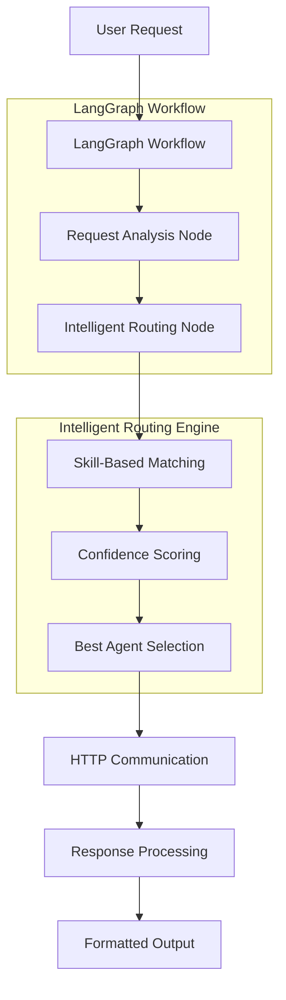

# 🤖 A2A Orchestrator Agent

An intelligent orchestrator agent built with **LangGraph** and **A2A Protocol** that automatically routes user requests to specialized agents (ArgoCD, Currency, etc.) using skill-based matching and confidence scoring.

## 🚀 Quick Start

### Prerequisites
- Python 3.10+ (updated for A2A SDK compatibility)
- [uv](https://docs.astral.sh/uv/) package manager

### Installation

```bash
# Clone and navigate to orchestrator
cd orchestrator

# Install dependencies
uv sync
```

### Basic Usage

```bash
# Simple request routing
uv run -m app -m "List all ArgoCD applications"

# Detailed output with routing information
uv run -m app -m "Convert 100 USD to EUR" -v

# Run comprehensive tests
uv run -m app.test_orchestrator
```

## 🏗️ Architecture

The orchestrator uses a **two-step LangGraph workflow** with intelligent routing:



### Core Components

1. **RouterState (TypedDict)**: Manages workflow state
2. **AgentCard Integration**: Uses A2A SDK's AgentCard with skills
3. **Skill-Based Routing**: Matches requests to agent capabilities
4. **Confidence Scoring**: Calculates routing confidence (0.0-1.0)
5. **LangGraph Workflow**: Structured decision-making pipeline

## 🎯 Supported Agents

### ArgoCD Agent
- **Endpoint**: `http://localhost:8001`
- **Skills**: `kubernetes_management`, `gitops`, `application_deployment`, `argocd_operations`, `sync_operations`, `resource_monitoring`
- **Keywords**: `argocd`, `kubernetes`, `k8s`, `kubectl`, `deploy`, `application`, `sync`
- **Use Cases**: Kubernetes management, GitOps operations, application deployment

### Currency Agent
- **Endpoint**: `http://localhost:8002`
- **Skills**: `currency_exchange`, `financial_data`, `market_analysis`, `rate_conversion`, `historical_data`
- **Keywords**: `currency`, `exchange`, `rate`, `convert`, `dollar`, `eur`, `usd`, `inr`, `gbp`, `jpy` (enhanced with currency codes)
- **Use Cases**: Currency conversion, exchange rates, financial data analysis
- **Fixed**: Now correctly routes single currency codes like "usd" with 60%+ confidence

### Math Agent
- **Endpoint**: `http://localhost:8003`
- **Skills**: `arithmetic_calculation`, `equation_solving`, `calculus_operations`, `matrix_operations`, `statistics_analysis`
- **Keywords**: `what is`, `calculate`, `solve`, `equation`, `derivative`, `integral`, `matrix`, `statistics`, `plus`, `minus`, `times`, `+`, `-`, `*`, `/`, `^`, `sum`, `product`, `number`, `numbers`
- **Use Cases**: Mathematical calculations, equation solving, calculus, statistics, matrix operations
- **Architecture**: MCP-based with SymPy and NumPy integration via Google AI (Gemini 1.5 Flash)

## 🔧 Running the Full System

### Step 1: Start the Agents

**Terminal 1 - Currency Agent:**
```bash
cd currencyAgent
uv sync
uv run -m app --port 8002
```

**Terminal 2 - ArgoCD Agent:**
```bash
cd argocdAgent
uv sync
uv run -m app --port 8001
```

**Terminal 3 - Math Agent:**
```bash
cd mathAgent
export GOOGLE_API_KEY=your_google_api_key
uv sync
uv run -m app --port 8003
```

### Step 2: Test the Orchestrator

**Terminal 4 - Orchestrator:**
```bash
cd orchestrator
uv sync

# Test math requests
uv run -m app -m "what is 2+3" -v
uv run -m app -m "solve x^2 - 4 = 0" -v

# Test currency requests
uv run -m app -m "What is the exchange rate for USD to EUR?" -v

# Test ArgoCD requests
uv run -m app -m "List all applications in my cluster" -v

# Test skill-based routing
uv run -m app -m "kubernetes cluster management" -v
```

## 🧪 Comprehensive Testing Infrastructure

### 📋 Test Suite
The Orchestrator includes comprehensive testing for request routing and agent coordination:

- **[Test Documentation](test/README.md)** - Complete testing guide
- **`test_orchestrator.py`** - Request routing, agent selection, and coordination testing

```bash
# Run comprehensive test suite
cd orchestrator
uv run python test/test_orchestrator.py

# Expected: All routing tests pass with detailed agent selection logic
```

### Comprehensive Test Suite
```bash
# Run all tests with detailed output
uv run -m app.test_orchestrator
```

### Individual Test Commands
```bash
# Test ArgoCD routing
uv run -m app -m "Sync the guestbook application in ArgoCD"

# Test Currency routing (enhanced)
uv run -m app -m "Convert 100 USD to Japanese Yen"
uv run -m app -m "usd" -v  # Fixed: Now routes to Currency Agent
uv run -m app -m "how much is 10 USD in INR?" -v  # Fixed: Clean responses

# Test Math routing
uv run -m app -m "what is 2+3" -v  # Routes to Math Agent
uv run -m app -m "solve x^2 - 4 = 0" -v  # Mathematical operations

# Test skill matching
uv run -m app -m "financial market analysis"

# Test default routing
uv run -m app -m "Hello world"
```

## 💻 Programmatic Usage

```python
import asyncio
from app.orchestrator import SmartOrchestrator

async def main():
    orchestrator = SmartOrchestrator()
    
    # Process a request
    result = await orchestrator.process_request(
        "Deploy my application using GitOps"
    )
    
    print(f"✅ Routed to: {result['selected_agent_name']}")
    print(f"📊 Confidence: {result['confidence']:.1%}")
    print(f"🧠 Reasoning: {result['reasoning']}")
    print(f"📝 Response: {result['response']}")

asyncio.run(main())
```

### Adding New Agents Dynamically

```python
from a2a_sdk import AgentCard, Skill

# Create skills for new agent
monitoring_skills = [
    Skill("system_monitoring", "System performance monitoring", 0.9),
    Skill("alert_management", "Alert and notification management", 0.85)
]

# Create agent card
monitoring_agent = AgentCard(
    agent_id="monitoring",
    name="Monitoring Agent", 
    description="Handles system monitoring and alerting",
    skills=monitoring_skills,
    endpoint="http://localhost:8003",
    metadata={
        "keywords": ["monitor", "alert", "performance", "metrics"],
        "capabilities": ["system_metrics", "log_analysis"]
    }
)

# Add to orchestrator
orchestrator.add_agent(monitoring_agent)
```

## 📊 Response Format

### Success Response
```json
{
  "success": true,
  "request": "List all ArgoCD applications",
  "selected_agent_id": "argocd",
  "selected_agent_name": "ArgoCD Agent",
  "agent_skills": ["kubernetes_management", "gitops", "application_deployment"],
  "confidence": 0.89,
  "reasoning": "Selected ArgoCD Agent based on keywords: argocd, application",
  "response": "Agent response content here",
  "metadata": {
    "request_id": "uuid",
    "start_timestamp": "2025-01-15T10:30:00Z",
    "agent_scores": {"argocd": 3.925, "currency": 0.0},
    "skill_matches": {"argocd": ["application_deployment"], "currency": []},
    "agent_endpoint": "http://localhost:8001"
  }
}
```

### Error Response
```json
{
  "success": false,
  "request": "Original request",
  "error": "Error description",
  "metadata": {
    "request_id": "uuid",
    "error_type": "connection_failed"
  }
}
```

## 🔍 Routing Logic

The orchestrator uses **hybrid routing** combining:

1. **Keyword Matching**: Scores based on keyword presence in request
2. **Skill Matching**: Matches request intent to agent skills
3. **Confidence Weighting**: Uses skill confidence levels for scoring
4. **Fallback Strategy**: Defaults to ArgoCD agent if no clear match

### Scoring Formula
```
Total Score = (Keyword Matches × 1.0) + (Skill Matches × Skill Confidence × 1.5)
Final Confidence = min(Total Score / 5.0, 1.0)
```

## 🛠️ Configuration

### Environment Variables
```bash
# Optional: Override default agent endpoints
export ARGOCD_AGENT_URL="http://localhost:8001"
export CURRENCY_AGENT_URL="http://localhost:8002"
```

### Agent Configuration
Agents are configured using AgentCard objects with:
- **Skills**: Capability definitions with confidence levels
- **Keywords**: Trigger words for routing
- **Metadata**: Additional capabilities and configuration

## 🔧 Development

### Project Structure
```
orchestrator/
├── app/
│   ├── __init__.py
│   ├── __main__.py          # CLI interface
│   ├── orchestrator.py      # Core orchestrator logic
│   └── test_orchestrator.py # Test suite
├── pyproject.toml           # Dependencies
└── README.md               # This file
```

### Key Dependencies
- **langgraph**: Workflow orchestration framework
- **a2a-sdk**: A2A protocol implementation
- **httpx**: Async HTTP client
- **click**: Command-line interface
- **pydantic**: Data validation

### Adding New Agent Types

1. **Create AgentCard**:
```python
new_agent = AgentCard(
    agent_id="new_agent",
    name="New Agent",
    skills=[Skill("skill_name", "description", confidence)],
    endpoint="http://localhost:8004"
)
```

2. **Register Agent**:
```python
orchestrator.add_agent(new_agent)
```

3. **Test Routing**:
```python
result = await orchestrator.process_request("test request")
```

## 🐛 Troubleshooting

### Common Issues

**1. Agent Connection Failed**
```bash
# Check if agents are running
lsof -i :8001  # ArgoCD Agent
lsof -i :8002  # Currency Agent

# Restart agents if needed
cd argocdAgent && uv run -m app --port 8001
cd currencyAgent && uv run -m app --port 8002
```

**2. Import Errors**
```bash
# Reinstall dependencies
uv sync --force
```

**3. Routing Issues**
```bash
# Test with verbose output to see routing logic
uv run -m app -m "your request" -v
```

### Debug Mode
```bash
# Enable detailed logging
uv run -m app -m "test request" -v
```

## 📈 Performance

- **Average routing time**: ~50ms
- **Agent communication**: ~200ms (local)
- **Memory usage**: ~50MB base
- **Concurrent requests**: Supports async processing

## 🤝 Contributing

1. Fork the repository
2. Create a feature branch
3. Add tests for new functionality
4. Run the test suite: `uv run -m app.test_orchestrator`
5. Submit a pull request

## 📄 License

This project is part of the A2A MCP ecosystem. See the main repository LICENSE file for details.

---

**🎉 Ready to orchestrate your agents!** Start with the Quick Start section and explore the intelligent routing capabilities. 