# Developer Guide: Orchestrator Client

This document provides a comprehensive technical overview of the Orchestrator Client, including its architecture, A2A protocol integration, design patterns, and implementation details.

## 📋 Overview

The Orchestrator Client is a sophisticated command-line interface that provides seamless interaction with A2A-compatible agents through the Agent-to-Agent (A2A) protocol. It features intelligent agent discovery, push notification support, and optimized response formatting for enhanced user experience.

## 🏗️ Architecture Overview


## 🔄 Complete Client Interaction Flow

```mermaid
sequenceDiagram
    participant User as 👤 User<br/>(Terminal)
    participant Client as 🖥️ Orchestrator Client<br/>(__main__.py)
    participant A2AClient as 🔌 A2A Client<br/>(A2AClient)
    participant HTTPClient as 🌐 HTTP Client<br/>(httpx.AsyncClient)
    participant Discovery as 🔍 Agent Discovery<br/>(list_available_agents)
    participant PushListener as 📡 Push Listener<br/>(PushNotificationListener)
    participant Agent as 🤖 Target Agent<br/>(Orchestrator/Direct)
    participant Formatter as 🎨 Response Formatter<br/>(format_ai_response)

    Note over User, Formatter: User Command: "uv run . --agent http://localhost:8000"

    User->>Client: Start orchestrator client<br/>orchestratorClient()
    Note right of User: CLI command with agent URL

    Client->>HTTPClient: httpx.AsyncClient(timeout=30)<br/>__main__.py:165
    Note right of Client: Initialize HTTP client

    Client->>A2AClient: A2ACardResolver(httpx_client, agent)<br/>__main__.py:166
    Note right of Client: Create A2A card resolver

    A2AClient->>Agent: GET /.well-known/agent.json<br/>A2ACardResolver.get_agent_card()
    Note right of A2AClient: Fetch agent capabilities

    Agent-->>A2AClient: Agent card JSON
    Note left of Agent: {"name": "Smart Orchestrator",<br/>"capabilities": {...}}

    A2AClient-->>Client: Agent card<br/>__main__.py:167
    Note left of A2AClient: Parsed agent card

    Client->>Client: print(card.model_dump_json())<br/>__main__.py:170
    Note right of Client: Display agent card

    Client->>Discovery: list_available_agents(httpx_client, agent, card)<br/>__main__.py:173
    Note right of Client: Discover available agents

    Discovery->>HTTPClient: GET http://localhost:8001/.well-known/agent.json<br/>__main__.py:108
    Note right of Discovery: Check ArgoCD Agent

    HTTPClient-->>Discovery: Agent response or timeout
    Note left of HTTPClient: Agent availability check

    Discovery->>HTTPClient: GET http://localhost:8002/.well-known/agent.json<br/>__main__.py:108
    Note right of Discovery: Check Currency Agent

    Discovery->>HTTPClient: GET http://localhost:8003/.well-known/agent.json<br/>__main__.py:108
    Note right of Discovery: Check Math Agent

    Discovery->>Client: print("Found X available agents")<br/>__main__.py:125
    Note right of Discovery: Display agent list

    alt Push Notifications Enabled
        Client->>PushListener: PushNotificationListener.start()<br/>__main__.py:190
        Note right of Client: Start notification listener
    end

    Client->>A2AClient: A2AClient(httpx_client, agent)<br/>__main__.py:205
    Note right of Client: Create A2A client

    loop User Interaction Loop
        Client->>User: input("What do you want to send?")<br/>__main__.py:207
        Note right of Client: Prompt for user input

        User-->>Client: User query
        Note left of User: "what is 2+3?"

        Client->>A2AClient: client.send_message(request)<br/>__main__.py:236
        Note right of Client: Send A2A message

        A2AClient->>HTTPClient: POST / (JSON-RPC)<br/>A2AClient.send_message()
        Note right of A2AClient: A2A protocol request

        HTTPClient->>Agent: HTTP POST with message<br/>httpx.post()
        Note right of HTTPClient: Forward to target agent

        Agent-->>HTTPClient: A2A response
        Note left of Agent: Task with result

        HTTPClient-->>A2AClient: HTTP response<br/>JSON-RPC result
        Note left of HTTPClient: A2A protocol response

        A2AClient-->>Client: Task object<br/>__main__.py:237
        Note left of A2AClient: Parsed task result

        Client->>Client: completeTask(client, task)<br/>__main__.py:238
        Note right of Client: Process task completion

        alt Task Not Complete
            Client->>A2AClient: client.get_task(task_id)<br/>completeTask()
            Note right of Client: Poll for task updates

            A2AClient->>Agent: GET /task/{task_id}<br/>A2AClient.get_task()
            Note right of A2AClient: Task status check

            Agent-->>A2AClient: Updated task
            Note left of Agent: Task progress/completion

            A2AClient-->>Client: Task update
            Note left of A2AClient: Task state change
        end

        Client->>Formatter: format_ai_response(task.artifacts)<br/>__main__.py:35
        Note right of Client: Format response for display

        Formatter->>Formatter: Extract text from artifacts<br/>__main__.py:42
        Note right of Formatter: Parse task artifacts

        Formatter->>Client: Formatted output<br/>__main__.py:50
        Note right of Formatter: User-friendly display

        Client->>User: print("🤖 AI RESPONSE")<br/>__main__.py:47
        Note right of Client: Display formatted response

        Note over User, Formatter: Output: "5"
    end

    Note over User, Formatter: User types ":q" to quit
```



## 🔍 Core Components Analysis

### 1. Orchestrator Client Main (\_\_main\_\_.py)

**Key Features:**
- Command-line interface with asyncclick
- A2A protocol integration
- Agent discovery and capability display
- Push notification support
- Response formatting and user experience optimization

**CLI Options:**
```python
@click.command()
@click.option("--agent", default="http://localhost:10000")
@click.option("--session", default=0)
@click.option("--history", default=False)
@click.option("--use_push_notifications", default=False)
@click.option("--push_notification_receiver", default="http://localhost:5000")
@click.option("--header", multiple=True)
```

### 2. Agent Discovery System

**Implementation:**
```python
async def list_available_agents(httpx_client, agent_url: str, card):
    """Display available agents if connecting to orchestrator"""
    if "orchestrator" in card.name.lower():
        agent_endpoints = [
            ("ArgoCD Agent", "http://localhost:8001"),
            ("Currency Agent", "http://localhost:8002"), 
            ("Math Agent", "http://localhost:8003")
        ]
        
        for name, endpoint in agent_endpoints:
            try:
                response = await httpx_client.get(f"{endpoint}/.well-known/agent.json")
                # Process agent capabilities
            except:
                # Handle unavailable agents
```

**Features:**
- **Automatic Discovery**: Probes known agent endpoints
- **Capability Display**: Shows agent skills and descriptions
- **Health Checking**: Detects available vs unavailable agents
- **Orchestrator Detection**: Only shows agent list for orchestrator connections

### 3. Response Formatting System

**Multi-format Support:**
```python
def format_ai_response(content):
    """Format AI response for better readability."""
    if isinstance(content, dict):
        # Handle A2A task artifacts (from orchestrator)
        if 'artifacts' in content:
            # Extract and format task artifacts
        
        # Handle structured data
        if 'content' in content:
            # Process structured responses
    
    elif isinstance(content, str):
        # Handle direct string content
```

**Response Types:**
- **Task Artifacts**: Extracts content from A2A task artifacts
- **Structured Data**: Handles JSON-formatted responses
- **Plain Text**: Formats simple string responses
- **Orchestrator Responses**: Special handling for orchestrator routing results

### 4. A2A Protocol Integration

**Client Initialization:**
```python
async with httpx.AsyncClient(timeout=30, headers=headers) as httpx_client:
    card_resolver = A2ACardResolver(httpx_client, agent)
    card = await card_resolver.get_agent_card()
    
    client = A2AClient(httpx_client, agent)
```

**Message Sending:**
```python
request = SendMessageRequest(
    message=Message(
        parts=[TextPart(text=user_input)],
        configuration=MessageSendConfiguration(
            stream=streaming,
            pushNotificationReceiver=push_receiver_url if use_push_notifications else None
        )
    ),
    contextId=context_id
)

task = await client.send_message(request)
```

### 5. Push Notification System

**Listener Setup:**
```python
from utils.push_notification_listener import PushNotificationListener

listener = PushNotificationListener(
    notification_receiver_host,
    notification_receiver_port,
    auth
)
await listener.start()
```

**Features:**
- **Real-time Updates**: Receives task progress notifications
- **Authentication**: Secure push notification handling
- **Async Processing**: Non-blocking notification handling

## 🎯 Key Design Patterns

### 1. A2A Protocol Pattern
- **Standard Compliance**: Full A2A specification adherence
- **Agent Card Resolution**: Dynamic capability discovery
- **Task Management**: Proper task lifecycle handling
- **Error Handling**: Graceful A2A protocol error handling

### 2. Async CLI Pattern
- **AsyncClick Integration**: Non-blocking command-line interface
- **Concurrent Operations**: Parallel agent discovery and communication
- **Resource Management**: Proper async context management

### 3. Response Formatting Pattern
- **Multi-format Support**: Handles various response types
- **User Experience**: Optimized display formatting
- **Content Extraction**: Intelligent artifact parsing

### 4. Agent Discovery Pattern
- **Health Checking**: Probes agent availability
- **Capability Display**: Shows agent skills and descriptions
- **Orchestrator Detection**: Contextual agent listing

## 🔧 Configuration and Customization

### Environment Variables
```bash
# Default agent endpoint
DEFAULT_AGENT_URL=http://localhost:8000

# Push notification settings
PUSH_NOTIFICATION_HOST=localhost
PUSH_NOTIFICATION_PORT=5000

# HTTP client settings
HTTP_TIMEOUT=30
MAX_RETRIES=3
```

### Custom Headers
```bash
# Add custom headers for authentication
uv run . --agent http://localhost:8000 --header "Authorization=Bearer token" --header "X-Custom-Header=value"
```

### Agent Discovery Configuration
```python
# Customize agent discovery endpoints
AGENT_DISCOVERY_ENDPOINTS = [
    ("Custom Agent", "http://localhost:8004"),
    ("Another Agent", "http://localhost:8005"),
]
```

## 🧪 Testing and Debugging

### Unit Testing

```python
import pytest
from unittest.mock import AsyncMock, patch

class TestOrchestratorClient:
    @pytest.mark.asyncio
    async def test_agent_discovery(self):
        """Test agent discovery functionality"""
        with patch('httpx.AsyncClient.get') as mock_get:
            mock_response = AsyncMock()
            mock_response.status_code = 200
            mock_response.json.return_value = {
                "name": "Test Agent",
                "description": "Test agent description",
                "skills": []
            }
            mock_get.return_value = mock_response
            
            # Test discovery logic
            await list_available_agents(mock_client, "http://localhost:8000", mock_card)
            
            assert mock_get.called
    
    @pytest.mark.asyncio
    async def test_response_formatting(self):
        """Test response formatting"""
        test_content = {
            "artifacts": [{
                "parts": [{
                    "kind": "text",
                    "text": "Test response"
                }]
            }]
        }
        
        result = format_ai_response(test_content)
        assert result == True  # Successfully formatted
```

### Integration Testing

```python
class TestA2AIntegration:
    @pytest.mark.asyncio
    async def test_full_client_workflow(self):
        """Test complete client workflow"""
        async with httpx.AsyncClient() as client:
            # Test agent card resolution
            card_resolver = A2ACardResolver(client, "http://localhost:8000")
            card = await card_resolver.get_agent_card()
            assert card.name is not None
            
            # Test message sending
            a2a_client = A2AClient(client, "http://localhost:8000")
            request = SendMessageRequest(
                message=Message(parts=[TextPart(text="test")]),
                contextId="test-context"
            )
            
            task = await a2a_client.send_message(request)
            assert task.id is not None
```

### Debug Mode

```python
# Enable debug logging
import logging
logging.basicConfig(level=logging.DEBUG)

# Test with debug output
async def debug_client():
    async with httpx.AsyncClient() as client:
        # Debug A2A communication
        print(f"Sending request to agent...")
        response = await client.post("/", json=request_data)
        print(f"Response: {response.json()}")
```

## 🚀 Performance Optimization

### 1. Connection Pooling
```python
# Configure HTTP client with connection pooling
httpx_client = httpx.AsyncClient(
    timeout=30,
    limits=httpx.Limits(max_connections=100, max_keepalive_connections=20)
)
```

### 2. Concurrent Agent Discovery
```python
async def discover_agents_concurrently(endpoints):
    """Discover multiple agents concurrently"""
    tasks = [check_agent_availability(endpoint) for endpoint in endpoints]
    results = await asyncio.gather(*tasks, return_exceptions=True)
    return [r for r in results if not isinstance(r, Exception)]
```

### 3. Response Caching
```python
from functools import lru_cache

@lru_cache(maxsize=100)
def cached_format_response(content_hash: str, content: str) -> str:
    """Cache formatted responses"""
    return format_ai_response(content)
```

## 🔒 Security Best Practices

### 1. Input Validation
```python
def validate_user_input(user_input: str) -> bool:
    """Validate user input for security"""
    if len(user_input) > 10000:  # Prevent very long inputs
        return False
    
    # Check for potentially harmful patterns
    dangerous_patterns = ['<script>', 'javascript:', 'data:']
    return not any(pattern in user_input.lower() for pattern in dangerous_patterns)
```

### 2. Secure Headers
```python
def get_secure_headers() -> dict:
    """Get security headers for HTTP requests"""
    return {
        "User-Agent": "A2A-Orchestrator-Client/1.0",
        "Accept": "application/json",
        "Content-Type": "application/json",
        "X-Requested-With": "A2A-Client"
    }
```

### 3. URL Validation
```python
def validate_agent_url(url: str) -> bool:
    """Validate agent URL for security"""
    try:
        parsed = urllib.parse.urlparse(url)
        return parsed.scheme in ['http', 'https'] and parsed.netloc
    except:
        return False
```

## 🔧 Extensibility Points

### 1. Custom Response Formatters
```python
class CustomResponseFormatter:
    """Custom response formatter for specific agent types"""
    
    def format_math_response(self, content: dict) -> str:
        """Format mathematical responses"""
        if 'calculation' in content:
            return f"🔢 Result: {content['calculation']}"
        return str(content)
    
    def format_currency_response(self, content: dict) -> str:
        """Format currency conversion responses"""
        if 'exchange_rate' in content:
            return f"💱 {content['from']} → {content['to']}: {content['rate']}"
        return str(content)
```

### 2. Plugin System
```python
class ClientPlugin:
    """Base class for client plugins"""
    
    def __init__(self, client):
        self.client = client
    
    async def pre_send_message(self, message: str) -> str:
        """Hook called before sending message"""
        return message
    
    async def post_receive_response(self, response: dict) -> dict:
        """Hook called after receiving response"""
        return response

# Plugin registration
def register_plugin(plugin_class):
    """Register a client plugin"""
    plugins.append(plugin_class)
```

### 3. Custom Agent Discovery
```python
class CustomAgentDiscovery:
    """Custom agent discovery implementation"""
    
    def __init__(self, discovery_config):
        self.config = discovery_config
    
    async def discover_agents(self) -> List[dict]:
        """Discover agents using custom logic"""
        # Custom discovery implementation
        return discovered_agents
```

## 📊 Monitoring and Metrics

### Performance Metrics
```python
class ClientMetrics:
    def __init__(self):
        self.request_count = 0
        self.response_times = []
        self.error_count = 0
    
    def record_request(self, response_time: float, success: bool):
        """Record request metrics"""
        self.request_count += 1
        self.response_times.append(response_time)
        if not success:
            self.error_count += 1
    
    def get_metrics(self) -> dict:
        """Get performance metrics"""
        avg_response_time = sum(self.response_times) / len(self.response_times) if self.response_times else 0
        return {
            "total_requests": self.request_count,
            "average_response_time": avg_response_time,
            "error_rate": self.error_count / self.request_count if self.request_count > 0 else 0
        }
```

### Health Monitoring
```python
async def health_check(agent_url: str) -> dict:
    """Perform health check on target agent"""
    try:
        async with httpx.AsyncClient() as client:
            response = await client.get(f"{agent_url}/.well-known/agent.json", timeout=5)
            return {
                "status": "healthy" if response.status_code == 200 else "unhealthy",
                "response_time": response.elapsed.total_seconds(),
                "agent_available": response.status_code == 200
            }
    except Exception as e:
        return {
            "status": "unhealthy",
            "error": str(e),
            "agent_available": False
        }
```

## 📚 Best Practices

### 1. Error Handling
- Always handle network timeouts gracefully
- Provide meaningful error messages to users
- Implement retry logic for transient failures
- Log errors for debugging purposes

### 2. User Experience
- Display clear progress indicators
- Format responses for readability
- Provide helpful command-line options
- Show agent capabilities when available

### 3. Performance
- Use connection pooling for HTTP clients
- Implement concurrent agent discovery
- Cache frequently accessed data
- Set appropriate timeouts

### 4. Security
- Validate all user inputs
- Use secure HTTP headers
- Implement proper authentication
- Sanitize response content

## 🔄 Usage Examples

### Basic Usage
```bash
# Connect to orchestrator
uv run . --agent http://localhost:8000

# Connect to specific agent
uv run . --agent http://localhost:8001

# Enable push notifications
uv run . --agent http://localhost:8000 --use_push_notifications true
```

### Advanced Usage
```bash
# Custom headers and settings
uv run . --agent http://localhost:8000 \
  --header "Authorization=Bearer token" \
  --header "X-Custom-Header=value" \
  --use_push_notifications true \
  --push_notification_receiver http://localhost:5000
```

### Programmatic Usage
```python
async def use_orchestrator_client():
    """Example of programmatic client usage"""
    async with httpx.AsyncClient() as httpx_client:
        # Initialize A2A client
        client = A2AClient(httpx_client, "http://localhost:8000")
        
        # Send message
        request = SendMessageRequest(
            message=Message(parts=[TextPart(text="What is 2+2?")]),
            contextId="example-context"
        )
        
        task = await client.send_message(request)
        
        # Wait for completion
        while task.state != TaskState.COMPLETED:
            await asyncio.sleep(1)
            task = await client.get_task(GetTaskRequest(taskId=task.id))
        
        # Format and display response
        format_ai_response(task.artifacts)
```

## 📚 Related Documentation

- [Main README](../README.md) - Project overview
- [Orchestrator Client README](README.md) - User guide
- [A2A Protocol](https://github.com/modelcontextprotocol/a2a) - A2A specification
- [AsyncClick Documentation](https://github.com/python-trio/asyncclick) - Async CLI framework
- [HTTPX Documentation](https://www.python-httpx.org/) - HTTP client library

---

*Last updated: January 2025*
