# A2A MCP Orchestrator Client

A command-line client for interacting with the A2A MCP Agent System. **Best used with the [intelligent orchestrator agent](../orchestrator/README.md)** for seamless multi-agent interactions.

## 🎉 Recent Updates (June 2025)
- **🤖 Agent Discovery**: Client now displays all available agents when connecting to orchestrator
- **Response Formatting Fixed**: Client now displays clean, formatted responses instead of raw JSON
- **Hanging Issues Resolved**: Currency requests respond quickly without timeouts
- **Enhanced User Experience**: Clean output like "10 USD is 862.6 INR" instead of technical JSON

## 🚀 Quick Start with Orchestrator

**Recommended**: Use the client with the orchestrator for intelligent agent routing:

```bash
# Terminal 1: Start the orchestrator system
cd orchestrator && uv run -m app --port 8000

# Terminal 2: Connect client to orchestrator
cd orchestrator_client && uv run . --agent http://localhost:8000

# Now interact naturally - the orchestrator will route to the right agent:
# > "List all my ArgoCD applications"
# > "Convert 100 USD to EUR"
# > "Show me Kubernetes cluster status"
```

## 🏗️ System Integration

The client integrates with the orchestrator system for intelligent routing:

```mermaid
graph TD
    A[User Input] --> B[🔧 Orchestrator Client]
    B --> C[🤖 Orchestrator Agent]
    C --> D{Intelligent Routing}
    D -->|Kubernetes/GitOps| E[☸️ ArgoCD Agent]
    D -->|Currency/Finance| F[💰 Currency Agent]
    D -->|Math/Calculations| G[🧮 Math Agent]
    E --> H[Response]
    F --> H
    G --> H
    H --> B
    B --> I[Formatted Output]
```



## 📖 Usage Options

### Option 1: With Orchestrator (Recommended)

Connect to the orchestrator for intelligent multi-agent interactions:

```bash
# Start orchestrator system
cd orchestrator && uv run -m app --port 8000

# Connect client to orchestrator
cd orchestrator_client && uv run . --agent http://localhost:8000

# Natural language interactions:
# > "Deploy my application to staging"     → Routes to ArgoCD Agent
# > "What's the current USD to EUR rate?"  → Routes to Currency Agent
# > "Help with Kubernetes management"      → Routes to ArgoCD Agent
```

### Option 2: Direct Agent Connection

Connect directly to a specific agent:

```bash
# Connect to ArgoCD agent directly
uv run . --agent http://localhost:8001

# Connect to Currency agent directly  
uv run . --agent http://localhost:8002
```

### Option 3: Custom Agent

Connect to any A2A-compatible agent:

```bash
uv run . --agent http://your-custom-agent:port
```

## 🚀 Quick Start

### Prerequisites

- Python 3.10+ (updated for A2A SDK compatibility)
- A running A2A agent server (orchestrator recommended)
- uv package manager

### Installation

1. **Install dependencies:**
```bash
cd orchestrator_client
uv sync
```

2. **Connect to the orchestrator system:**
```bash
# Start the full system first:
# Terminal 1: cd currencyAgent && uv run -m app --port 8002
# Terminal 2: cd argocdAgent && uv run -m app --port 8001  
# Terminal 3: cd orchestrator && uv run -m app --port 8000

# Terminal 4: Connect client
uv run . --agent http://localhost:8000
```

## 📖 Usage

### Basic Usage

```bash
# Connect to the orchestrator (recommended)
uv run . --agent http://localhost:8000

# Connect to a specific agent with custom headers
uv run . --agent http://localhost:8001 --header "Authorization=Bearer token"

# Use a specific session ID
uv run . --agent http://localhost:8000 --session 12345

# Enable history tracking
uv run . --agent http://localhost:8000 --history
```

### Command Line Options

- `--agent` - Agent server URL (default: http://localhost:8000 for orchestrator)
- `--session` - Session ID for conversation continuity (default: 0)
- `--history` - Enable history tracking (default: False)
- `--use_push_notifications` - Enable push notifications (default: False)
- `--push_notification_receiver` - Push notification receiver URL (default: http://localhost:5000)
- `--header` - Additional HTTP headers (can be specified multiple times)

### Interactive Commands

Once connected, you can interact with the agent(s):

```
What do you want to send to the agent? plan a deployment
Select a file path to attach? (press enter to skip)
```

**Available Commands:**
- `:q` or `quit` - Exit the CLI
- Any text input - Send a message to the agent

## 🧪 Testing Infrastructure

### 📋 Test Suite
The CLI includes comprehensive testing for WebSocket and push notification functionality:

- **[Test Documentation](test/README.md)** - Complete testing guide
- **`push_notification_listener.py`** - WebSocket connections and real-time communication testing

```bash
# Test WebSocket push notifications
cd orchestrator_client
uv run python test/push_notification_listener.py

# Expected: WebSocket connection, notification handling, and real-time communication work
```

## 📋 Example Interactions

### With Orchestrator (Multi-Agent Routing)

```bash
# Connect to orchestrator
uv run . --agent http://localhost:8000

# Output shows:
# ======= Agent Card ========
# {"name":"Smart Orchestrator Agent",...}
# 
# ============================================================
# 🤖 AVAILABLE AGENTS
# ============================================================
# Found 3 available agents:
# 
# 1. ArgoCD Agent (http://localhost:8001)
#    Description: Handles ArgoCD and Kubernetes operations via MCP protocol
#    Skills: Kubernetes Management, GitOps, Application Deployment (+3 more)
# 
# 2. Currency Agent (http://localhost:8002)
#    Description: Handles currency exchange and financial data
#    Skills: Currency exchange operations, Financial data analysis (+2 more)
# 
# 3. Math Agent (http://localhost:8003)
#    Description: Advanced mathematical assistant for calculations...
#    Skills: Arithmetic Calculation, Equation Solving, Calculus Operations (+2 more)
# 
# ============================================================
# 💡 The orchestrator will automatically route your requests to the best agent!
# ============================================================
```

**Math Operations:**
```
> what is 2+3

🤖 AI RESPONSE
============================================================
5
============================================================

> solve x^2 - 4 = 0

🤖 AI RESPONSE
============================================================
The solutions to the equation x^2 - 4 = 0 are:
x = -2 and x = 2
============================================================
```

**ArgoCD/Kubernetes Operations:**
```
> List all ArgoCD applications

🤖 ORCHESTRATOR RESPONSE
============================================================
✅ Routed to: ArgoCD Agent (Confidence: 99%)
Reasoning: Selected ArgoCD Agent based on keywords: argocd, application

ArgoCD Agent Response: Here are all your applications:
- guestbook (Healthy, Synced)
- frontend-app (Healthy, OutOfSync)
- backend-api (Progressing, Synced)
============================================================
```

**Currency/Financial Operations:**
```
> Convert 100 USD to EUR

🤖 AI RESPONSE
============================================================
100 USD is currently 92.34 EUR
(Exchange rate: 1 USD = 0.9234 EUR)
============================================================

> usd

🤖 AI RESPONSE  
============================================================
Please specify which currency you would like to convert to. 
Also, specify the date for the exchange rate you want to use.
============================================================

> how much is 10 USD in INR?

🤖 AI RESPONSE
============================================================
10 USD is 862.6 INR
============================================================
```

**Skill-Based Routing:**
```
> kubernetes cluster management

🤖 ORCHESTRATOR RESPONSE
============================================================
✅ Routed to: ArgoCD Agent (Confidence: 74%)
Reasoning: Selected ArgoCD Agent based on keywords: kubernetes, cluster and skills: kubernetes_management

ArgoCD Agent Response: I can help you manage your Kubernetes cluster through ArgoCD...
============================================================
```

### Planning Tasks

```
What do you want to send to the agent? plan a deployment

🤖 AI PLANNER RESPONSE
============================================================
Original Query: plan a deployment
Task Type: planning
Scope: general

📋 TASKS:
  • Task 1: Hello from planner agent - AI processed: ## Deployment Plan

**User Query:** Plan a deployment

This plan assumes a software deployment to a server environment...

**1. Task Breakdown:**
* **Phase 1: Preparation (1-2 days)**
  * 1.1 **Code Freeze:** Declare a code freeze...
  * 1.2 **Build Artifact:** Build the release artifact...

**2. Dependencies:**
* 1.2 (Build Artifact) must be completed before 1.4 (Test Environment Setup)

**3. Resource Requirements:**
* **Personnel:** Developers, DevOps engineers, system administrators
* **Hardware:** Servers, network infrastructure, monitoring tools

**4. Timeline Estimates:**
* Total estimated time: 3-7 days

**5. Success Criteria:**
* Successful deployment to the target environment without errors
============================================================
```

### ArgoCD Operations

```
What do you want to send to the agent? sync argocd application

🤖 AI RESPONSE
============================================================
Hello from ArgoCD agent! Processing: The user query "sync argocd application" requests a **synchronization operation** within Argo CD. This means the user wants to bring the live Kubernetes state into alignment with the desired state defined in their Git repository.

Here's a breakdown of the steps involved and relevant ArgoCD concepts:

**1. Identifying the Target Application:**
* Argo CD needs to know *which* application to synchronize...

**2. Fetching the Desired State:**
* Argo CD will retrieve the latest application manifest from the configured Git repository...

**3. Comparing Desired and Current States:**
* Argo CD compares the desired state (from Git) with the current state...

**4. Applying Necessary Changes:**
* Based on the comparison, Argo CD will automatically apply the necessary changes...

**5. Monitoring and Reporting:**
* Argo CD monitors the synchronization process and reports the status...

**Relevant ArgoCD Concepts and Best Practices:**
* **GitOps:** This is the fundamental principle behind Argo CD...
* **Application Manifests:** These YAML files define the desired state...
* **Synchronization Strategies:** Argo CD allows you to choose different strategies...
============================================================
```

## 🧪 Testing Scenarios

### Full System Test
```bash
# Start all components
cd currencyAgent && uv run -m app --port 8002 &
cd argocdAgent && uv run -m app --port 8001 &
cd orchestrator && uv run -m app --port 8000 &

# Connect client
cd orchestrator_client && uv run . --agent http://localhost:8000

# Test different request types:
# > "List all ArgoCD applications"
# > "Convert 100 USD to EUR"  
# > "Show me Kubernetes deployments"
# > "What's the Bitcoin price?"
```

### Orchestrator Only Test
```bash
# Test routing without running actual agents
cd orchestrator && uv run -m app --port 8000 &
cd orchestrator_client && uv run . --agent http://localhost:8000

# The orchestrator will show routing decisions even if agents aren't running
```

### Direct Agent Test
```bash
# Test specific agent directly
cd argocdAgent && uv run -m app --port 8001 &
cd orchestrator_client && uv run . --agent http://localhost:8001
```

## 🔧 Configuration

### Environment Variables

- `A2A_LOG_LEVEL` - Logging level (default: INFO)

### Headers

You can specify custom HTTP headers for authentication or other purposes:

```bash
uv run . --agent http://localhost:8000 --header "Authorization=Bearer your-token" --header "X-Custom-Header=value"
```

### Session Management

Use sessions for conversation continuity:

```bash
# Start a named session
uv run . --agent http://localhost:8000 --session my-session-123

# Continue the same session later
uv run . --agent http://localhost:8000 --session my-session-123 --history
```

## 🚀 Full System Setup

To run the complete orchestrated system with CLI:

### Terminal 1: Currency Agent
```bash
cd currencyAgent
uv sync
uv run -m app --port 8002
```

### Terminal 2: ArgoCD Agent
```bash
cd argocdAgent
uv sync  
uv run -m app --port 8001
```

### Terminal 3: Orchestrator
```bash
cd orchestrator
uv run -m app --port 8000
```

### Terminal 4: Orchestrator Client
```bash
cd orchestrator_client
uv sync
uv run . --agent http://localhost:8000

# Now you can interact naturally:
# > "List all my ArgoCD applications"
# > "Convert 50 GBP to USD"
# > "Help me deploy my application"
# > "Show me cluster status"
```

## 🐛 Troubleshooting

### Common Issues

1. **Connection Refused**
   - Ensure the agent server is running
   - Check the correct URL and port
   - Verify network connectivity

2. **Orchestrator Not Routing Correctly**
   ```bash
   # Test orchestrator directly
   cd orchestrator
   uv run -m app -m "test request" -v
   
   # Check if agents are reachable
   curl http://localhost:8001/health  # ArgoCD
   curl http://localhost:8002/health  # Currency
   ```

3. **Authentication Errors**
   - Check your API keys and tokens
   - Verify header format (key=value)
   - Ensure proper permissions

4. **Agent Not Responding**
   - Check agent server logs
   - Verify agent card configuration
   - Test with a simple query first

### Debug Mode

Enable verbose logging by setting the environment variable:

```bash
export A2A_LOG_LEVEL=DEBUG
uv run . --agent http://localhost:8000
```

### Testing Connectivity

```bash
# Test orchestrator endpoint
curl http://localhost:8000/health

# Test agent endpoints
curl http://localhost:8001/health  # ArgoCD
curl http://localhost:8002/health  # Currency

# Test CLI connection
uv run . --agent http://localhost:8000 --session test-connection
```

## 📚 Related Documentation

- **[Main Project README](../README.md)** - Complete system overview
- **[Orchestrator README](../orchestrator/README.md)** - Intelligent routing system  
- **[Orchestrator Blog Post](../orchestrator/BLOG_POST.md)** - Technical architecture
- **[ArgoCD Agent README](../argocdAgent/README.md)** - ArgoCD agent documentation
- **[Currency Agent README](../currencyAgent/README.md)** - Currency agent documentation

## 🎯 Best Practices

1. **Use the Orchestrator**: Connect to the orchestrator rather than individual agents for the best experience
2. **Natural Language**: Write requests in natural language - the orchestrator will route appropriately
3. **Session Management**: Use sessions for complex multi-turn conversations
4. **Error Handling**: If an agent is down, the orchestrator will show routing decisions even without responses

## 🤝 Contributing

1. Fork the repository
2. Create a feature branch
3. Make your changes
4. Add tests if applicable
5. Submit a pull request

## 📄 License

This project is licensed under the MIT License - see the [LICENSE](../LICENSE) file for details.

---

## 🎉 Quick Test Commands

```bash
# Test with orchestrator (recommended)
cd orchestrator_client && uv run . --agent http://localhost:8000

# Test with specific agent
cd orchestrator_client && uv run . --agent http://localhost:8001  # ArgoCD
cd orchestrator_client && uv run . --agent http://localhost:8002  # Currency

# Test with full system setup
cd orchestrator && uv run -m app.test_orchestrator  # Verify routing works
```
